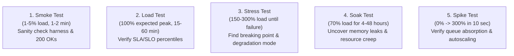

# Workload Modeling, Load Testing Archetypes & Coordinated Omission

> **Mandate**: *A load test is only as truthful as its arrival model. Do not measure how fast a system responds when clients are polite; measure how it behaves when traffic arrives relentlessly without regard for server health.*

---

## 1 · The 5 Universal Load Testing Archetypes

Every load-testing campaign must select from five standardized archetypes based on the operational question being asked:



| Test Archetype | Target Concurrency / Rate | Duration | Primary Diagnostic Question |
| :--- | :--- | :--- | :--- |
| **Smoke Test** | Minimal ($1\text{--}5\text{ virtual users}$) | $1\text{--}2\text{ minutes}$ | Does the load harness execute cleanly, authenticate, and receive valid responses? |
| **Load Test** | $100\%$ expected production peak | $15\text{--}60\text{ minutes}$ | Does the system fulfill its $P_{95}/P_{99}$ latency and error rate SLAs under normal peak demand? |
| **Stress Test** | Incremental ramp to failure ($150\%\dots 400\%$) | $30\text{--}90\text{ minutes}$ | At what exact throughput does the system saturate, and does it degrade gracefully or crash? |
| **Soak Test** | Steady $70\text{--}80\%$ capacity | $4\text{--}48\text{ hours}$ | Do heap allocations, open sockets, or database connections slowly creep over time? |
| **Spike Test** | Instantaneous $10\times$ traffic surge | $5\text{--}15\text{ minutes}$ | Can the system absorb sudden traffic bursts without dropping connections or cascading into collapse? |

---

## 2 · Open vs. Closed Workload Models (Coordinated Omission Defense)

Understanding the distinction between open and closed load models is critical to avoiding falsified latency metrics:

### 2.1 The Closed-Loop Trap (Why Most Benchmarks Lie)
In a **closed-loop model**, a fixed number of virtual users send a request, wait for the response, and only then send the next request:
$$\text{Next Request} = \text{Response Received} + \text{Think Time}$$

*The Failure Mode*: If the server experiences a $10\text{-second}$ GC pause, all virtual users freeze and wait. During the freeze, **zero new requests are sent**. When the server resumes, it processes a nearly empty queue, and the benchmark reports an artificially low average latency. This phenomenon—coined by Gil Tene as **Coordinated Omission**—causes benchmarks to overlook the catastrophic queueing delays real users experience.

### 2.2 The Open-Loop Model (Realistic Arrivals)
In an **open-loop model**, requests arrive according to an independent schedule (such as a Poisson arrival process), completely decoupled from when the server responds:
$$\text{Arrival Time}(R_{k+1}) = \text{Arrival Time}(R_k) + \Delta t_{\text{independent}}$$

*The Diagnostic Reality*: If the server pauses for $10\text{ seconds}$, new requests continue piling into the network buffer or queue. When the pause ends, the waiting requests suffer massive queueing delays ($10\text{s} + \text{service time}$). The open-loop benchmark correctly records and reports this tail latency explosion.

```
CLOSED MODEL: Client 1: [---Req 1---][Wait 10s][---Req 2---] (Only 2 requests sent!)
OPEN MODEL:   Schedule: |--R1--|--R2--|--R3--|--R4--|--R5--|--R6--| (Requests queue up!)
```

### 2.3 Defense Rule
Always configure load generators (e.g. `k6`, `wrk2`, `Locust`, `Gatling`) in **constant-arrival-rate** or **open-system mode**. Ensure the generator records latency as:
$$\text{Reported Latency} = \text{Completion Time} - \text{Scheduled Arrival Time}$$
*(Never calculate latency solely from when the socket connection was established).*

---

## 3 · Load Generator Saturation Defense

A common benchmarking error is measuring the saturation of the test runner machine rather than the target service.

### 3.1 Pre-Flight Generator Telemetry Checks
Continuously monitor the load generator instance during tests:
1. **CPU Saturation**: Load generator CPU utilization must remain **$\le 75\%$**. If generator CPU hits $90\text{--}100\%$, timer scheduling slips and latency measurements become invalid.
2. **Ephemeral Port Exhaustion**: Ensure `net.ipv4.ip_local_port_range` is expanded and `tcp_tw_reuse` is enabled to prevent `EADDRNOTAVAIL` socket errors.
3. **File Descriptor Limits**: Set `ulimit -n 65535` or higher on the generator host to avoid running out of sockets.
4. **Network Interface Saturation**: Monitor interface bandwidth (`rx_packets`, `tx_packets`, drops). Ensure network throughput does not approach hardware link capacity.

### 3.2 Invalidation Contract
If the load generator experiences CPU saturation $> 80\%$, packet drops, or socket exhaustion, **the load test run is declared invalid**. Scale the load generator horizontally across multiple instances before re-testing.
