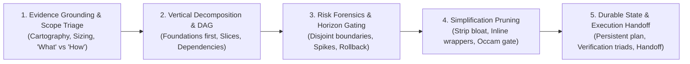
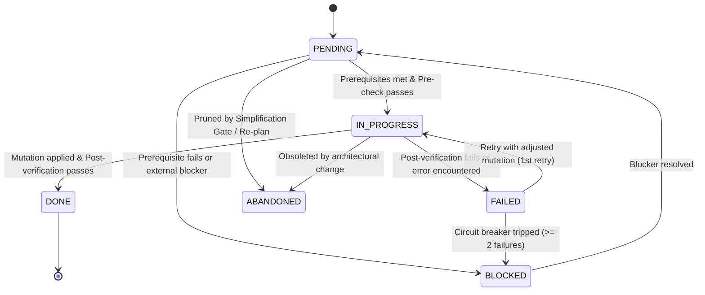

# Planning: Universal Implementation Planning & Verifiable Execution Protocol

> **Mandate**: *Execution without a verified plan is reckless mutation; planning without empirical verification is fantasy.*  
> Transform settled requirements and architectural designs into an executable, dependency-ordered, risk-mitigated Directed Acyclic Graph (DAG) of verifiable vertical slices. Ground every task in repository facts, isolate file mutation surfaces, enforce deterministic falsifiability, prune accidental complexity aggressively, and maintain durable state across context boundaries without prescribing implementation algorithms or constraining agent problem-solving creativity.

---

## 1 · The 5-Phase Planning Lifecycle

Every implementation initiative, feature addition, refactoring campaign, or non-trivial bug-fix traverses this 5-phase protocol:



1. **Phase 1 — Evidence Grounding & Scope Triage**: Ground the plan in empirical repository facts before drafting a single task. Inspect existing file paths, AST symbols, dependencies, and configuration baselines via project analysis or code inspection. Distinguish settled requirements (*what*) from execution choices (*how*). Select the cognitive sizing mode (`micro`, `standard`, `epic`, `spike`, `refactor`, `rescue-and-triage`).
2. **Phase 2 — Vertical Decomposition & Dependency DAG Synthesis**: Identify shared foundational primitives (data schemas, interfaces, type definitions, migrations) and place them at the root of the Directed Acyclic Graph (DAG). Decompose functional capabilities into thin, end-to-end **vertical slices** (contract $\to$ logic $\to$ consumer $\to$ test) rather than dead horizontal layers. Enforce strict topological dependency ordering (`blocked_by` / `blocks`).
3. **Phase 3 — Risk Forensics & Epistemic Horizon Gating**: Assign explicit, disjoint target files to every task to prevent boundary collisions. Apply **Rolling Wave Planning**: elaborate immediate-phase tasks in high fidelity while holding distant-phase tasks as coarse milestones. Quarantine high-uncertainty assumptions with high reversal costs into dedicated **Investigation Spikes**.
4. **Phase 4 — Simplification Gate (Adversarial Pruning)**: Subject the draft plan to adversarial pruning. Challenge every abstraction layer, helper utility, premature generalization, and redundant phase. Eliminate accidental complexity so the implementation achieves 100% of verified requirements with the minimum necessary moving parts.
5. **Phase 5 — Durable State Formalization & Execution Handoff**: Synthesize the verified plan into persistent storage (`PLAN.md` or repository task manifest). Bind every task to a deterministic **Verification Triad** $\langle \text{Pre-check}, \text{Mutation}, \text{Post-verification} \rangle$. Hand off to direct execution or `multi-agent-orchestration`.

---

## 2 · Progressive Disclosure (Reference Routing)

To preserve context bandwidth and prevent cognitive overload, consult specialized reference manuals strictly on demand:

| Context Trigger | Mandatory Reference Manual | Purpose |
| :--- | :--- | :--- |
| **Repo cartography, pre-flight checks, anti-hallucination** | [`references/evidence-and-grounding.md`](references/evidence-and-grounding.md) | Grounding tasks in verified repository reality; distinguishing requirements (*what*) from plans (*how*). |
| **Vertical slicing, topological sorting, DAGs, critical path** | [`references/task-decomposition-and-dag.md`](references/task-decomposition-and-dag.md) | Vertical slice decomposition, topological dependency sorting, critical path analysis, anti-layering. |
| **File allocation, mutation globs, blast radius, concurrency** | [`references/boundary-and-ownership.md`](references/boundary-and-ownership.md) | Disjoint file allocation matrices, non-overlapping globs, concurrency safety for single/multi-agent work. |
| **Pre/Post-checks, falsifiable test commands, toolchain matrices** | [`references/verification-and-testing-triads.md`](references/verification-and-testing-triads.md) | Universal verification triads across major toolchains (Rust, Go, TS, Python, C++, Java, Swift, SQL). |
| **Adversarial plan pruning, anti-overengineering, Occam's razor** | [`references/thermo-nuclear-simplification.md`](references/thermo-nuclear-simplification.md) | Adversarial pruning lenses: stripping speculative flexibility, premature wrappers, and config bloat. |
| **Epistemic horizons, investigation spikes, unverified APIs** | [`references/rolling-wave-and-spikes.md`](references/rolling-wave-and-spikes.md) | Progressive wave elaboration, timeboxed discovery spikes, turning unknown risks into evidence. |
| **Plan schema, task state machine, re-planning, drift** | [`references/persistent-state-and-drift.md`](references/persistent-state-and-drift.md) | Durable task state machine, diff reconciliation, anti-thrashing circuit breaker, delta protocols. |
| **Scoring plans, quality audit gates, rejection triggers** | [`references/plan-quality-rubric.md`](references/plan-quality-rubric.md) | Plan Quality Gate, pre-flight validation checklist, hard rejection rules. |
| **Micro-mode 3-line intent examples across diverse stacks** | [`examples/micro-plan-walkthrough.md`](examples/micro-plan-walkthrough.md) | Concrete examples of zero-boilerplate 3-line execution intent for quick bug fixes and minor edits. |
| **Standard full-stack feature plan walkthrough** | [`examples/standard-feature-plan.md`](examples/standard-feature-plan.md) | Full vertical slice implementation plan for a production feature (backend schema $\to$ API $\to$ UI). |
| **Epic multi-phase system overhaul plan walkthrough** | [`examples/epic-distributed-migration.md`](examples/epic-distributed-migration.md) | Large-scale multi-phase system migration showing foundation-first locking and fallback gates. |
| **Investigation spike & discovery walkthrough** | [`examples/spike-and-unknowns-trace.md`](examples/spike-and-unknowns-trace.md) | Concrete execution trace resolving an undocumented external API via a spike before planning downstream. |
| **Mid-flight failure recovery & re-planning trace** | [`examples/rescue-and-replanning-trace.md`](examples/rescue-and-replanning-trace.md) | Trace of execution failure tripping the circuit breaker, freezing state, and executing an assumption re-plan. |

---

## 3 · Adaptive Cognitive Sizing (The 6 Execution Modes)

Size implementation planning strictly to the scope, operational risk, and epistemic uncertainty of the task. Never impose heavy paperwork on trivial edits; never skip structural decomposition on multi-file systems:

| Mode | Trigger & Scope | Planning Ceremony | Required Output |
| :--- | :--- | :--- | :--- |
| **`micro`** | Quick bug fix, localized utility, single-symbol change, low blast radius. | Instant evidence check $\to$ pre-check $\to$ mutation boundary $\to$ post-verification. **Zero boilerplate**. | **3-Line Execution Intent** block directly before editing. |
| **`standard`** | Standard feature, API endpoint, service integration, component addition across interacting modules. | Full 5-phase lifecycle: vertical slicing, DAG ordering, file ownership, verification triads. | Structured Plan (`PLAN.md` or task manifest) with numbered tasks and verification commands. |
| **`epic`** | Greenfield subsystem, cross-cutting architectural migration, multi-module overhaul. | Multi-phase DAG, foundation settlement phase, parallel workstreams, explicit risk registers, rollback gates. | Formal Implementation Plan with sub-phases, milestones, and integration checkpoints. |
| **`spike`** | High uncertainty, unproven API, unfamiliar library, ambiguous bug reproduction. | Timeboxed investigation, hypothesis formulation, disposable test harness, findings synthesis. | Spike Report answering the unknown + unblocking downstream planning. |
| **`refactor`** | Behavior-preserving restructure, module decoupling, debt cleanup. | Characterization test pinning, atomic micro-steps, strict invariant assertions, zero behavioral changes. | Refactoring DAG with verification passes after every individual micro-step. |
| **`rescue-and-triage`** | Execution stalled, repeated test failures, broken assumptions, or plan drift. | Freeze state, invoke `failure-recovery` for root-cause diagnosis, invalidate broken assumptions, replan. | Plan Delta isolating root failure and charting corrected path. |

### The 3-Line Execution Intent Protocol (For `micro` Mode)
When operating in `micro` mode, emit this concise block directly preceding code modification:
```markdown
> **Target**: `[Exact file path and function/symbol]`
> **Mutation**: `[Precise behavioral change or bug fix]`
> **Verification**: `[Deterministic test command or terminal check confirming resolution]`
```

> **Boundary**: This skill owns *single-agent task decomposition* into ordered execution steps with verification triads. For *parallel multi-agent fan-out* across independent modules with worktree isolation, activate `multi-agent-orchestration` instead.

---

## 4 · The 7 Universal Planning Invariants

Regardless of language, framework, runtime, or computational paradigm, every valid implementation plan upholds these 7 timeless laws:

### 4.1 Invariant 1: Evidence Grounding Primacy (The Anti-Hallucination Law)
Every task in a plan must be grounded in verified repository facts. No plan may schedule mutations against hypothetical paths, nonexistent export symbols, or assumed configurations. Any task touching existing code must cite verified evidence obtained via file inspection, AST searches, or static analysis.

### 4.2 Invariant 2: Acyclic Dependency DAG & Foundation-First Ordering (The Topological Law)
The task execution graph must be a strict Directed Acyclic Graph (DAG) ordered from foundational contracts to leaf implementations. Shared schemas, type interfaces, database migrations, and build configurations must precede dependent business logic. Cyclic task dependencies ($A \to B \to A$) are mathematically invalid.

### 4.3 Invariant 3: Atomic Vertical Slicing & Disjoint Ownership (The Blast-Radius Law)
Work must be decomposed into end-to-end, functional vertical slices with explicit, non-overlapping file mutation boundaries. Horizontal layers (e.g., creating 10 empty database models without endpoints) are forbidden. Every concurrent or distinct task must declare its exact `Target Files`—no two parallel tasks may claim mutation authority over the same file.

### 4.4 Invariant 4: Deterministic Verification Triad (The Falsifiability Law)
Every task must define a falsifiable Verification Triad:
$$\langle \text{Pre-check}, \text{Mutation}, \text{Post-verification} \rangle$$
- **Pre-check**: Deterministic condition confirming readiness (e.g., dependencies installed, baseline test passes).
- **Mutation**: The precise change scope (files to create/edit).
- **Post-verification**: A concrete execution command or deterministic inspection proving the change works and broke nothing. Subjective self-attestation (*"code looks good"*) is strictly forbidden.

### 4.5 Invariant 5: Rolling Wave Horizon & Epistemic Quarantine (The Horizon Law)
Detail only what is empirically knowable. Tasks in the immediate wave must have exact file paths and commands; tasks beyond high-uncertainty spikes or future phases are held as coarse milestones until prerequisite evidence lands. Uncertainties with high reversal cost must be isolated into timeboxed Investigation Spikes before scheduling downstream execution.

### 4.6 Invariant 6: Simplification Pruning (The Occam Law)
Every plan must pass through an adversarial simplification filter before approval. Challenge every phase, abstraction layer, and workstream. Eliminate speculative generality, premature optimizations, redundant wrappers, and unnecessary backward-compatibility shims. The optimal plan achieves 100% of verified requirements with the minimum number of moving parts.

### 4.7 Invariant 7: Durable State Persistence & Bidirectional Traceability (The Alignment Law)
Plan state must reside in persistent external storage (e.g., `PLAN.md` or task tracker), and every task must trace bidirectionally to a validated requirement or architectural decision. As tasks execute, durable state transitions through an explicit state machine (`PENDING`, `IN_PROGRESS`, `BLOCKED`, `DONE`, `FAILED`, `ABANDONED`) so any fresh context or subagent can resume seamlessly without conversational history.

---

## 5 · The Task State Machine & Anti-Thrashing Circuit Breaker

### 5.1 The Task State Machine

Tasks advance through an explicit, auditable lifecycle:



### 5.2 The Anti-Thrashing Circuit Breaker
When execution encounters repeated verification failures:
1. **Threshold**: If any task fails post-verification $\ge 2$ consecutive times, or alternates between breaking two files, the **Circuit Breaker trips**.
2. **Immediate Freeze**: The agent must **immediately freeze execution**. Do not make further speculative code edits.
3. **State Quarantine**: Mark the failing task `FAILED` or `BLOCKED` in the durable plan.
4. **Attribution & Diagnostic Handoff**: Invoke `failure-recovery` to perform causal diagnosis:
   - If an **implementation bug**: spawn an isolated, targeted fix task.
   - If a **flawed assumption / requirement conflict**: trigger a plan delta—invalidate dependent downstream tasks, mark them `ABANDONED`, re-plan the DAG from current repository reality, and confirm the delta before resuming.

---

## 6 · Universal Archetype Adaptation

The protocol adapts to any technical domain without modifying its core invariants:

* **Low-Level, Embedded & Systems**:
  - Foundations: Memory layouts, linker scripts, ABI bindings, package declarations.
  - Slices: Register/driver interface $\to$ Safe abstraction $\to$ System call $\to$ Hardware-in-the-loop / unit test.
  - Verification: Target-specific compilation checks, unit tests, memory sanitizers.
* **Cloud & Distributed Microservices**:
  - Foundations: Interface schemas (OpenAPI/Protobuf), database migrations, idempotency keys.
  - Slices: Schema definition $\to$ Data access repository $\to$ Business service $\to$ Transport handler $\to$ Integration test.
  - Verification: Automated contract tests, local service integration test runs.
* **Full-Stack Web & Mobile**:
  - Foundations: Shared DTO schemas, state management models, route table declarations.
  - Slices: API endpoint $\to$ Client state hook $\to$ UI component $\to$ User journey test.
  - Verification: Component tests, type checks, headless execution checks.
* **Data Engineering, Pipelines & ML**:
  - Foundations: Source table DDLs, schema validation manifests, DAG schedule configurations.
  - Slices: Data extraction $\to$ Transformation model $\to$ Quality check $\to$ Output table.
  - Verification: Automated data quality checks, pipeline dry-runs on representative data batches.
* **Autonomous AI Agents & Swarms**:
  - Foundations: Tool interface schemas, capability tokens, context window budget ceilings.
  - Slices: Tool handler $\to$ Agent harness integration $\to$ Evaluation benchmark scenario.
  - Verification: Hermetic mock tool execution, deterministic task completion gates (`agent-evaluation`).

---

## 7 · Guardrails & Anti-Patterns

- ❌ **No Hallucinated File Paths**: Never plan a task against an unverified path. Always verify file presence or directory conventions via inspection first.
- ❌ **No Horizontal Layering (Dead Layers)**: Never schedule all DB models in Task 1, all controllers in Task 2, and all views in Task 3. Slice vertically so every task delivers a working, verifiable slice.
- ❌ **No Code Smuggling in Plans**: Never paste large wholesale code implementations into the plan document. Plans specify interfaces, boundaries, and verification checks, leaving execution to the editor.
- ❌ **No Self-Grading Verification**: Never accept "verify code looks correct" as a post-verification step. Verification must execute an automated test, compiler check, or deterministic inspection.
- ❌ **No Premature Wave Detailing**: Never draft minute step-by-step instructions for tasks beyond an unresolved high-uncertainty spike. Use Rolling Wave planning.
- ❌ **No Shared Mutation Surfaces in Parallel Tasks**: Never dispatch parallel tasks with overlapping file boundaries. Every concurrent task must own a disjoint file set.
- ❌ **No Zombie Execution Loops**: Never retry a failing task $\ge 2$ times without freezing execution and tripping the Anti-Thrashing Circuit Breaker.

---

## 8 · Verification & Decision Gate

Before approving any implementation plan and advancing to execution:

1. **Evidence Grounding Cleared**: Confirm all referenced file paths, modules, and symbols exist or have explicit creation tasks.
2. **Acyclic DAG Verified**: Confirm dependency ordering is strictly acyclic and shared foundations precede consumers.
3. **Disjoint Boundaries Checked**: Confirm all parallel tasks have non-overlapping target files.
4. **Verification Triads Bound**: Confirm every task has an automated, falsifiable post-verification command.
5. **Simplification Pruning Applied**: Confirm all speculative abstractions, premature generalizations, and redundant helper files have been eliminated.
6. **Epistemic Horizon Respected**: Confirm all high-risk uncertainties are isolated into Investigation Spikes.
7. **Quality Score Cleared**: Ensure the plan satisfies completeness, DAG acyclicity, and falsifiability criteria.
