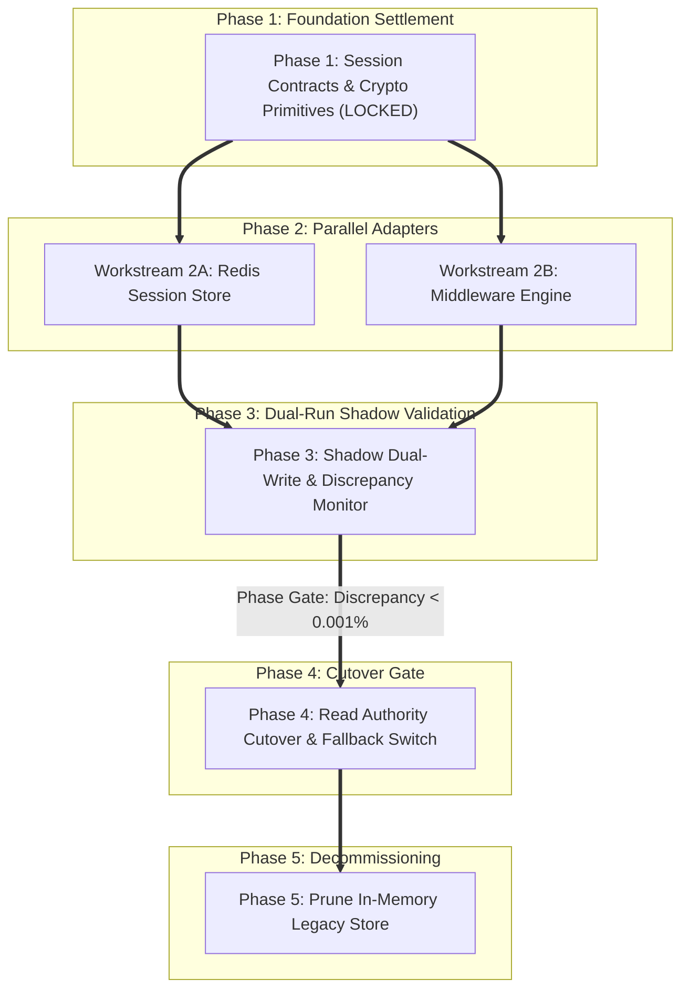

# Epic Plan Walkthrough: Distributed Session Migration

> **Context**: Migrating a high-throughput Go backend from an in-memory session store to a distributed Redis session cluster with AES-GCM encryption.  
> **Traceability**: `REQ-200` to `REQ-205` | `ADR-031` (Dual-Run Strangler-Fig Migration).  
> **Cognitive Mode**: `epic` (Multi-phase, 12 files, zero-downtime cutover).

---

## 1 · Phase Architecture & Phase Gates

---

## 2 · Phase Breakdown & Tasks

### Phase 1: Foundation Settlement (Must Land & Pass First)
* **`T01`**: Define `Session` struct, `SessionStore` interface, and error codes in `pkg/session/types.go`.
* **`T02`**: Implement AES-256-GCM session encryptor in `pkg/session/crypto.go`.
* *Phase 1 Gate*: `go test -v ./pkg/session/... && go vet ./pkg/session/...` green before starting Phase 2.

### Phase 2: Parallel Adapter Implementations (Disjoint Files)
* **`T03`** (Workstream A): Implement `RedisSessionStore` with connection pooling in `internal/session/redis_store.go`.
  - Target files: `internal/session/redis_store.go`, `internal/session/redis_store_test.go`
  - Post-verification: `go test -v -race ./internal/session/ -run TestRedisStore`
* **`T04`** (Workstream B): Implement `SessionMiddleware` with context injection in `internal/middleware/session.go`.
  - Target files: `internal/middleware/session.go`, `internal/middleware/session_test.go`
  - Post-verification: `go test -v ./internal/middleware/ -run TestSessionMiddleware`

### Phase 3: Shadow Dual-Run & Discrepancy Monitoring
* **`T05`**: Implement `DualWriteSessionStore` that writes to both legacy and Redis stores asynchronously, logging discrepancies to Prometheus.
  - Post-verification: `go test -v ./internal/session/ -run TestDualWriteDiscrepancy`
* *Phase 3 Gate*: Run load test in staging; verify discrepancy metric == 0 for 100,000 requests.

### Phase 4: Read Authority Cutover & Point-of-No-Return Gate
* **`T06`**: Switch primary read authority to `RedisSessionStore` via dynamic config flag.
* **Point-of-No-Return Contingency**: If Redis error rate exceeds 0.05%, dynamic flag automatically falls back to in-memory store within 2 seconds.

### Phase 5: Decommissioning & Cleanup
* **`T07`**: Delete legacy in-memory session implementation and prune dead imports.
  - Post-verification: `go build ./... && go test -v ./...`
