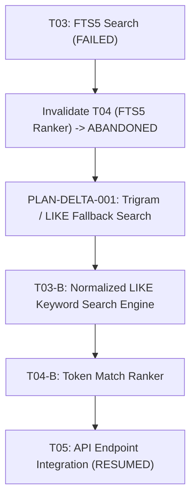

# Rescue & Re-Planning Trace: Circuit Breaker Recovery

> **Context**: Mid-flight execution encounters a fatal environmental constraint. The agent trips the Anti-Thrashing Circuit Breaker, halts execution, audits invalidated assumptions, and executes an authorized re-plan via the `PLAN-DELTA` protocol.

---

## 1 · The Failure & Circuit Breaker Trip

### Initial Plan State
* **Task T03**: Implement full-text search indexing via SQLite FTS5 extension.
* **Target Files**: `src/db/search.py`, `tests/test_search.py`
* **Verification Command**: `pytest tests/test_search.py -v`

### First Attempt & Failure
1. The agent modifies `src/db/search.py` to create virtual table `USING fts5(...)`.
2. Runs verification: `pytest tests/test_search.py -v`
3. Output: `sqlite3.OperationalError: no such module: fts5` (Failure 1).

### Second Attempt & Failure
1. The agent attempts to load extension dynamically via `conn.enable_load_extension(True)`.
2. Runs verification: `pytest tests/test_search.py -v`
3. Output: `AttributeError: 'sqlite3.Connection' object has no attribute 'enable_load_extension'` (Failure 2).

### Circuit Breaker Action: IMMEDIATE FREEZE
$$\text{Consecutive Failures } \ge 2 \implies \text{TRIP CIRCUIT BREAKER}$$

The agent **halts all code editing immediately**. It does not speculate or attempt a third workaround.

---

## 2 · State Quarantine & Attribution Forensics

In `PLAN.md`, the agent marks Task `T03` as `FAILED` and records the forensic finding:

```markdown
### Task T03: SQLite FTS5 Full-Text Search [FAILED]
- **Failure Forensics**:
  - The runtime Python/SQLite binary was compiled without FTS5 and without `enable_load_extension` support.
  - Continuing with FTS5 will never succeed in this environment.
- **Circuit Breaker Status**: TRIPPED. Execution frozen.
```

---

## 3 · The `PLAN-DELTA` Synthesis

The agent triggers the re-planning protocol:



### Emitted Plan Mutation (`PLAN-DELTA-001`) in `PLAN.md`

```markdown
## PLAN-DELTA-001: Fallback from FTS5 to Normalized Keyword Search
- **Trigger**: System SQLite lacks FTS5 extension support.
- **Pruned Tasks**:
  - `T04: FTS5 BM25 Ranker` -> `ABANDONED` (Pruned: FTS5 unavailable)
- **New Tasks Appended**:
  - `T03-B: Normalized Keyword Search Engine`
    - Target: `src/db/search.py` (Using lowercase token matching + B-tree index)
    - Post-verification: `pytest tests/test_search.py -v`
  - `T04-B: In-Memory Token Match Ranker`
    - Target: `src/services/ranker.py`
    - Post-verification: `pytest tests/test_ranker.py -v`
- **Downstream Reconnected**: `T05` re-wired to depend on `T04-B`.
```

---

## 4 · Resumed Execution & Verification

1. The agent resets the circuit breaker.
2. Implements `T03-B` in `src/db/search.py` using standard SQL `LIKE` with normalized tokens.
3. Runs post-verification: `pytest tests/test_search.py -v` $\to$ **PASSED (exit code 0)**.
4. Marks `T03-B` as `DONE`.
5. Advances to `T04-B` with zero drift and zero residual debt.
