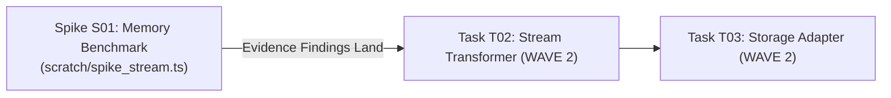

# Spike & Unknowns Walkthrough: Resolving Stream Buffering

> **Scenario**: Building a multi-gigabyte file export pipeline. The agent must determine whether the cloud storage SDK buffers uploads in RAM (risking OOM under container memory limits) or supports true zero-copy backpressure streaming.  
> **Reversal Cost**: $C_{\text{reversal}} > 4\text{ hours}$ (if architecture requires refactoring stream plumbing later).  
> **Action**: Quarantine downstream tasks and execute an isolated **Investigation Spike**.

---

## 1 · Initial Plan State with Quarantined Wave



```markdown
### Spike S01: Memory Footprint of Cloud Storage Multi-Part Upload
- **Hypothesis**: Multi-part streaming via `@aws-sdk/lib-storage` consumes $< 50\text{MB}$ RSS during a 2GB file upload under backpressure.
- **Target Files**: `scratch/spike_stream.ts` (DISPOSABLE BENCHMARK)
- **Status**: `IN_PROGRESS`

### Downstream Tasks (FROZEN UNTIL S01 PASSES)
- **T02**: Implement ExportPipelineTransformer (Status: `BLOCKED_BY_S01`)
- **T03**: Implement S3MultipartUploader (Status: `BLOCKED_BY_S01`)
```

---

## 2 · Disposable Spike Benchmark Script

The agent writes a temporary script in `scratch/spike_stream.ts`:

```typescript
import { Upload } from "@aws-sdk/lib-storage";
import { S3Client } from "@aws-sdk/client-s3";
import { Readable } from "node:stream";

// Generate 1GB synthetic stream
function createByteStream(sizeBytes: number) {
  let emitted = 0;
  return new Readable({
    read(size) {
      if (emitted >= sizeBytes) return this.push(null);
      const chunk = Buffer.alloc(Math.min(size, sizeBytes - emitted), 0xaa);
      emitted += chunk.length;
      this.push(chunk);
    }
  });
}

const s3 = new S3Client({ endpoint: "http://localhost:4566", region: "us-east-1" });
const initialMem = process.memoryUsage().rss;

const upload = new Upload({
  client: s3,
  params: { Bucket: "test-bucket", Key: "spike.bin", Body: createByteStream(1024 * 1024 * 1024) },
  queueSize: 4,
  partSize: 5 * 1024 * 1024
});

await upload.done();
const peakMem = process.memoryUsage().rss;
console.log(`Peak RSS Delta: ${(peakMem - initialMem) / 1024 / 1024} MB`);
```

---

## 3 · Spike Findings (`SPIKE_REPORT.md`)

```markdown
# Spike Report S01: S3 Multi-Part Stream Buffering
- **Date**: 2026-09-25
- **Hypothesis Confirmed**: YES.
- **Empirical Metric**: Peak RSS delta measured at `24.2 MB` for a 1GB stream using `queueSize: 4` and `partSize: 5MB`.
- **Architectural Conclusion**: Safe to proceed with direct PassThrough streaming without intermediate disk buffering. Container memory ceiling of 256MB is fully respected.
```

---

## 4 · Unblocking Wave 2 Execution

With empirical evidence confirmed:
1. Delete disposable `scratch/spike_stream.ts`.
2. Mark `S01` as `DONE` in `PLAN.md`.
3. Elaborate `T02` and `T03` with exact configurations (`partSize: 5MB`, `queueSize: 4`).
4. Transition `T02` from `BLOCKED` to `PENDING` and begin execution.
