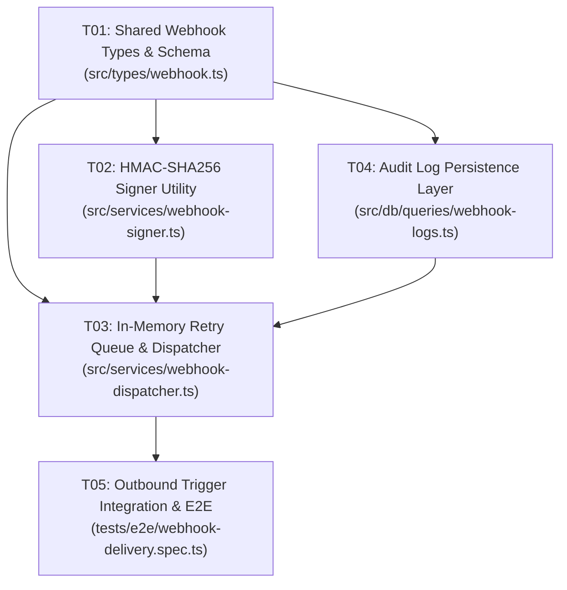

# Standard Feature Plan Walkthrough: Webhook Signature & Delivery Engine

> **Context**: Building an outbound HMAC-SHA256 signed webhook delivery pipeline in a TypeScript/Node.js service.  
> **Requirements**: `REQ-101` (HMAC Signing), `REQ-102` (Exponential Backoff Retry), `REQ-103` (Delivery Audit Log).  
> **Architecture Decision**: `ADR-012` (In-process queue with SQLite audit logging).

---

## 1 · Task Progress Matrix (Dependency DAG)

| ID | Task Description | Target Files | Blocked By | Status |
| :--- | :--- | :--- | :--- | :--- |
| `T01` | Define WebhookPayload, Headers & DeliveryLog types | `src/types/webhook.ts` | — | `DONE` |
| `T02` | Implement HMAC-SHA256 signature generator | `src/services/webhook-signer.ts`, `*.test.ts` | `T01` | `DONE` |
| `T04` | Implement WebhookDeliveryLog SQLite store | `src/db/queries/webhook-logs.ts`, `*.test.ts` | `T01` | `DONE` |
| `T03` | Implement WebhookDispatcher with backoff retry | `src/services/webhook-dispatcher.ts`, `*.test.ts` | `T02`, `T04` | `IN_PROGRESS` |
| `T05` | End-to-end delivery journey & failure test | `tests/e2e/webhook-delivery.spec.ts` | `T03` | `PENDING` |

---

## 2 · Detailed Task Specifications

### Task T01: Define Shared Webhook Types & Schema
- **Requirement**: `REQ-101`, `REQ-103`
- **Target Files**: `src/types/webhook.ts` (NEW)
- **Pre-check**: `npx tsc --noEmit` (passes green)
- **Mutation Scope**: Export interfaces `WebhookPayload`, `SignedHeaders`, and `WebhookDeliveryLog`.
- **Post-verification**: `npx tsc --noEmit` (type checks with zero errors)
- **Blocked By**: NONE
- **Status**: `DONE`

---

### Task T02: Implement HMAC-SHA256 Signer Utility
- **Requirement**: `REQ-101`
- **Target Files**:
  - `src/services/webhook-signer.ts` (NEW)
  - `src/services/webhook-signer.test.ts` (NEW)
- **Pre-check**: `npm test -- src/services/webhook-signer.test.ts` (file not found / passes 0)
- **Mutation Scope**: Implement `generateWebhookSignature(payload: string, secret: string): string` using Node crypto.
- **Post-verification**: `npm test -- src/services/webhook-signer.test.ts` (verifies valid signature & negative invalid secret test)
- **Blocked By**: `T01`
- **Status**: `DONE`

---

### Task T04: Implement WebhookDeliveryLog SQLite Store
- **Requirement**: `REQ-103`
- **Target Files**:
  - `src/db/queries/webhook-logs.ts` (NEW)
  - `src/db/queries/webhook-logs.test.ts` (NEW)
- **Pre-check**: `npm test -- src/db/queries/webhook-logs.test.ts`
- **Mutation Scope**: Implement `recordDeliveryAttempt(log: WebhookDeliveryLog): Promise<void>`.
- **Post-verification**: `npm test -- src/db/queries/webhook-logs.test.ts`
- **Blocked By**: `T01`
- **Status**: `DONE`

---

### Task T03: Implement WebhookDispatcher with Exponential Backoff
- **Requirement**: `REQ-102`
- **Target Files**:
  - `src/services/webhook-dispatcher.ts` (NEW)
  - `src/services/webhook-dispatcher.test.ts` (NEW)
- **Pre-check**: Tasks `T02` and `T04` marked `DONE`
- **Mutation Scope**: Integrate `WebhookSigner` and `recordDeliveryAttempt`; implement 3-attempt backoff with jitter.
- **Post-verification**: `npm test -- src/services/webhook-dispatcher.test.ts` (mock HTTP server verifying 3 retries on 500)
- **Blocked By**: `T02`, `T04`
- **Status**: `IN_PROGRESS`

---

### Task T05: End-to-End Delivery Journey & Failure Verification
- **Requirement**: `REQ-101`, `REQ-102`, `REQ-103`
- **Target Files**:
  - `tests/e2e/webhook-delivery.spec.ts` (NEW)
- **Pre-check**: Task `T03` marked `DONE`
- **Mutation Scope**: Integration test triggering event $\to$ dispatching signed payload $\to$ asserting audit log row.
- **Post-verification**: `npm test -- tests/e2e/webhook-delivery.spec.ts`
- **Blocked By**: `T03`
- **Status**: `PENDING`

---

## 3 · Thermo-Nuclear Pruning Audit

* **Pruned**: Removed speculative `RedisQueueAdapter` and `DistributedWorkerCluster`. The system workload envelope is $< 50\text{ req/sec}$; in-process async dispatch with SQLite durability satisfies all requirements without external infrastructure.
* **Pruned**: Inlined payload serialization instead of creating an `AbstractPayloadSerializerFactory`.
