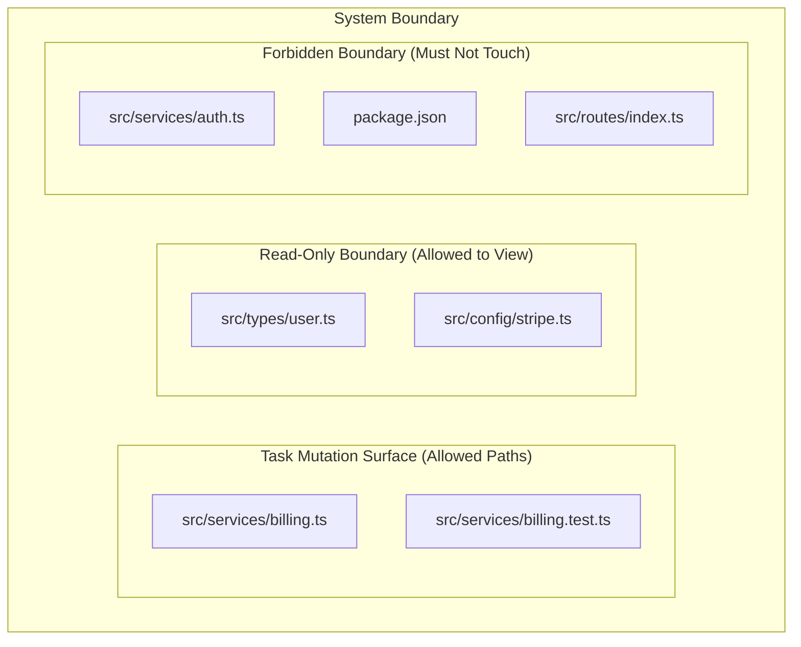
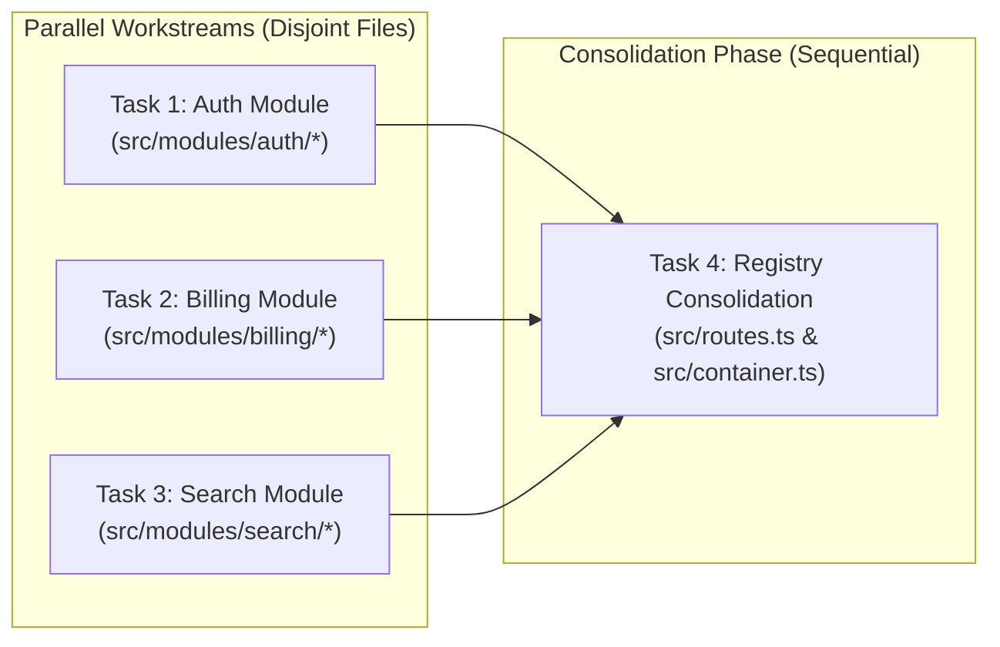

# Boundary Cartography & File Ownership

> **Mandate**: *Every mutation must have an unambiguous, bounded home.* Ambiguous file ownership causes merge conflicts, overwritten code, and uncontrolled blast radiuses. Every task must declare its exact `Target Files`—no two concurrent tasks may claim mutation authority over the same file.

---

## 1 · The Blast-Radius Containment Principle

A well-architected plan enforces strict spatial containment on every change:



### The 3 Boundary Rings
1. **Target Mutation Surface (`Target Files`)**: The exclusive list of files this specific task creates or modifies.
2. **Read-Only Context**: Files the agent may inspect for interfaces, constants, or patterns, but **must not modify**.
3. **Forbidden Boundary**: Shared configurations, core entrypoints, or unrelated subsystems strictly quarantined from mutation during this task.

---

## 2 · Disjoint Ownership for Safe Concurrency

When tasks are scheduled in parallel (either within a single agent session or dispatched via `multi-agent-orchestration`):

$$\text{TargetFiles}(T_i) \cap \text{TargetFiles}(T_j) = \emptyset \quad \forall \; i \ne j \quad \text{where } T_i \parallel T_j$$

### Concurrency Collision Rules
* **Strict Disjointness**: If Task A and Task B execute concurrently, their target file sets must be completely disjoint.
* **Shared File Serialization**: If both Task A and Task B need to touch `src/routes.ts`, they **cannot run concurrently**.
  - *Option 1*: Sequence them ($T_A \to T_B$).
  - *Option 2*: Defer shared registration to a dedicated **Consolidation Task** ($T_A \parallel T_B \to T_{\text{consolidate}}$).

---

## 3 · The Shared Registry Consolidation Pattern

In real-world applications, many independent vertical slices need to register with a central file (e.g., dependency injection container, route table, plugin registry, or root exports):



By decoupling module implementation from central registration, modules are built and tested in parallel without touching the shared bottleneck. The consolidation task then wires all completed modules into the main application in a single, atomic pass.

---

## 4 · Boundary Declaration Syntax

In `PLAN.md`, every task explicitly states its boundary:

```markdown
- **Target Files**:
  - `src/features/reports/generator.ts` (NEW)
  - `src/features/reports/generator.test.ts` (NEW)
- **Read-Only References**:
  - `src/types/reports.ts`
  - `src/db/queries/metrics.ts`
- **Forbidden Paths**:
  - `src/index.ts` (Registration reserved for Task 008)
  - `package.json` (Locked)
```
