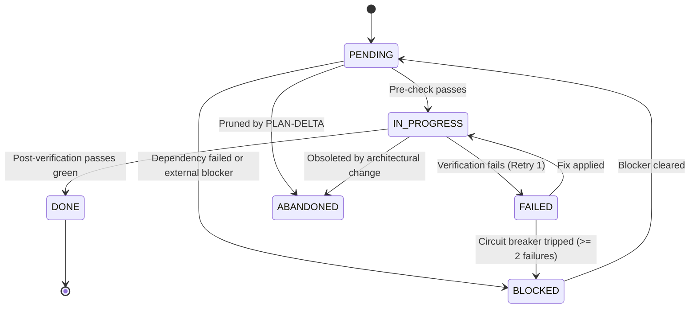
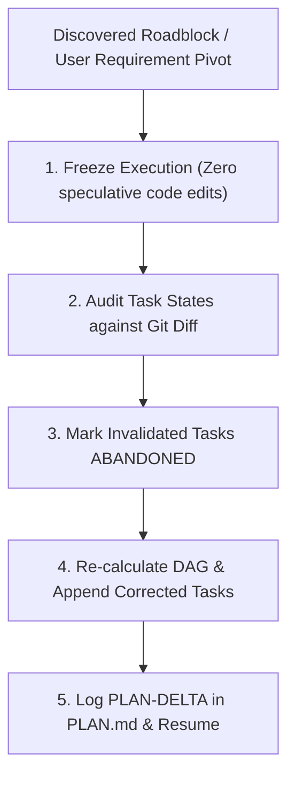

# Persistent State, Drift Detection & Re-Planning

> **Mandate**: *Working memory must outlive context windows.* Long engineering sessions compress, truncate, or refresh LLM context. If plan state lives solely in conversational messages, the agent will lose coherence, duplicate work, or forget unverified tasks. Plan state must reside in a durable, persistent markdown file (`PLAN.md`), synchronized continuously with git working tree reality.

---

## 1 · The Canonical `PLAN.md` Schema

For `standard` and `epic` modes, emit and maintain `PLAN.md` at the project or module root:

```markdown
# Implementation Plan: [Feature / Initiative Name]

> **Status**: IN_PROGRESS  
> **Traceability**: REQ-042, REQ-043 | ADR-007  
> **Last Verified Commit**: `a1b2c3d`  
> **Current Wave**: Wave 1 (Foundations & Core Slices)

---

## 1 · Task Progress Matrix

| ID | Task Description | Target Files | Blocked By | Status |
| :--- | :--- | :--- | :--- | :--- |
| `T01` | Define Auth DTOs & Session Schema | `src/types/auth.ts` | — | `DONE` |
| `T02` | Implement JWT Token Signer | `src/auth/signer.ts` | `T01` | `DONE` |
| `T03` | Implement OAuth Callback Handler | `src/auth/handler.ts` | `T02` | `IN_PROGRESS` |
| `T04` | Register Auth Routes in Server | `src/server.ts` | `T03` | `PENDING` |
| `T05` | End-to-End Auth Journey Test | `tests/e2e/auth.spec.ts` | `T04` | `PENDING` |

---

## 2 · Detailed Task Specifications

### Task T03: Implement OAuth Callback Handler
- **Requirement**: `REQ-042`
- **Target Files**:
  - `src/auth/handler.ts` (NEW)
  - `src/auth/handler.test.ts` (NEW)
- **Pre-check**: `npm test -- src/auth/signer.test.ts` (passes green)
- **Mutation Scope**: Implement state validation and exchange auth code for session JWT.
- **Post-verification**: `npm test -- src/auth/handler.test.ts`
- **Blocked By**: `T02`
- **Status**: `IN_PROGRESS`

---

## 3 · Assumptions & Risk Register

| Risk / Assumption | Impact | Mitigation / Spike Task | Status |
| :--- | :--- | :--- | :--- |
| OAuth provider rate limit on token exchange | Medium | Added mock fixture in unit tests | Verified |
```

---

## 2 · The 6-State Task Machine & Transition Rules



### Transition Invariants
1. **No Leapfrogging**: A task cannot move from `PENDING` to `DONE` without entering `IN_PROGRESS` and running its post-verification command.
2. **Deterministic Completion**: A task can only reach `DONE` if its post-verification command executed with exit code 0 and all assertions passed.
3. **Blocker Containment**: When a task moves to `BLOCKED` or `FAILED`, all downstream tasks in the DAG (`blocks`) are automatically frozen in `PENDING`.

---

## 3 · Drift Detection & Git-Diff Reconciliation

Plan drift occurs when the files on disk diverge from what `PLAN.md` recorded (e.g. manual edits by a human, unexpected build artifacts, or uncommitted edits).

### Pre-Execution Reconciliation Algorithm
Before picking up the next task from `PLAN.md`:
1. Run `git status -s` to inspect the working tree.
2. Compare modified files against the `Target Files` of the task marked `IN_PROGRESS`.
3. If uncommitted files belong to another task or are unrecorded:
   - **Stop and reconcile**: Do not proceed until uncommitted state is either committed as part of the previous task, stashed, or incorporated into the plan.

---

## 4 · The `PLAN-DELTA` Re-Planning Protocol

When an upstream assumption fails or the user introduces a requirement change mid-flight:



1. **Freeze Execution**: Stop editing immediately.
2. **Audit Completed Tasks**: Tasks marked `DONE` that remain valid stay `DONE`.
3. **Prune Invalidated Tasks**: Mark pending tasks whose premise is invalidated as `ABANDONED` with an explicit reason note.
4. **Append Corrected Tasks**: Insert new or modified tasks into the DAG with fresh verification triads.
5. **Log Delta**: Add a `PLAN-DELTA-xxx` entry in `PLAN.md` documenting why the plan mutated before resuming execution.
