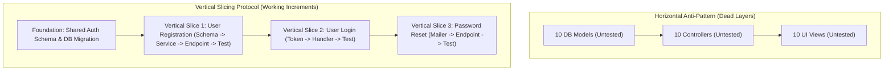
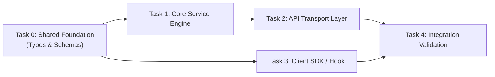

# Task Decomposition & Dependency DAG Synthesis

> **Mandate**: *Software grows like an organism, not a skyscraper.* Decompose work into thin, functional **vertical slices** rather than dead horizontal layers. Order all tasks into a strict Directed Acyclic Graph (DAG) where shared foundations precede consumers, cyclic dependencies are mathematically impossible, and the critical path is visibly managed.

---

## 1 · Vertical Slices vs. Horizontal Dead Layers

### The Horizontal Layering Pathology
In traditional waterfall engineering, agents make the mistake of building horizontally:
* *Task 1*: Create 10 empty database tables.
* *Task 2*: Create 10 dead model files.
* *Task 3*: Create 10 skeleton controllers.
* *Task 4*: Try to wire everything together and spend hours debugging 50 disjoint errors.

### The Vertical Slicing Law (Gall's Law in Action)
A complex system that works invariably evolved from a simple system that worked. Slice functionality vertically from contract to storage:

Every vertical slice must:
1. Touch all necessary layers for a single, narrow capability.
2. Produce a working, testable increment.
3. Be verifiable immediately via automated tests without waiting for downstream slices.

---

## 2 · Topological Sorting & DAG Construction

### Mathematical Invariants of the Task DAG
A task graph $G = (V, E)$ consists of tasks $V$ and dependency edges $E$ where edge $(u, v)$ signifies that task $u$ must complete (`DONE`) before task $v$ can begin (`IN_PROGRESS`).

1. **Acyclicity**: $\forall v \in V$, there is no path from $v$ to $v$. Cyclic dependencies ($A \to B \to A$) indicate an architectural boundary violation and must be resolved by extracting a shared foundation.
2. **Topological Order**: Tasks must be sorted such that for every directed edge $(u, v)$, $u$ precedes $v$ in the execution sequence.
3. **Single Foundation Root**: Shared primitives always sit at root depth ($d=0$).

---

## 3 · Foundation-First Ordering Discipline

When decomposing a feature or system, partition tasks into two strict tiers:

### Tier 1: Shared Foundations (Root Tasks)
These primitives must land, compile, pass tests, and be committed before any leaf work begins:
* Database migrations and schema definitions.
* Core type definitions, domain interfaces, and Protobuf/OpenAPI contracts.
* Dependency manifest updates (`package.json`, `Cargo.toml`, `go.mod`).
* Global configuration schemas and environment variable mappings.

### Tier 2: Leaf Implementations (Vertical Slices)
Once foundations are locked, independent leaf slices can execute sequentially or in parallel without file collisions or schema churn.

---

## 4 · Task Sizing Heuristics (The Goldilocks Zone)

Neither micro-fragmentation nor monolithic vagueness is permitted:

| Dimension | Anti-Pattern: Micro-Fragmentation | Anti-Pattern: Monolithic Blob | The Goldilocks Target |
| :--- | :--- | :--- | :--- |
| **Scope** | *"Add 1 import line in file A"* | *"Implement full authentication system"* | **1 Bounded Mutation Surface**: 1 service, 1 endpoint, or 1 cohesive component. |
| **File Count** | 1 file, 2 lines of change. | 15 files across 4 subsystems. | **1–4 tightly coupled files** (e.g. implementation + test + contract). |
| **Duration** | $< 1$ minute of cognitive execution. | 45 minutes of unbounded coding. | **1 atomic verification cycle** (5–15 minutes). |
| **Testability** | Cannot be tested independently. | Requires 20 tests across entire system. | **Self-contained test unit** (1 test command validates the slice). |

---

## 5 · Critical Path Method (CPM) for Parallel Execution

In complex plans, identify the **Critical Path**—the sequence of dependent tasks that determines the absolute minimum time to project completion:

* **Critical Tasks**: Tasks with zero slack (delaying them delays the entire project). Focus maximum attention and verification rigor here.
* **Non-Critical Tasks**: Independent leaf tasks with positive slack (e.g. documentation, client SDK bindings, telemetry hooks) that can be parallelized or dispatched to subagents without blocking the main line.
