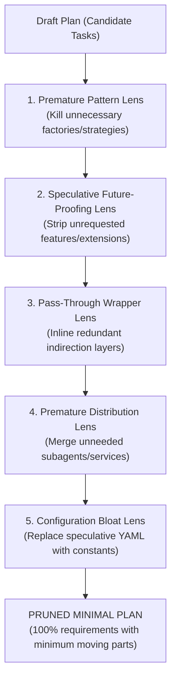

# Thermo-Nuclear Plan Simplification

> **Mandate**: *Complexity is the primary graveyard of software initiatives.* Autonomous agents naturally tend to over-engineer—introducing speculative factory wrappers, premature extensibility hooks, redundant helper classes, and 8-phase rollouts for 30 lines of work. Phase 4 of the planning lifecycle forces every plan through the **Thermo-Nuclear Challenge**: strip every non-essential moving part so the implementation remains simple, maintainable, and robust.

---

## 1 · The 5 Adversarial Pruning Lenses

Before an implementation plan is released for execution, challenge every single task and architectural boundary against these 5 lenses:

### Lens 1: Accidental Abstraction & Premature Patterns
* **The Symptom**: A task creates an `AbstractTokenValidatorFactory` with an `ITokenValidationStrategy` to support exactly one Google OAuth token.
* **The Challenge**: *Will this interface have $\ge 2$ production implementations in this pull request?* If no, delete the interface and factory. Implement a direct, cohesive class or function.

### Lens 2: Speculative Future-Proofing & Gold-Plating
* **The Symptom**: Planning caching layers, multi-tenant database shims, or dynamic event hooks for a feature that only requested a basic CLI utility.
* **The Challenge**: *Does a verified requirement in `requirements-analysis` explicitly demand this capability?* If no, strip it immediately. Push it to Non-Goals.

### Lens 3: Redundant Intermediate Wrappers (Pass-Through Layers)
* **The Symptom**: Layer A calls Layer B, which calls Layer C, which calls Layer D, with zero data transformation or policy enforcement happening in B and C.
* **The Challenge**: *What failure domain or policy does this intermediate layer defend?* If none, inline it. Two well-bounded layers beat four hollow ones.

### Lens 4: Premature Distribution & Agent Swarms
* **The Symptom**: Spawning 4 subagents to modify 3 files in the same directory, or creating a separate microservice for a simple internal utility.
* **The Challenge**: *Can this run efficiently in-process or in a single focused agent session?* If yes, use a single agent. Orchestration overhead must earn its keep.

### Lens 5: Configuration Bloat
* **The Symptom**: Adding 10 new environment variables, YAML config files, and runtime flags for things that have known, static values.
* **The Challenge**: *Will an operator genuinely need to change this without redeploying code?* If no, use a private constant.

---

## 2 · The Thermo-Nuclear Challenge Checklist

Run this quick checklist before approving any plan:

- [ ] **Can Task B be folded into Task A without violating blast radius?** If Task A creates a DTO and Task B creates the service using it, merge them.
- [ ] **Are there tasks whose sole purpose is creating empty boilerplate or stubs?** Delete them; create files when their active logic is written.
- [ ] **Can this 6-step plan be executed cleanly in 3 vertical slices?**
- [ ] **Are all proposed third-party dependencies strictly necessary?** (Refer to `solution-discovery` triviality threshold).
- [ ] **Does every task directly trace to a validated `REQ-xxx`?**
