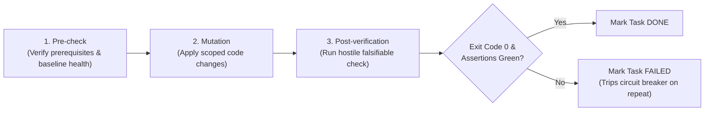

# Verification & Testing Triads

> **Mandate**: *An unverified task is an unfinished task; a self-attested task is an unverified task.* Never accept "the code looks clean" or "it should compile" as evidence of completion. Every task must be bound to a deterministic, falsifiable Verification Triad: $\langle \text{Pre-check}, \text{Mutation}, \text{Post-verification} \rangle$.

---

## 1 · The Anatomy of the Verification Triad

Every task encapsulates an empirical transformation cycle:

1. **Pre-check**: A deterministic command or inspection confirming that dependencies exist and the existing baseline is green before mutation.
2. **Mutation**: The strictly scoped file creations or modifications.
3. **Post-verification**: An automated command executing a compiler, unit test, linter, or end-to-end assertion confirming that the mutation behaves correctly and introduced zero regressions.

---

## 2 · The Universal Toolchain Verification Matrix

Verification must be native to the project's runtime and tooling. Use concrete toolchain commands:

| Language / Stack | Pre-Check Command | Post-Verification Command | Regression Shield Command |
| :--- | :--- | :--- | :--- |
| **Rust** | `cargo check` | `cargo test -p <pkg> --test <test_name>` | `cargo clippy --all-targets -- -D warnings` |
| **TypeScript / Node** | `npm test -- <test_path> --watch=false` | `npm test -- <test_path>` | `npx tsc --noEmit && npm run lint` |
| **Python** | `pytest <test_file> -q` | `pytest <test_file> -v` | `ruff check . && mypy <target_path>` |
| **Go** | `go vet ./...` | `go test -v -run <TestName> ./...` | `go test -race ./...` |
| **C / C++ (CMake)** | `cmake --build build --target <target>` | `ctest --test-dir build -R <test_name>` | Valgrind / ASan run |
| **Java / Kotlin** | `./gradlew test --dry-run` | `./gradlew test --tests "<TestPattern>"` | `./gradlew check` |
| **C# / .NET** | `dotnet build --no-incremental` | `dotnet test --filter "FullyQualifiedName~<Test>"` | `dotnet format --verify-no-changes` |
| **Swift** | `swift build` | `swift test --filter <TestClass>` | `swift test` |
| **SQL / Migrations** | `migrate status` | `migrate up 1 && migrate down 1 && migrate up 1` | Re-run schema validator |

---

## 3 · Hostile Empirical Verification (Popperian Falsifiability)

Verification is meaningful only if it has the genuine power to **fail**.

### Falsifiability Rules
* **No Subjective Self-Attestation**: Never write *"Verification: Manually review the file to ensure proper structure."* This is not verification.
* **Negative Assertions (Boundary Falsification)**: For every valid happy-path test, verify at least one invalid/unwanted boundary condition (e.g. invalid auth token returns 401, empty payload returns 400).
* **Test Isolation**: A task's verification command should execute quickly (ideally $< 10$ seconds) and test the specific slice, reserving the full end-to-end suite for phase-gate checkpoints.

---

## 4 · Hermetic Verification & Flakiness Elimination

If a verification command touches a flaky third-party external service, the verification is compromised:

* **No Ambient Network Calls in Task Verification**: Task-level post-checks must run hermetically against local mocks, recorded network fixtures, or in-memory databases.
* **Flake Attribution**: If a test fails, determine whether the failure is in the newly mutated code or an external environmental condition before declaring a task `FAILED`.
