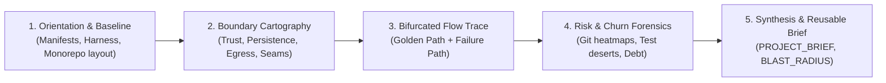
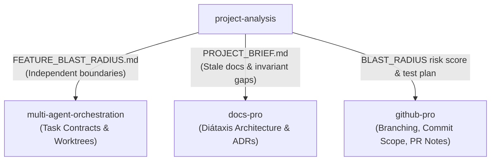

# Project Analysis: Autonomous Codebase Inspection Protocol

> **Mandate**: Understand before modifying. Ground every assertion in verifiable code reality, trace execution paths across both golden and failure paths, map system boundaries rather than browsing files alphabetically, separate evidence from hypothesis, and produce durable, token-efficient mental models that downstream agents can immediately consume.

---

## 1 · Adaptive Analysis Lifecycle

Never propose or apply code mutations to an unfamiliar repository before understanding it. Execute every analysis task through this disciplined 5-phase pipeline:

1. **User Intent & Mode Sizing**: Decode whether the task is a quick bug check, a pre-flight feature check, a full repository onboarding, or a legacy forensic audit (see Section 2).
2. **Phase 1 — Macro Orientation & Baseline Health**: Fingerprint the ecosystem, runtime, build harness, and monorepo workspace boundaries. Record pre-existing build/test breakages without modifying any files.
3. **Phase 2 — Boundary & Topology Cartography**: Map trust perimeters, data/persistence tiers, external integration egress, and internal package seams (see [`references/boundary-and-topology-mapping.md`](references/boundary-and-topology-mapping.md)).
4. **Phase 3 — Bifurcated Execution Tracing**: Trace canonical user journeys from ingress to terminal state, inspecting *both* the Golden Path and the Failure/Rollback Path (see [`references/vertical-flow-tracing.md`](references/vertical-flow-tracing.md)).
5. **Phase 4 — Risk, Churn & Testing Forensics**: Identify git churn hotspots, dark corners without test coverage, and documentation drift (see [`references/risk-and-hotspot-forensics.md`](references/risk-and-hotspot-forensics.md)).
6. **Phase 5 — Contract Synthesis & Stopping Gate**: Synthesize findings into durable markdown artifacts (`PROJECT_BRIEF.md` or `FEATURE_BLAST_RADIUS.md`) tagged with epistemic certainty tiers, and halt immediately once the stopping contract is satisfied (see Section 5 and [`references/artifact-schemas.md`](references/artifact-schemas.md)).

---

## 2 · Mode Selection (Cognitive Sizing)

Before initiating analysis, classify the engagement into exactly one mode based on the user's objective:

| Mode | Trigger & Objective | Scope of Inspection | Target Output |
| :--- | :--- | :--- | :--- |
| **`triage`** | Quick bug fix, localized query, or "where does X happen?" | Locate entrypoint, trace one relevant call path, report exact change location. | Concise chat response with line-anchored file pointers. |
| **`feature_preflight`** | Planning a new feature, schema change, or targeted refactoring. | Map mutation surface, upstream callers, downstream side effects, test gaps, and risk score. | `FEATURE_BLAST_RADIUS.md` deliverable. |
| **`system_onboarding`** | Exploring a new repo, authoring an architecture map, or multi-agent onboarding. | Full 5-phase funnel: ecosystem, topology, bifurcated flows, invariants, and directory semantics. | `PROJECT_BRIEF.md` + `SYSTEM_TOPOLOGY.md`. |
| **`forensic_audit`** | Legacy tech debt evaluation, security audit, or major framework migration. | Deep git churn heatmaps, test coverage topology, architectural drift audit, and dead code analysis. | `RISK_MATRIX.md` + `DEBT_INVENTORY.md`. |

---

## 3 · The Epistemic Evidence Ladder

Documentation drifts; live code and passing tests do not. Every claim in an analysis artifact must declare its evidence grounding tier:

| Tier | Source of Truth | Reliability | Tag Syntax |
| :---: | :--- | :--- | :--- |
| **1** | Passing test assertions, compiler/linter output, active CI configs. | **Absolute Ground Truth** | `[VERIFIED: tests/...#L42]` |
| **2** | Concrete code definitions, AST exports, public interfaces, types. | **Structural Truth** | `[CODE: src/...#L15]` |
| **3** | Package manifests (`package.json`, `Cargo.toml`), Dockerfiles, env schemas. | **Config Truth** | `[CONFIG: Cargo.toml#L8]` |
| **4** | Code comments, `README.md`, ADRs, wiki documentation. | **Stated Intent** *(untrusted until cross-checked)* | `[STATED: docs/...]` |
| **5** | LLM deductions, mental models, unverified architectural guesses. | **Hypothesis** *(must state verification criteria)* | `[HYPOTHESIS: reason]` |

**Never present a Tier 4 or 5 inference as a verified architectural fact.** *(Deep guide: [`references/epistemic-evidence-tiers.md`](references/epistemic-evidence-tiers.md).)*

---

## 4 · Universal System Invariants & Archetypes

Software systems across all languages and decades conform to the **Universal Invariants**:
$$\text{Stimulus / Ingress} \longrightarrow \text{Boundary Validation} \longrightarrow \text{State Transformation} \longrightarrow \text{Persistence / Memory} \longrightarrow \text{Egress / Actuation}$$

The protocol translates seamlessly across any project archetype:
- **Web / API Services**: HTTP/gRPC $\rightarrow$ Auth middleware $\rightarrow$ Domain service $\rightarrow$ Database/Cache $\rightarrow$ HTTP response.
- **Frontend & Mobile**: User gesture / Route $\rightarrow$ Event handler $\rightarrow$ State store $\rightarrow$ Storage/SQLite $\rightarrow$ UI render.
- **CLI Tools & Daemons**: POSIX flags / STDIN $\rightarrow$ Parser $\rightarrow$ Stream processing $\rightarrow$ Filesystem $\rightarrow$ STDOUT / Exit code.
- **Libraries & SDKs**: Public API call / FFI $\rightarrow$ Argument check $\rightarrow$ Pure algorithm $\rightarrow$ In-memory data $\rightarrow$ Return value.
- **Data & ML Pipelines**: Cron / Kafka $\rightarrow$ Schema check $\rightarrow$ DAG transform / Backprop $\rightarrow$ Data lake $\rightarrow$ Output table.
- **IaC & GitOps**: `git push` / CLI $\rightarrow$ Linter $\rightarrow$ State diff / Graph resolution $\rightarrow$ Cloud API $\rightarrow$ State file.
- **AI Agent Systems**: User prompt / Tool result $\rightarrow$ Context budget $\rightarrow$ Reasoning loop $\rightarrow$ Working tree $\rightarrow$ Response / Action.

*(Platform-agnostic execution scripts for PowerShell, Bash, and native file tools: [`references/tool-and-shell-procedures.md`](references/tool-and-shell-procedures.md).)*

---

## 5 · Token Hygiene & Stopping Contract

### 5.1 Token Hygiene Rules
- **Ignore noise**: Never view lockfiles (`*-lock.*`), minified bundles (`*.min.js`), compiled binaries, or generated protobuf/OpenAPI clients.
- **Slice reading**: Never read an unfamiliar file of $>200$ lines in its entirety. Search for anchors and view bounded slices ($\le 150$ lines).
- **Surface extraction**: Extract interfaces, type signatures, and routing declarations; do not pull implementation bodies into the mental model unless tracing a specific flow.

### 5.2 The "Sufficient Understanding" Stopping Contract
The agent **must halt exploration immediately** once all of the following criteria are met:
- [ ] Ecosystem, runtime, workspace layout, and package manifests identified.
- [ ] Execution harness (build, run, test commands) discovered and grounded in manifest files.
- [ ] Primary entrypoints and ingress routing located.
- [ ] At least one core data model and its state persistence mechanism verified.
- [ ] At least one system invariant cataloged with line citations.
- [ ] Baseline health (pre-existing build/test breakages) recorded without attempting modification.

Once these conditions are satisfied, synthesize the deliverable and **stop calling exploration tools**.

---

## 6 · Downstream Handoff Contracts

`project-analysis` acts as the intelligence pre-flight for all other Agent Grimoire skills:

- **Handoff to `multi-agent-orchestration`**: When analysis reveals decoupled modules, pass the identified file boundaries directly into the orchestrator's `allowed_paths` and `forbidden_paths` task contracts.
- **Handoff to `docs-pro`**: When analysis discovers documentation drift or missing invariants, pass the verified code evidence into `docs-pro` to draft ADRs or update reference docs.
- **Handoff to `github-pro`**: Use the blast radius risk score to determine branch naming, commit isolation, and pre-push verification commands.

---

## 7 · Verification & Quality Gate

Before declaring project analysis complete:

- [ ] **Zero Mutations**: Git working tree is completely clean; no source files or dependencies were modified during analysis.
- [ ] **Baseline Health Documented**: Pre-existing test failures or build anomalies are explicitly noted rather than obscured or "fixed".
- [ ] **Epistemic Discipline**: Every architectural claim has a Tier tag (`[VERIFIED]`, `[CODE]`, `[CONFIG]`, `[STATED]`, or `[HYPOTHESIS]`). Zero untagged assertions.
- [ ] **Bifurcated Flows**: Traced paths document both the successful execution and the failure/rollback behavior.
- [ ] **Change Location Pointers**: Specific, line-anchored file pointers indicate exactly where common changes must be made.
- [ ] **Context Bounded**: Output deliverables are dense, modular, and adhere to [`references/artifact-schemas.md`](references/artifact-schemas.md).
