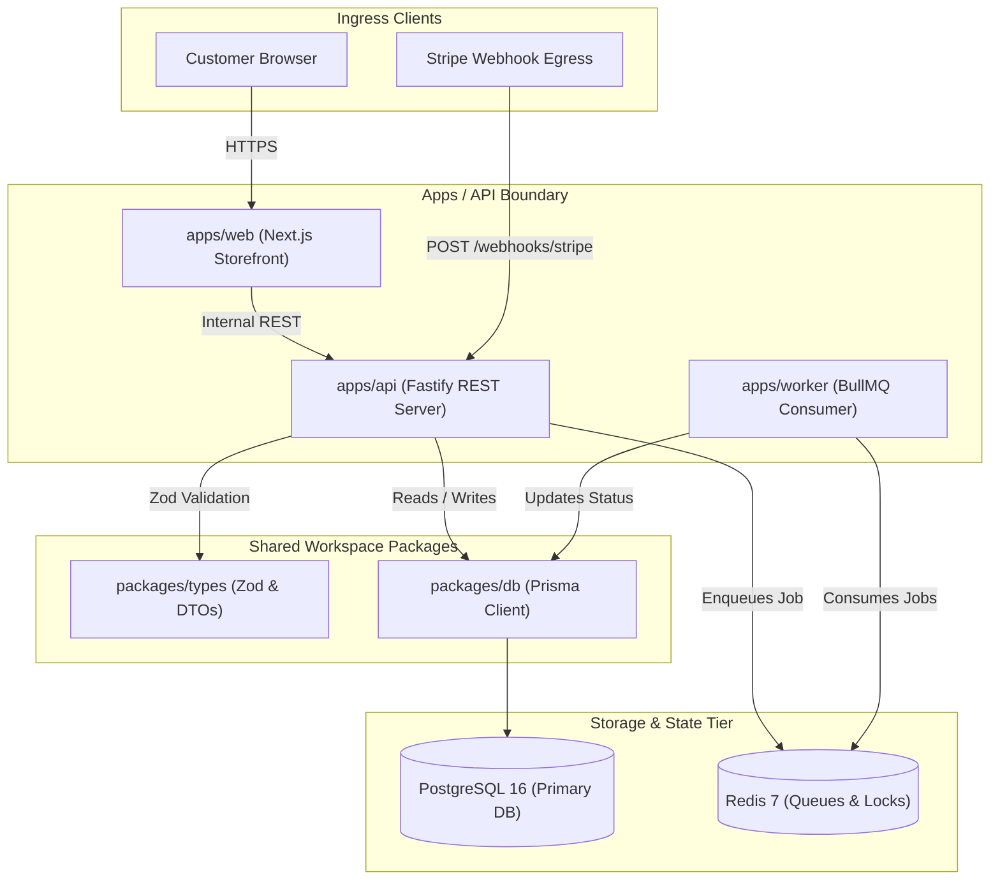

# Project Brief: Hyperion Commerce Engine
> Generated: 2026-09-24 | Mode: system_onboarding | Target Revision: `a4f89c2` | Certainty: Evidence-Grounded

## 1. System Identity & Workspace Structure
- **Archetype**: Polyglot Monorepo (Node.js API + Next.js Frontend + Worker Service)
- **Workspace Layout**: Turborepo with pnpm workspaces `[CONFIG: pnpm-workspace.yaml#L1-L6]`
- **Core Stack**:
  - Runtime: Node.js 20.x, TypeScript 5.4 `[CONFIG: package.json#L12]`
  - API Framework: Fastify 4.26 `[CONFIG: apps/api/package.json#L18]`
  - Persistence: PostgreSQL 16 + Prisma ORM 5.12 `[CONFIG: packages/db/prisma/schema.prisma#L4]`
  - Caching & Queues: Redis 7.2 + BullMQ `[CODE: apps/worker/src/queue.ts#L10]`
  - Frontend: Next.js 14 (App Router) `[CONFIG: apps/web/package.json#L15]`

## 2. Execution Harness & Baseline Health
| Operation | Command | Grounding Source | Baseline Status |
| :--- | :--- | :--- | :--- |
| **Build** | `pnpm run build` | `[CONFIG: package.json#L7]` | `[VERIFIED: Passing in 14.2s]` |
| **Test (All)** | `pnpm run test` | `[CONFIG: package.json#L8]` | `[BASELINE: 1 failing test in apps/web/components/cart.test.tsx]` |
| **Test (API)** | `pnpm --filter @repo/api test` | `[CONFIG: apps/api/package.json#L9]` | `[VERIFIED: 42 passed]` |
| **Dev Run** | `pnpm run dev` | `[CONFIG: package.json#L6]` | `[CONFIG: Starts Turbo on :3000 and :4000]` |

## 3. Directory Layout Semantics
- `apps/api/`: Fastify REST API handling order ingestion and checkout `[CODE: apps/api/src/server.ts#L1-L45]`.
- `apps/web/`: Next.js storefront client with server components `[CODE: apps/web/app/page.tsx#L1]`.
- `apps/worker/`: Background worker for payment webhook reconciliation and email dispatch `[CODE: apps/worker/src/index.ts#L8]`.
- `packages/db/`: Prisma schema, migrations, and shared database client `[CODE: packages/db/src/client.ts#L5]`.
- `packages/types/`: Shared TypeScript DTOs and Zod validation schemas `[CODE: packages/types/src/order.ts#L1]`.

## 4. Key Invariants & Non-Negotiables
1. `[INV-01]` All API routes must validate request bodies using Zod schemas imported from `@repo/types` prior to reaching service handlers. `[CODE: apps/api/src/middleware/validate.ts#L14]`
2. `[INV-02]` Inventory deductions and order creation must execute within a single Prisma interactive database transaction. `[CODE: apps/api/src/services/order.ts#L56]`
3. `[INV-03]` Payment webhook handling in `apps/worker` must check idempotency keys in Redis before processing duplicate events. `[VERIFIED: apps/worker/tests/webhook.test.ts#L88]`

## 5. System Topology Diagram

## 6. Canonical Vertical Flows

### The Checkout Flow (Golden Path)
- **Ingress**: `apps/api/src/routes/checkout.ts#L22` receives `POST /api/checkout`.
- **Validation**: `validate(CheckoutSchema)` runs; sanitizes address and line items `[CODE: apps/api/src/routes/checkout.ts#L25]`.
- **Domain Service**: `CheckoutService.process()` calculates taxes and verifies stock `[CODE: apps/api/src/services/checkout.ts#L44]`.
- **Persistence**: Executes `prisma.$transaction`: creates `Order` row, decrements `Inventory`, writes `AuditLog` `[CODE: apps/api/src/services/checkout.ts#L68]`.
- **Async Egress**: Enqueues `order.created` event into Redis BullMQ `[CODE: apps/api/src/services/checkout.ts#L92]`.
- **Terminal Egress**: Returns HTTP 201 with `OrderConfirmationDTO` `[VERIFIED: apps/api/tests/checkout.test.ts#L45]`.

### The Checkout Stock Depletion Flow (Failure Path)
- **Ingress**: Item stock is `0` when `CheckoutService.process()` runs.
- **Guard**: Invariant check fails: `if (stock < requested) throw new OutOfStockError(itemId)` `[CODE: apps/api/src/services/checkout.ts#L50]`.
- **Rollback**: Interactive transaction aborts; zero database rows written.
- **Terminal Egress**: Global Fastify error handler catches `OutOfStockError` $\rightarrow$ returns HTTP 409 Conflict with item ID `[VERIFIED: apps/api/tests/checkout.test.ts#L102]`.

## 7. Change Location Index (Where to Look)
- **Add a new REST route**: Create handler in `apps/api/src/routes/`, register in `apps/api/src/server.ts`.
- **Add a database model or migration**: Edit `packages/db/prisma/schema.prisma` $\rightarrow$ run `pnpm --filter @repo/db prisma migrate dev`.
- **Add a shared DTO or schema**: Add to `packages/types/src/` $\rightarrow$ re-export in `packages/types/src/index.ts`.
- **Add a background job consumer**: Add processor in `apps/worker/src/processors/`, register in `apps/worker/src/index.ts`.
