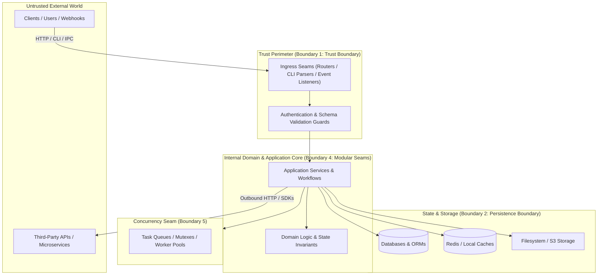

# Boundary & Topology Mapping Playbook

> **Core Axiom**: Software bugs and architectural degradation cluster at the seams. Mapping boundaries—where control transfers, where trust changes, and where state persists—provides the structural scaffolding for all safe code modifications.

---

## 1. The Five Critical System Boundaries

Every architecture contains five distinct boundaries that an agent must map:

### Boundary 1: Trust Boundaries
- **Definition**: The perimeter where untrusted external inputs cross into internal process memory.
- **Where to look**: API route handlers, GraphQL resolvers, CLI argument definitions, WebSocket message listeners, webhook ingestion endpoints.
- **What to verify**: Is input validated via a schema (Zod, Pydantic, Serde, Joi)? Is authentication verified before or after payload parsing?

### Boundary 2: Persistence Boundaries
- **Definition**: Where transient memory is converted to durable state.
- **Where to look**: ORM models, migration folders (`migrations/`, `prisma/`, `alembic/`), raw SQL queries, local file I/O, cache clients.
- **What to verify**: What is the database engine? Are database mutations transactional? Is there a cache-invalidation strategy?

### Boundary 3: External Integration Seams (Egress)
- **Definition**: Network calls or IPC where the system depends on third-party availability.
- **Where to look**: HTTP client wrappers (`axios`, `reqwest`, `requests`), SDK initializations (Stripe, AWS, Twilio, OpenAI), message brokers (RabbitMQ, Kafka, SQS).
- **What to verify**: Are timeouts configured? Is there retry logic or a circuit breaker? What happens if the third-party is offline?

### Boundary 4: Modular & Workspace Seams (Monorepos)
- **Definition**: Physical and logical boundaries separating distinct packages or modules within the repository.
- **Where to look**:
  - Node.js: `pnpm-workspace.yaml`, `lerna.json`, `turbo.json`, `packages/`
  - Rust: `[workspace]` in root `Cargo.toml`, `crates/`
  - Go: `go.work`, multi-module directories
  - Python: Poetry/Hatch workspaces, `packages/`
  - Java/Kotlin: `settings.gradle`, multi-module Maven `pom.xml`
- **What to verify**: What is the internal dependency graph? Does `core` depend on `api` (forbidden cycle) or does `api` depend on `core`?

### Boundary 5: Concurrency & State Seams
- **Definition**: Points where shared mutable state is accessed by concurrent threads, async coroutines, or distributed workers.
- **Where to look**: Mutexes (`sync.Mutex`), thread pools, background cron workers, Celery/BullMQ job queues, atomic variables.
- **What to verify**: How are race conditions prevented? What happens during worker crashes?

---

## 2. Monorepo & Multi-Package Cartography

When inspecting a monorepo or workspace, map the internal package topology before inspecting individual files:

1. **Root Workspace Manifest**: Inspect root configuration to discover declared packages and member directories.
2. **Package Identity Catalog**:
   | Package Directory | Package Name | Role / Responsibility | Internal Dependencies |
   | :--- | :--- | :--- | :--- |
   | `packages/types` | `@repo/types` | Shared TypeScript interfaces & DTOs | None (Leaf node) |
   | `packages/db` | `@repo/db` | Prisma client & migrations | `@repo/types` |
   | `packages/core` | `@repo/core` | Domain business logic | `@repo/types`, `@repo/db` |
   | `apps/web` | `@repo/web` | Next.js frontend application | `@repo/core`, `@repo/types` |
   | `apps/api` | `@repo/api` | Fastify backend REST API | `@repo/core`, `@repo/types` |

3. **Verify Boundary Invariants**:
   - Check if downstream leaves accidentally import root applications.
   - Verify whether packages are built independently or bundled together.

---

## 3. Mermaid Topology Visualization Standards

When rendering system topology in analysis artifacts:
- **Group components logically**: Use `subgraph` blocks for Ingress, Core, Persistence, and External Services.
- **Quote labels containing special characters**: Always write `id["Node (Detail)"]` instead of `id[Node (Detail)]` to prevent syntax parsing failures.
- **Highlight data flow direction**: Use directional arrows (`-->` or `-.->`) indicating the flow of control.
