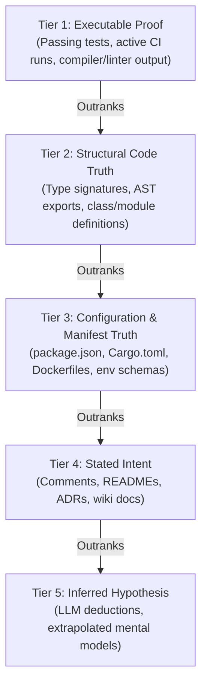

# Epistemic Evidence Tiers & Grounding Standards

> **Core Axiom**: In codebase analysis, documentation drifts, comments rot, and LLMs hallucinate plausible-sounding architectures. The source code, passing test assertions, and active runtime configuration are the sole ground truth.

---

## 1. The 5-Tier Epistemic Ladder

Every architectural claim, data flow, or invariant documented during analysis must declare its grounding tier.

### Tier 1: Executable Proof (Highest Certainty)
- **What it is**: Evidence produced by executing a deterministic tool or test runner against the codebase.
- **Examples**:
  - A test assertion passes: `tests/auth_test.go:45` verifies that expired JWTs return HTTP 401.
  - A compiler or type-checker verifies that `User` implements the `Authenticatable` interface.
  - A linter confirms no circular imports between `packages/core` and `packages/api`.
- **Tag Syntax**: `[VERIFIED: <file-path>#L<line> or <test-command>]`

### Tier 2: Structural Code Truth
- **What it is**: Observable, static source code definitions that cannot be altered without compilation/syntax errors.
- **Examples**:
  - Class definitions, exported functions, public structs, interfaces, and type aliases.
  - Router tables (`app.post('/api/v1/orders', orderHandler)`).
  - Explicit import/export statements defining dependency direction.
- **Tag Syntax**: `[CODE: <file-path>#L<line>]`

### Tier 3: Configuration & Manifest Truth
- **What it is**: Declarative metadata specifying dependencies, build parameters, runtime environments, and infrastructure.
- **Examples**:
  - `package.json`, `Cargo.toml`, `pyproject.toml`, `go.mod`.
  - `docker-compose.yml`, Kubernetes manifests, Terraform `.tf` files.
  - Environment variable schemas (`.env.example`, `config.yaml`).
- **Tag Syntax**: `[CONFIG: <file-path>#L<line>]`

### Tier 4: Stated Intent (Subject to Drift)
- **What it is**: Human-written natural language describing how the system is *intended* or *supposed* to work.
- **Caveat**: Stated intent is frequently outdated. It represents aspirations or historical states, not current reality.
- **Rule**: Stated intent must be cross-checked against Tier 1, 2, or 3 before being relied upon.
- **Tag Syntax**: `[STATED: <doc-path>#L<line>]`

### Tier 5: Inferred Hypothesis
- **What it is**: An architectural deduction made by the agent that has not yet been verified against code or configuration.
- **Mandatory Requirement**: Every hypothesis must state **Verification Criteria**—the exact file, test, or symbol that would prove or disprove it.
- **Tag Syntax**: `[HYPOTHESIS: <deduction> | Verify: <action-or-file>]`

---

## 2. Epistemic Conflict Resolution

When different sources contradict each other, resolve conflicts using the **Law of Precedence**:

$$\text{Tier 1 (Executed Test)} > \text{Tier 2 (Source Code)} > \text{Tier 3 (Manifests)} > \text{Tier 4 (Documentation)} > \text{Tier 5 (Inference)}$$

### Common Conflict Scenarios

| Scenario | Conflict | Resolution Rule |
| :--- | :--- | :--- |
| **Outdated README** | `README.md` says "Uses PostgreSQL", but `docker-compose.yml` and `Cargo.toml` specify SQLite. | **Record SQLite** (`[CONFIG: Cargo.toml#L15]`). Flag `README.md` as drifted (`[DRIFT: README.md#L40]`). |
| **Dormant Feature Flag** | Code contains an endpoint `/api/v2/pay`, but route is commented out or guarded by `if (false)`. | **Record Inactive** (`[CODE: src/router.ts#L88]`). Do not list as an active ingress path. |
| **Phantom Microservice** | Architecture doc shows a "Recommendation Service", but repository contains no client, config, or URL pointing to it. | **Record as Stated/Dead** (`[STATED: docs/arch.md]`). Note absence of live integration code. |
| **Broken Test Suite** | 3 tests fail in `tests/billing/`. | **Record Baseline Breakage** (`[BASELINE: tests/billing/ (3 failures)]`). Do not mutate files to fix them. |

---

## 3. The Brownfield Baseline Health Rule

When analyzing an unfamiliar codebase, the agent must never assume the project is in a clean or working state.

1. **Run Pre-Flight Checks Non-Destructively**:
   - Run the project's verification command in read-only mode (e.g., `npm test`, `cargo check`, `pytest --collect-only`).
2. **Document Breakages Without Intervening**:
   - If tests fail, syntax errors exist, or dependencies are missing, record them in the `Baseline Health` section of the deliverable.
   - **Absolute Prohibition**: Never attempt to "fix" pre-existing broken tests or refactor broken code during an analysis pass. The analysis agent is a surveyor, not a builder.
