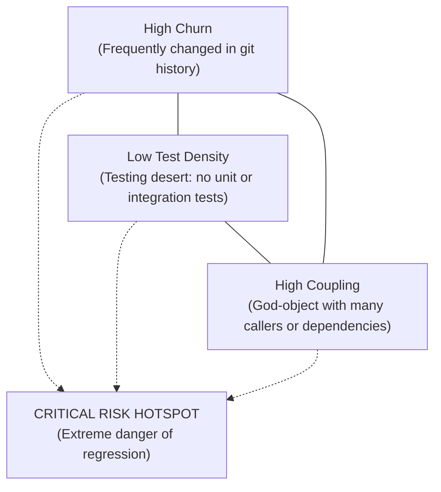

# Risk, Churn & Hotspot Forensics Playbook

> **Core Axiom**: Software risk is not evenly distributed. In any repository, 80% of regressions originate from 20% of the files—specifically those where high git churn, low test density, and high structural coupling intersect.

---

## 1. The Risk Intersection Triangle

An area of the codebase becomes a **High-Risk Hotspot** when three vectors align:

---

## 2. Forensic Analysis Procedures

### 2.1 Git Churn Forensics
High churn indicates frequent bug fixes, unstable requirements, or an architecture that violates the Single Responsibility Principle.

- **Objective**: Identify the top 10 most frequently modified files over the last 3–6 months.
- **Interpretation Matrix**:
  - **High Churn + High Test Coverage**: Healthy active development.
  - **High Churn + Low/Zero Test Coverage**: **Dangerous hotspot**. Any change requires extreme care and new test coverage.
  - **Low Churn + Complex Logic**: Stable legacy core. Do not refactor without explicit justification.

### 2.2 Testing Desert Forensics
A "testing desert" is a critical domain module completely devoid of test coverage.

- **Check Test Topology**:
  - Are tests co-located (`foo.ts` next to `foo.test.ts`) or centralized in a top-level `tests/` directory?
  - Does the test harness run fast unit tests, or do all tests hit a real database?
- **Red Flag Signals**:
  - `tests/` directory has not been modified in >6 months while `src/` has had hundreds of commits.
  - Core payment, auth, or calculation logic has zero test files referencing its functions.
  - Mock overuse: tests only assert that mocks are called, never asserting real state mutations.

### 2.3 Coupling Gravity Wells (God Objects)
Modules that attract dependencies like black holes:
- **Signals**:
  - A file with $>30$ import statements or exports $>50$ symbols.
  - A file imported by almost every other module in the codebase (e.g., `src/utils/helpers.ts`, `src/common/index.ts`).
  - Circular dependencies: Module A imports B, which imports C, which imports A.

### 2.4 Architectural Drift Forensics
Detecting when documentation and code diverge:
- Check `README.md` setup commands against actual scripts in package manifests.
- Check ADR decisions against live dependencies (e.g., ADR-0004 says "Use Redis", but repository has migrated to Memcached).
- Identify dead code: exported functions or files that are never imported anywhere in the working tree.

---

## 3. The Risk Matrix Deliverable Schema

When completing a `forensic_audit` or compiling risk findings in a `PROJECT_BRIEF.md`, summarize risks in a structured matrix:

| Component / File Path | Churn Rank | Test Density | Coupling Score | Risk Level | Recommended Precaution |
| :--- | :--- | :--- | :--- | :--- | :--- |
| `src/auth/session.ts` | Top 3 (24 commits) | Low (1 mock test) | High (imported by 14 files) | **CRITICAL** | Write integration test suite before mutating. |
| `src/services/billing.ts`| Top 8 (12 commits) | Moderate (4 tests) | Moderate | **MEDIUM** | Run full test suite; verify idempotency. |
| `src/utils/format.ts` | Low (1 commit) | High (12 unit tests) | High | **LOW** | Safe to touch with existing test suite. |
