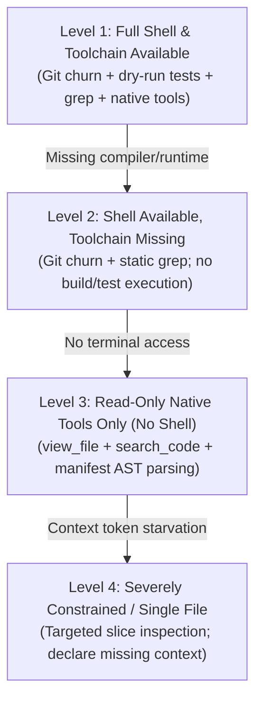

# Tool & Shell Procedures (Execution Adapters)

> **Core Axiom**: The project analysis protocol defines *what* semantic facts must be discovered. The agent uses *whatever* tools and shells exist in its current runtime environment to discover them. Never lock procedures to a single operating system or shell.

---

## 1. Semantic Invariants vs. Execution Adapters

| Semantic Inspection Task | POSIX / Bash / Zsh | Windows PowerShell | Native Agent Read Tools (No Shell) | Language Server / LSP / AST |
| :--- | :--- | :--- | :--- | :--- |
| **1. Detect Manifests** | `ls -la \| grep -E 'package\|Cargo\|pyproject'` | `Get-ChildItem -File \| Where-Object Name -match 'package\|Cargo\|pyproject'` | `view_file` on root directory listing | Workspace root symbol index |
| **2. Locate Entrypoints** | `find . -maxdepth 3 -name "main.*" -o -name "index.*"` | `Get-ChildItem -Depth 2 -Include 'main.*','index.*','app.*'` | Targeted `view_file` on standard conventions (`src/`, `cmd/`, `bin/`) | Document symbol lookup on workspace entry |
| **3. Trace Call Graph** | `grep -rn "handlerName" src/` or `rg "handlerName"` | `Select-String -Path "src\*" -Pattern "handlerName"` | Keyword code search tool | `FindReferences` / LSP call hierarchy |
| **4. Calculate Git Churn** | `git log --name-only --since="3 months ago"` | `git log --name-only --since="3 months ago"` | Fallback: check file modified timestamps | Git MCP Server log inspection |
| **5. Run Non-Destructive Tests** | `npm test -- --dry-run` or `pytest --collect-only` | `npm test -- --dry-run` or `pytest --collect-only` | Read test files statically; do not execute | LSP diagnostic checks |

---

## 2. Cross-Platform Execution Recipes

### 2.1 Git Churn Analysis (Top 10 Hotspots)

#### Bash / Linux / macOS
```bash
git log --format=format: --name-only --since="3 months ago" | \
  grep -v '^$' | grep -v 'node_modules\|vendor\|\.lock' | \
  sort | uniq -c | sort -nr | head -n 10
```

#### Windows PowerShell
```powershell
git log --format=format: --name-only --since="3 months ago" | `
  Where-Object { $_ -ne "" -and $_ -notmatch 'node_modules|vendor|\.lock' } | `
  Group-Object | Sort-Object Count -Descending | Select-Object -First 10 -Property Count, Name
```

#### Native Tool / No-Git Fallback
If git is not installed or the directory is not a git repository:
1. Use directory inspection to locate the largest non-generated files.
2. Inspect the top-level test directory to see which modules have corresponding test files.
3. Mark churn in the deliverable as `[UNAVAILABLE: Git history not accessible; fallback to file layout]`.

---

### 2.2 Ingress & Entrypoint Discovery

#### POSIX Shell
```bash
# Web routes
grep -Ern '(app|router)\.(get|post|put|delete|use)\(' src/ | head -n 20

# CLI commands
grep -Ern '(Command|Subcommand|clap|click|cobra)' src/ | head -n 20
```

#### Windows PowerShell
```powershell
# Web routes
Select-String -Path "src\*" -Pattern '(app|router)\.(get|post|put|delete|use)\(' | Select-Object -First 20

# CLI commands
Select-String -Path "src\*" -Pattern '(Command|Subcommand|clap|click|cobra)' | Select-Object -First 20
```

#### Native Tooling (Slice-Bounded)
1. Inspect the root package manifest (`package.json` $\rightarrow$ `main`, `scripts`, `bin`; `Cargo.toml` $\rightarrow$ `[[bin]]`, `[lib]`; `pyproject.toml` $\rightarrow$ `[project.scripts]`).
2. Open only the declared entrypoint file (`src/index.ts`, `src/main.rs`, `main.py`) using `view_file` with `StartLine: 1, EndLine: 120`.

---

## 3. Graceful Degradation Ladder

When operating in constrained or sandboxed agent environments:



- **If build tools are missing**: Do not attempt to install them. Record the manifest commands and mark baseline verification status as `[UNVERIFIED: Runtime not installed]`.
- **If terminal commands fail or hang**: Abort the command immediately. Fall back to static code inspection using native file-reading tools.
- **Never get stuck on missing tooling**: A project analysis agent's job is to inspect the repository as it exists, not to configure the host machine.
