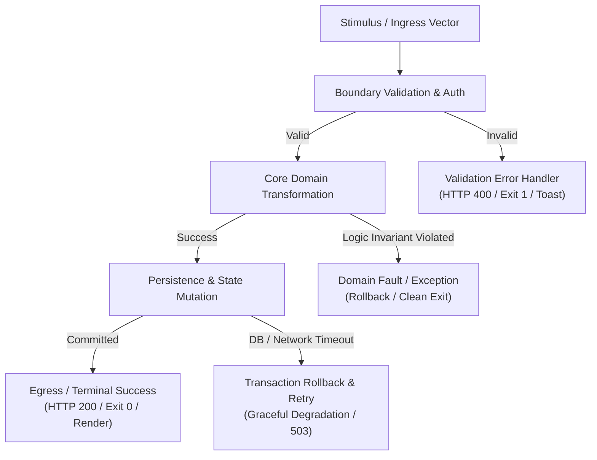

# Vertical Execution Tracing Playbook

> **Core Axiom**: Software is an execution graph, not an alphabetical encyclopedia. Reading files from `src/a` to `src/z` produces cognitive fragmentation. An agent must trace representative transactions vertically from stimulus to terminal state.

---

## 1. The Bifurcated Tracing Model

Every transaction in a software system follows two parallel pathways: the **Golden Path** (when all inputs and dependencies behave as expected) and the **Failure Path** (when inputs are malformed, resources are unavailable, or invariants are violated).

A complete analysis must trace both branches:

---

## 2. Step-by-Step Tracing Methodology

To trace a vertical flow without context bloat:

1. **Step 1: Select the Canonical Journey**:
   - For an API: Choose the most common state mutation (e.g., `POST /orders`, `POST /auth/login`).
   - For a CLI: Choose the primary command invocation (e.g., `tool deploy --env prod`).
   - For a Library: Choose the primary entrypoint function exported in the root namespace.
   - For a Frontend: Choose the core user action (e.g., submitting a checkout form or toggling a filter).

2. **Step 2: Locate the Ingress Seam**:
   - Identify where external stimulus enters the process boundary (route declaration, CLI parser argument, event listener, or exported function).

3. **Step 3: Trace Ingress Middleware & Guards**:
   - What checks execute before domain logic? (Authentication, schema validation, rate-limiting, CORS, input sanitization).

4. **Step 4: Trace the Domain Transformation**:
   - Where is business logic applied? Locate the service, command handler, or domain entity where inputs are mutated or evaluated.

5. **Step 5: Trace State & Persistence**:
   - Where does data get committed? (Database transaction, local filesystem write, state store update, message queue publish).
   - **Crucial Question**: Is the write wrapped in an atomic transaction or unit of work?

6. **Step 6: Trace Egress & Return**:
   - How does the system signal completion? (HTTP response payload, console STDOUT, UI state re-render, return code).

7. **Step 7: Trace the Failure / Rollback Path**:
   - Intentionally trace: What happens if the database throws a duplicate key error or network timeout at Step 5?
   - Is there a retry loop? Does a circuit breaker trip? Does the process panic or exit gracefully?

---

## 3. Archetype Tracing Walkthroughs

### 1. Web Service / REST API
- **Ingress**: `src/api/routes/users.ts#L24` (`router.post('/register', validate(UserSchema), handler)`)
- **Golden Path**: `handler` calls `UserService.create()` $\rightarrow$ hashes password with bcrypt $\rightarrow$ inserts into `users` table via `db.transaction()` $\rightarrow$ sends welcome email via queue $\rightarrow$ returns HTTP 201 with sanitized DTO.
- **Failure Path**: Duplicate email triggers database unique constraint error $\rightarrow$ caught by repository $\rightarrow$ rethrown as `ConflictException` $\rightarrow$ captured by global error middleware $\rightarrow$ returns HTTP 409 JSON payload.

### 2. CLI Tool (e.g. Rust / Go)
- **Ingress**: `src/main.rs#L18` (`Cli::parse()`)
- **Golden Path**: Subcommand `sync` matched $\rightarrow$ loads config from `~/.config/app.toml` $\rightarrow$ connects to remote endpoint $\rightarrow$ writes local cache atomically via tempfile rename $\rightarrow$ prints `[OK]` to STDOUT $\rightarrow$ exits with code `0`.
- **Failure Path**: Remote endpoint returns HTTP 500 $\rightarrow$ retries 3 times with exponential backoff $\rightarrow$ fails $\rightarrow$ prints error to STDERR $\rightarrow$ cleans up tempfile $\rightarrow$ exits with code `1`.

### 3. Library / SDK
- **Ingress**: `src/index.ts#L5` (`export function parseDocument(input: string): Document`)
- **Golden Path**: Validates input string is not empty $\rightarrow$ tokenizes into Lexer stream $\rightarrow$ builds AST nodes $\rightarrow$ validates AST invariants $\rightarrow$ returns `Document` object.
- **Failure Path**: Malformed syntax at byte offset 42 $\rightarrow$ Lexer raises `ParseError` with line/column coordinates $\rightarrow$ function throws or returns `Result::Err(ParseError)`.

### 4. Data / ETL Pipeline
- **Ingress**: Scheduled cron trigger / S3 bucket notification (`dags/daily_orders.py#L12`)
- **Golden Path**: Task 1 extracts raw JSON from S3 $\rightarrow$ Task 2 validates schema against Great Expectations $\rightarrow$ Task 3 runs dbt transformation in Snowflake $\rightarrow$ Task 4 loads aggregated metrics to Postgres $\rightarrow$ marks DAG run `SUCCESS`.
- **Failure Path**: S3 file schema contains unexpected null field $\rightarrow$ validation task fails $\rightarrow$ Slack webhook alert dispatched $\rightarrow$ downstream dbt tasks skipped $\rightarrow$ marks DAG run `UPSTREAM_FAILED`.

---

## 4. Extracting Invariants During Tracing

While following the vertical path, listen for **system invariants** (rules that must never be broken):
- Look for `assert`, `require`, `guard`, or `throw` statements.
- Look for database transaction blocks (`db.transaction { ... }`).
- Look for mutex locks (`sync.Mutex.Lock()`) or atomic CAS operations.
- Record every discovered invariant in the deliverable with the tag `[INV-XX]`.
