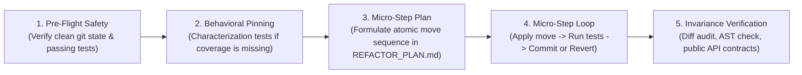

# Refactoring: Behavior-Preserving Restructuring Protocol

> **Mandate**: Improve internal code structure, readability, and modularity while guaranteeing that external observable behavior remains strictly invariant. Never refactor without an active green test harness; pin legacy behavior before touching code; execute in atomic micro-steps; and revert immediately on test breakage.

---

## 1 · The Refactoring Lifecycle

Never execute wide-scale speculative rewrites in a single unverified leap. Execute every refactoring effort through this disciplined 5-phase protocol:

1. **Pre-Flight Safety Check**: Verify that working tree is clean and baseline test suite passes with exit code `0`. If existing tests are failing, resolve or report them before initiating a refactor.
2. **Behavioral Pinning (Characterization Tests)**: If the target code lacks tests, author **Characterization Tests** (Golden Master snapshots) capturing existing outputs for a range of inputs *before* altering a single line of production code (see [`references/characterization-testing.md`](references/characterization-testing.md)).
3. **Micro-Step Formulation**: Break the restructuring down into a sequence of small, proven refactoring moves (e.g. Extract Function $\rightarrow$ Introduce Parameter Object $\rightarrow$ Move Function) documented in a lightweight plan (see [`examples/refactor-plan-template.md`](examples/refactor-plan-template.md)).
4. **The Micro-Step Loop**:
   - Apply exactly *one* atomic structural change.
   - Run the scoped test suite immediately.
   - **If Green**: Make an atomic git commit or progress checkpoint.
   - **If Red**: Revert immediately to the last green state; do not try to "debug forward" through compounded structural errors.
5. **Invariance Verification & Cleanup**: Verify that public interfaces, return schemas, error types, and execution semantics remain identical (see [`references/invariance-verification.md`](references/invariance-verification.md)).

> **Boundary**: This skill owns *behavior-preserving code restructuring* under the Separation Law. For *system vitality assessment, dead code identification, and tech debt governance* (the decision of WHAT to refactor), activate `maintenance` instead.

---

## 2 · Mode Selection (Cognitive Sizing)

Differentiate local opportunistic tidying from major architectural transformations:

| Mode | Trigger & Scope | Discipline & Process | Commit Strategy |
| :--- | :--- | :--- | :--- |
| **`opportunistic`** | Local cleanup (renaming local variable, inlining temporary, extracting a 5-line helper) during a feature task. | Boy Scout Rule: Leave code slightly cleaner. Scope limited strictly to the function under active edit. | Bundled atomically within the feature task, clearly noted in commit message. |
| **`strategic`** | Decomposing a God object, modularizing a package, breaking circular dependencies, or replacing conditionals with polymorphism. | **Strict Separation Law**: No behavioral modifications permitted. Must pin behavior first, execute via micro-steps, and produce a dedicated PR/branch. | Dedicated commits: `refactor(scope): extract payment strategy from checkout`. |

---

## 3 · The Separation Law

$$\text{Code Modification} = \text{Refactoring (Structure)} \oplus \text{Behavioral Change (Feature / Bugfix)}$$

* A commit or pull request must **never** mix structural refactoring with behavioral changes.
* Mixing the two makes git bisect impossible, obscures regressions, and doubles reviewer cognitive load.
* If a new feature requires architectural restructuring, execute in two distinct stages:
  1. **Stage 1 (Refactor)**: Restructure the code so the new feature is easy to add (verify tests pass, zero behavioral changes).
  2. **Stage 2 (Feature)**: Add the new feature cleanly onto the prepared architecture.

---

## 4 · Agent Refactoring Recipes

Leverage standardized, battle-tested refactoring moves (see [`references/refactoring-catalogue.md`](references/refactoring-catalogue.md)):

* **Extract Function / Method**: Turn a cohesive block of code inside a long function into its own named helper with explicit parameters and return types.
* **Replace Conditional with Map / Strategy**: Replace sprawling `switch` or `if/else` chains with dictionary dispatch or polymorphic strategy interfaces.
* **Introduce Parameter Object**: Replace functions taking 5+ parameters with a cohesive, typed options object.
* **Invert Dependency (Introduce Seam)**: Replace hardcoded static imports of external services with interface parameters to decouple modules and unlock testability.
* **Inline Temp / Variable**: Remove intermediate variables that add cognitive noise without adding semantic clarity.

---

## 5 · Guardrails & Anti-Patterns

### 5.1 Strictly Disallowed Actions
- ❌ **No Speculative Rewrites ("Second System Syndrome")**: Never delete a 1,000-line working module to rewrite it from scratch. Refactor incrementally in place.
- ❌ **No Untested Mutations**: Never refactor code that has zero test coverage. You must pin behavior with characterization tests first.
- ❌ **No Silent API Alterations**: Never alter public method signatures, export names, or return schemas during a refactor.
- ❌ **No "Debugging Forward" on Structural Failures**: If a refactoring step breaks tests, revert instantly (`git checkout -- path`). Never layer speculative fixes on top of a broken refactor.

### 5.2 The Invariance Stopping Contract
The agent may declare a refactoring task complete **only** when:
- [ ] Baseline tests were green before starting.
- [ ] Every micro-step was verified against the test harness.
- [ ] Public API contracts and interfaces are 100% preserved.
- [ ] Git diff inspection confirms zero changes to business logic or error semantics.
- [ ] The full regression test suite passes cleanly with exit code 0.
