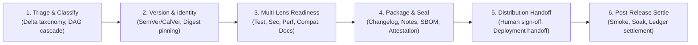

# Release Management: Universal Versioning, Readiness & Governance Protocol

> **Mandate**: *Release management is the disciplined, auditable formalization of change identity, readiness certification, and downstream contract governance.*  
> A release is not the execution of a bash script (`git tag`, `npm publish`, or `docker push`), nor is it synonymous with deploying code to an environment. Release management decides **WHAT** is being released (semantic delta classification, atomic change scope, issue/commit lineage), **WHETHER** it is safe and ready (multi-lens evidence gates: testing, security, performance, compatibility, documentation), **HOW** its identity is formalized (injective, tamper-evident version identity and artifact provenance), and **HOW** it is communicated (verifiable release ledgers, semantic changelogs, announcement drafts, and human governance attestations).  
> True release engineering preserves agent creativity, rejects platform dogma, and guarantees that every state transition is reproducible, traceable, and recoverable across any software archetype.

---

## 1 · The 6-Phase Universal Release Lifecycle

Every release—from a localized patch to an enterprise multi-package monorepo train, a mobile binary submission, or an autonomous agent fleet upgrade—traverses this closed-loop lifecycle:



1. **Phase 1 — Triage & Change Classification**: Inspect changes since the prior baseline release. Classify every change item according to its semantic operational impact: Breaking ($\Delta_{\text{major}}$), Non-breaking Additive ($\Delta_{\text{minor}}$), Patch/Fix ($\Delta_{\text{patch}}$), or Non-functional (docs/tooling/refactor). In multi-package workspaces, compute the topological dependency DAG to determine cascading release requirements (see [`references/change-classification-and-changelog-engineering.md`](references/change-classification-and-changelog-engineering.md)).
2. **Phase 2 — Versioning & Release Identity**: Calculate the new release identifier based on the project's chosen versioning contract (SemVer, CalVer, ZeroVer, sequential build numbers, or content-addressed digests). Bind the release to an injective, immutable release tuple $\mathcal{R} = \langle \text{Identity}, \text{Digest}(A), \text{CommitSHA}, \text{Timestamp} \rangle$ (see [`references/release-identity-and-version-semantics.md`](references/release-identity-and-version-semantics.md)).
3. **Phase 3 — Multi-Lens Readiness Audit**: Evaluate release gates across 5 required dimensions: Functional Verification, Security & Vulnerability Posture, Performance & Latency Budgets, Migration & Compatibility Safety, and Operational Documentation. Compute composite readiness score $\mathcal{S}_{\text{readiness}} \in [0, 100]$. Reject release if any mandatory invariant fails (see [`references/readiness-evidence-and-quality-gates.md`](references/readiness-evidence-and-quality-gates.md)).
4. **Phase 4 — Packaging & Release Ledger Sealing**: Synthesize the immutable changelog and audience-specific release notes. Generate artifact bills of materials (SBOM) and signed release metadata. Package artifacts reproducibly. Sealing the release identity occurs *only after* verification gates succeed—never tag or seal speculatively (see [`references/change-classification-and-changelog-engineering.md`](references/change-classification-and-changelog-engineering.md) and [`references/governance-provenance-and-human-authority.md`](references/governance-provenance-and-human-authority.md)).
5. **Phase 5 — Controlled Distribution & Deployment Handoff**: Obtain explicit human authorization for public registries or irreversible production switches. Dispatch sealed artifacts to target distribution channels (registries, stores, firmware banks) or hand off the certified release package to [`deployment`](../deployment/SKILL.md) for environment rollout (see [`references/governance-provenance-and-human-authority.md`](references/governance-provenance-and-human-authority.md)).
6. **Phase 6 — Post-Release Verification & Soak**: Execute post-distribution verification (smoke checks against live endpoints, package registry pull tests). Monitor initial soak window in coordination with [`observability`](../observability/SKILL.md). Upon stability, formally settle the release record in persistent memory (see [`references/rollback-preparedness-and-recovery-contracts.md`](references/rollback-preparedness-and-recovery-contracts.md)).

---

## 2 · Progressive Disclosure (Reference Routing)

To prevent cognitive overload and preserve LLM context bandwidth, consult reference manuals strictly on demand based on task context:

| Context Trigger | Mandatory Reference Manual | Purpose |
| :--- | :--- | :--- |
| **Version calculation, SemVer, CalVer, tags, build numbers, content hashes, monorepo versions** | [`references/release-identity-and-version-semantics.md`](references/release-identity-and-version-semantics.md) | Injective identity math, comparison of versioning schemas, prerelease cycles, independent vs lockstep monorepos. |
| **Readiness criteria, test attestations, CVE scans, performance budgets, scorecard** | [`references/readiness-evidence-and-quality-gates.md`](references/readiness-evidence-and-quality-gates.md) | 5-lens readiness scorecard, composite score formula, supply chain integrity, CI attestations. |
| **Commit classification, changelog synthesis, release announcements, migration guides** | [`references/change-classification-and-changelog-engineering.md`](references/change-classification-and-changelog-engineering.md) | Semantic delta taxonomy, Conventional Commits parsing, Keep a Changelog formatting, audience-specific notes. |
| **API stability, breaking changes, schema evolution, deprecation windows, migration paths** | [`references/compatibility-contracts-and-deprecation-lifecycles.md`](references/compatibility-contracts-and-deprecation-lifecycles.md) | 3 tiers of compatibility (wire, schema, semantic), 3-stage deprecation protocol, blast-radius vectors. |
| **Rollback feasibility, irreversible migrations, forward compensation, feature flags** | [`references/rollback-preparedness-and-recovery-contracts.md`](references/rollback-preparedness-and-recovery-contracts.md) | Rollback triage, Forward Compensation Transactions (FCT), feature flag decoupling, post-release escalation. |
| **Human approval gates, SBOM, provenance, emergency hotfixes, credential hygiene** | [`references/governance-provenance-and-human-authority.md`](references/governance-provenance-and-human-authority.md) | Human-in-the-loop boundaries, SBOM (SPDX/CycloneDX), Emergency Fast-Track Protocol (Break-Glass), release ledgers. |

---

## 3 · Adaptive Cognitive Sizing (The 6 Execution Modes)

Size your release engineering ceremony strictly to the task's scope, risk profile, and downstream blast radius. Never apply heavy enterprise bureaucracy to a localized patch, and never execute speculative, unverified releases across high-blast-radius production systems:

| Mode | Trigger & Scope | Engineering Discipline | Required Output & Protocol |
| :--- | :--- | :--- | :--- |
| **`micro-patch`** | Localized bug fix, typo, documentation update, patch bump with zero contract alterations. | Source check $\to$ version bump $\to$ inline changelog entry $\to$ smoke verification. **Zero boilerplate**. | **3-Line Release Intent Block** directly preceding execution. |
| **`standard-library`** | Open-source package, internal shared SDK, reusable library, REST/gRPC client (1–5 modules). | SemVer delta analysis $\to$ changelog synthesis $\to$ unit/integration test pass $\to$ tag creation. | `RELEASE.md` or git tag with semantic notes and API change summary. |
| **`service-release`** | Backend service, API, containerized worker with network consumers. | Multi-lens readiness audit $\to$ container digest pinning $\to$ compatibility check $\to$ deployment handoff. | Service Release Record with verified artifact digests, config diffs, and health criteria. |
| **`stateful-release`** | Releases coupled with database migrations, event schema shifts, or persistent storage updates. | Expand/Contract phase verification $\to$ dual-read/write compatibility proof $\to$ forward compensation runbook. | Stateful Migration Release Plan with rollback feasibility proof and migration gates. |
| **`agentic-fleet`** | AI agent prompts, system instructions, MCP servers, or LLM models. | Benchmark eval pass ($\ge \tau$) $\to$ tool permission audit $\to$ semantic drift evaluation $\to$ token budget check. | Agentic Release Certificate with benchmark delta and token/latency budget compliance. |
| **`governed-enterprise`** | Regulated software, mission-critical infrastructure, multi-team monorepos, high-blast-radius enterprise systems. | Formal multi-gate scorecard (Sec/Perf/A11y/Legal) $\to$ SBOM generation $\to$ human sign-off $\to$ staged ring release. | Comprehensive Release Manifest with cryptographic signatures, SBOM, and formal approval audit. |

### The 3-Line Release Intent Protocol (For `micro-patch` Mode)
When operating in `micro-patch` mode, summarize release intent in exactly 3 lines before emitting release commands:
```markdown
> **Release Target**: [Package / Binary / Module name @ vX.Y.Z]
> **Change Classification**: [Patch / Fix: exact bug or change summary]
> **Verification Gate**: [Clean test/build command output: PASS]
```

> **Boundary**: This skill owns *what ships, when, and under what version identity* (readiness scorecards, version encoding, changelog, consumer protection). It does NOT own *how artifacts reach environments* — that is `deployment`'s responsibility. Release-management produces a versioned release artifact; deployment consumes it.

---

## 4 · The 8 Universal Release Invariants

Regardless of language, framework, cloud provider, build system, or runtime environment, every robust release upholds these 8 mathematical laws:

### 4.1 Invariant 1: Injective Release Identity & Provenance (The Identity Axiom)
Every release must possess a globally unique identifier within its operational namespace, bound injectively to an immutable cryptographic digest of its artifact and source state:
$$\mathcal{R}_i = \langle V_i, \text{Digest}(A_i), \text{CommitSHA}_i, T_i \rangle$$
$$\forall i \neq j, \quad V_i = V_j \iff \text{Digest}(A_i) = \text{Digest}(A_j)$$
* Mutating released artifacts in-place, reusing version tags for new commits, or releasing unpinned pointers (`latest`, `HEAD`, dirty working trees) is strictly forbidden.

### 4.2 Invariant 2: Empirical Evidence Gating (The Proof Axiom)
Release readiness is demonstrated through empirical, reproducible evidence, never assumed or self-attested:
$$\text{Ready}(\mathcal{R}) \iff \bigwedge_{k \in \{\text{Test}, \text{Security}, \text{Perf}, \text{Compat}, \text{Docs}\}} \text{Gate}_k(\text{Evidence}) = \text{PASS}$$

### 4.3 Invariant 3: Semantic Change Contract Alignment (The Semantics Axiom)
The release identifier must communicate the operational nature of change according to the project's versioning contract:
$$\Delta \text{Contract} \implies \text{VersionStep}(\text{CurrentVersion}, \Delta \text{Contract})$$
* Introducing breaking changes in patch releases or silent contract modifications without updating the version epoch is prohibited.

### 4.4 Invariant 4: End-to-End Lineage & Traceability (The Lineage Axiom)
Every released artifact must be bidirectionally traceable across its entire lifecycle:
$$\text{Artifact} \iff \text{SourceCommit} \iff \text{ChangeLedger} \iff \text{ReleaseNotes} \iff \text{Attestation}$$

### 4.5 Invariant 5: Compatibility & Downstream Consumer Defense (The Compatibility Axiom)
A release must defend downstream consumers from uncoordinated breaking mutations:
$$\text{Compatible}(\mathcal{R}_{\text{new}}, \mathcal{R}_{\text{prev}}) \lor (\text{Deprecated}(\mathcal{R}_{\text{prev}}, \Delta t) \land \text{HasMigrationGuide}(\mathcal{R}_{\text{new}}))$$

### 4.6 Invariant 6: Rollback & Recovery Determinism (The Recovery Axiom)
No release may be authorized without a pre-certified, verified recovery path:
$$\text{RecoveryPath}(\mathcal{R}) \in \{ \text{InstantRollback}, \text{ExpandContractDecoupled}, \text{CertifiedForwardCompensation} \}$$

### 4.7 Invariant 7: Bounded Authority & Human Governance (The Governance Axiom)
Autonomous agents operate within bounded authority envelopes:
$$\text{Action}(\text{Irreversible} \lor \text{PublicRegistryPublish} \lor \text{ProductionTrafficSwitch}) \implies \text{HumanAttestation}()$$
* Autonomous agents may automate change triage, version calculation, readiness auditing, changelog synthesis, and staging verification. Public distribution or irreversible mutations mandate explicit human confirmation.

### 4.8 Invariant 8: Topological Change Propagation & Monorepo Cascading (The Cascade Axiom)
In multi-package repositories, version increments must propagate through the dependency Directed Acyclic Graph (DAG) without circular contamination:
$$\forall (A \to B) \in \text{WorkspaceDAG}, \quad \text{Breaking}(B) \implies \text{EvaluateDownstream}(A, \Delta B)$$

---

## 5 · The Emergency Fast-Track Protocol (Break-Glass)

When an active Sev-0 production incident, zero-day exploit, or data corruption catastrophe requires immediate release:

> [!CAUTION] EMERGENCY RELEASE FAST-TRACK PROTOCOL (BREAK-GLASS)
> An agent or engineer may bypass non-critical release gates **IF AND ONLY IF**:
> 1. **Sev-0 Incident Citation**: Cites the verified incident ID and active business impact.
> 2. **Minimal Blast Radius**: The patch must be an atomic fix containing *only* the remediation logic.
> 3. **Critical Core Gate Execution**: Compilation, targeted regression test, and cryptographic artifact signing *cannot be bypassed*.
> 4. **Mandatory Post-Incident Reconciliation Commitment**: An immutable debt ticket is committed to run full regression, documentation sync, and post-mortem within 24 hours.

---

## 6 · Universal Archetype Adaptation

The 8 invariants adapt dynamically across every software archetype:

* **Cloud Services & APIs**: SemVer / CalVer / Git Commit Digest $\to$ Container image digest pinning $\to$ Compatibility check $\to$ Deployment handoff.
* **Client & Mobile**: App Version + Build Number $\to$ Signed binary $\to$ App store submission review $\to$ Phased rollout.
* **Libraries & SDKs**: SemVer 2.0.0 $\to$ Cross-runtime matrix verification $\to$ Signed package archive $\to$ Registry publish with token authorization.
* **AI Agents & MCP Swarms**: Semantic Agent Version + Prompt Hash $\to$ Benchmark evaluation suite pass $\to$ Tool schema bundle $\to$ Human sign-off for capability expansion.
* **Embedded & IoT**: Firmware Semantic Tag + Hardware Revision $\to$ HIL test pass $\to$ Signed bootloader binary $\to$ A/B partition fallback.
* **Monorepos & Multi-Packages**: Independent Package SemVers or Unified Train CalVer $\to$ Dependency cycle checks $\to$ Workspace lockfile $\to$ Coordinated release DAG.

---

## 7 · Anti-Patterns & Operational Traps

* ❌ **The Ghost Release (Premature Tagging)**: Creating a Git tag or bumping package manifest version *before* running builds and tests.
* ❌ **The "Latest" Trap**: Releasing, deploying, or referencing floating tags (`:latest`, `HEAD`, unpinned branch heads) instead of cryptographic digests or immutable tags.
* ❌ **SemVer Disconnect (Silent Breaking Changes)**: Introducing a breaking behavioral change in a patch or minor release under the excuse that "it was just a bug fix".
* ❌ **Unrecorded Hotfixes**: Pushing emergency changes directly to production servers or registries without tagging, changelogging, or committing to source control.
* ❌ **Release-Deployment Conflation**: Assuming that because code was pushed to staging, it has been "released", or conversely, blocking artifact packaging because a target environment is offline.

---

## 8 · Ecosystem Integration Matrix

Release management acts as the formal bridge between build verification and live operational runtime:

```
+---------------------------------------------------------------------------------------+
|                                  RELEASE-MANAGEMENT                                   |
|   Decides WHAT is released, WHETHER it is ready, its IDENTITY, and its AUDIT LEDGER.  |
+-------------------------------------------+-------------------------------------------+
                                            | Hands off certified release package
                                            v
+---------------------------------------------------------------------------------------+
|                                      DEPLOYMENT                                       |
|   Handles GETTING IT into the target operational runtime environment.                 |
+---------------------------------------------------------------------------------------+
```

| Grimoire Skill | Release Management Boundary Interface |
| :--- | :--- |
| [`requirements-analysis`](../requirements-analysis/SKILL.md) | Supplies feature acceptance criteria and release baseline requirements. |
| [`code-quality`](../code-quality/SKILL.md) | Enforces defensive programming, boundary checks, and error hygiene prior to release triage. |
| [`code-review`](../code-review/SKILL.md) | Provides pre-merge peer audit attestations required for the readiness scorecard. |
| [`testing`](../testing/SKILL.md) | Supplies empirical test suite execution proof and flakiness-free pass attestations. |
| [`security-engineering`](../security-engineering/SKILL.md) | Provides CVE scan reports, threat reachability audits, and SBOM attestation. |
| [`configuration-management`](../configuration-management/SKILL.md) | Manages environment parameters, secrets, and feature flag states across target rings. |
| [`deployment`](../deployment/SKILL.md) | Accepts certified release packages and executes progressive traffic steering. |
| [`observability`](../observability/SKILL.md) | Supplies post-release telemetry, error budget burn rates, and soak verification data. |
| [`failure-recovery`](../failure-recovery/SKILL.md) | Receives escalation if post-release verification fails or error budgets breach. |
| [`github-pro`](../github-pro/SKILL.md) | Executes version control operations and forge interactions (tags, releases, merges). |

---

## 9 · The Clean Release Stopping Contract

A release management task is strictly **COMPLETE** only when:
1. **Release Identity Calculated**: The new version identifier is deterministically computed based on semantic delta analysis and the project's versioning contract.
2. **Readiness Scorecard Passed**: All required verification dimensions (functional tests, security scans, performance budgets, compatibility checks) pass with empirical proof.
3. **Artifact Sealed & Digest Pinned**: Deployable artifacts are packaged and bound to immutable cryptographic digests.
4. **Changelog & Documentation Updated**: Semantic changelog entries and audience release notes are synthesized and committed to version control.
5. **Distribution & Deployment Ready**: Certified release metadata is handed off to `deployment` or published to target distribution channels.
6. **Governance Compliance Certified**: Irreversible public distribution or production cutovers carry explicit human authorization.
