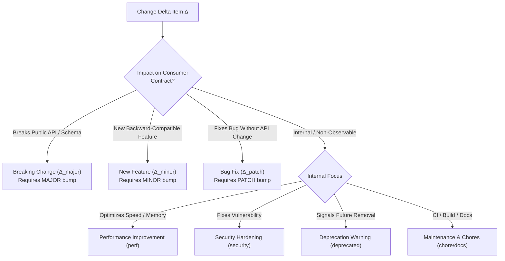
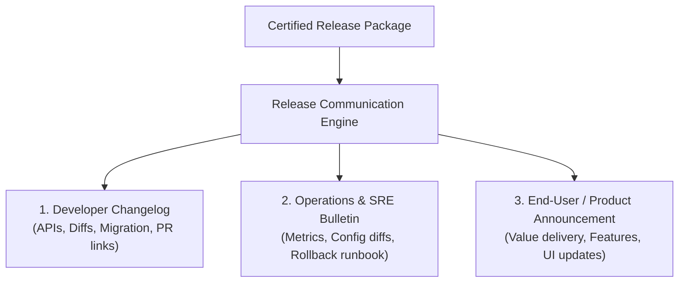

# Change Classification & Changelog Engineering: Semantic Deltas, Keep a Changelog & Communication

> **Mandate**: *A changelog is a contract with downstream consumers, not a raw dump of git commit logs.*  
> Software evolves through changes, but consumers experience changes through their operational impact. Documenting a release as "bug fixes and performance improvements" is a failure of technical communication. Release engineering requires a rigorous change classification taxonomy, automated extraction of semantic intent from version control, Diátaxis-aligned changelog formatting, concrete before/after migration recipes for breaking changes, and tailored release announcements for diverse audiences.

---

## 1 · The Universal Semantic Delta Taxonomy

Every modification between baseline release $\mathcal{R}_{\text{prev}}$ and candidate release $\mathcal{R}_{\text{cand}}$ falls into an explicit operational category:



### 1.1 Category Definitions & SemVer Mapping

| Delta Category | Definition & Operational Impact | SemVer Impact | Changelog Section |
| :--- | :--- | :--- | :--- |
| **Breaking Change** | Modifies existing public API signatures, wire formats, database schemas, CLI flags, or runtime semantics in a way that breaks existing consumers. | **MAJOR** | `Changed` or `Removed` (with explicit breaking badge) |
| **Feature / Addition** | Adds new public functions, endpoints, configuration options, or UI capabilities while preserving full backward compatibility. | **MINOR** | `Added` |
| **Bug Fix / Patch** | Restores intended behavior to a defective component without altering valid contracts or interfaces. | **PATCH** | `Fixed` |
| **Security Hardening** | Patches a known vulnerability, updates an insecure dependency, or tightens authentication/authorization boundaries. | **PATCH** | `Security` |
| **Performance** | Reduces latency, memory allocation, CPU overhead, or network bandwidth without altering external behavior. | **PATCH** | `Changed` |
| **Deprecation** | Signals that a feature or API will be removed in a future release. Existing code continues to work, but warnings are emitted. | **MINOR** | `Deprecated` |
| **Internal Maintenance** | Build scripts, tests, internal refactors, documentation updates, or CI pipeline changes that do not affect runtime artifacts. | **None** (Omit or group) | Optional `Chores` / `Internal` |

---

## 2 · Extracting Semantic Intent from Version Control

To eliminate subjective manual documentation, extract change intent directly from structured commit history and metadata:

### 2.1 Conventional Commits Specification
Structure commit messages to allow deterministic automated classification:
```text
<type>[optional scope]: <description>

[optional body]

[optional footer(s)]
```
* **Breaking Change Signatures**:
  * Exclamation point after type/scope: `feat(auth)!: replace session cookie with JWT`
  * Footer token: `BREAKING CHANGE: The 'userId' parameter has been renamed to 'accountId'.`
* **Type Mapping**:
  * `feat`: New feature $\to$ `Added`
  * `fix`: Bug fix $\to$ `Fixed`
  * `perf`: Performance enhancement $\to$ `Changed`
  * `refactor`: Behavior-preserving refactor $\to$ `Internal`
  * `docs`: Documentation updates $\to$ `Documentation`
  * `chore`: Maintenance / tooling $\to$ `Chores`

### 2.2 Traceability Metadata & Footers
Every release-worthy commit must link to issue trackers and co-authors via standard Git trailers:
```text
Fixes: #481
Resolves: ISS-9102
Co-authored-by: Alice Developer <alice@example.com>
Reviewed-by: Bob Reviewer <bob@example.com>
```

---

## 3 · Changelog Engineering: The "Keep a Changelog" Standard

A professional changelog adheres to the [Keep a Changelog](https://keepachangelog.com/) standard:
* Categorized by date and semantic version.
* Grouped by human-readable action buckets.
* Written for humans, not parsers.

### 3.1 Canonical Changelog Template
```markdown
# Changelog

All notable changes to this project will be documented in this file.
The format is based on [Keep a Changelog](https://keepachangelog.com/en/1.1.0/),
and this project adheres to [Semantic Versioning](https://semver.org/spec/v2.0.0.html).

## [2.1.0] - 2026-09-25

### Added
- Multi-region replication support for PostgreSQL storage adapter (#1420).
- New `--dry-run` flag in the CLI inspection tool (#1435).

### Changed
- Connection pool default idle timeout increased from 30s to 60s for improved throughput (#1422).
- Upgraded underlying gRPC transport to HTTP/2 multiplexing (#1428).

### Deprecated
- `StorageClient.connect_legacy()` is deprecated and will be removed in v3.0.0. Use `StorageClient.connect()` (#1430).

### Removed
- Legacy v1 JSON serialization format (previously deprecated in v1.8.0) (#1415).

### Fixed
- Prevent socket descriptor leak on transient TCP reset during handshake (#1439).
- Correct time zone normalization when parsing ISO-8601 timestamps with millisecond precision (#1442).

### Security
- Updated dependency `crypto-lib` to 3.2.1 to resolve CVE-2026-8819 (CVSS 5.3) (#1445).
```

---

## 4 · Actionable Migration Recipes for Breaking Changes

Whenever a release introduces a breaking change, the release notes **must** provide concrete, copy-pasteable before/after code migration recipes:

### 4.1 Recipe Structure
1. **What Changed**: Concise explanation of the technical motivation for the break.
2. **Blast Radius**: Which interfaces, methods, or configurations are impacted.
3. **Before / After Snippets**: Concrete code examples showing old vs new syntax.
4. **Automated Codemod**: Command to run automated migration scripts (if available).

### 4.2 Example Migration Recipe
```markdown
#### ⚠️ Breaking: Authentication Header Migration

**Why**: To support multi-tenant session isolation and zero-trust tokens, the legacy `X-API-Key` header has been replaced with standard RFC 6750 `Authorization: Bearer <token>`.

**Impact**: All REST API clients calling `/v2/` endpoints.

**Migration Example**:

```diff
- curl -H "X-API-Key: secret_12345" https://api.service.com/v2/records
+ curl -H "Authorization: Bearer secret_12345" https://api.service.com/v2/records
```

**SDK Migration (TypeScript)**:

```diff
- const client = new ServiceClient({ apiKey: 'secret_12345' });
+ const client = new ServiceClient({ auth: { bearerToken: 'secret_12345' } });
```
```

---

## 5 · Audience-Tailored Release Announcements

Different stakeholders require different narratives. A technical changelog is unsuitable for executive leadership, while marketing copy is useless for on-call SREs:



1. **Developer Changelog** (`CHANGELOG.md`):
   * Focus: Function signatures, bug fixes, dependency updates, pull request numbers.
2. **Operations & SRE Release Bulletin**:
   * Focus: New environment variables, database migration duration estimates, CPU/memory profile changes, rollback command triggers.
3. **End-User / Product Announcement**:
   * Focus: What problems are solved? What new workflows are unlocked? Visual screenshots or terminal recordings.

---

## 6 · Deadly Changelog Anti-Patterns

* ❌ **The Raw Git Log Dump**: Generating release notes by pasting `git log v1.0..v2.0 --oneline` with 50 lines of `fix typo`, `wip`, and `merge branch main`.
* ❌ **The Vague "Improvements" Cop-Out**: Publishing "General bug fixes and performance improvements" with zero technical specificity.
* ❌ **The Hidden Breaking Change**: Burying an API-breaking modification in a 200-line changelog under "Miscellaneous fixes" without a breaking badge or migration recipe.
* ❌ **The Unverified Author Attribution**: Claiming credit for community contributions without tagging co-authors or pull request contributors.
