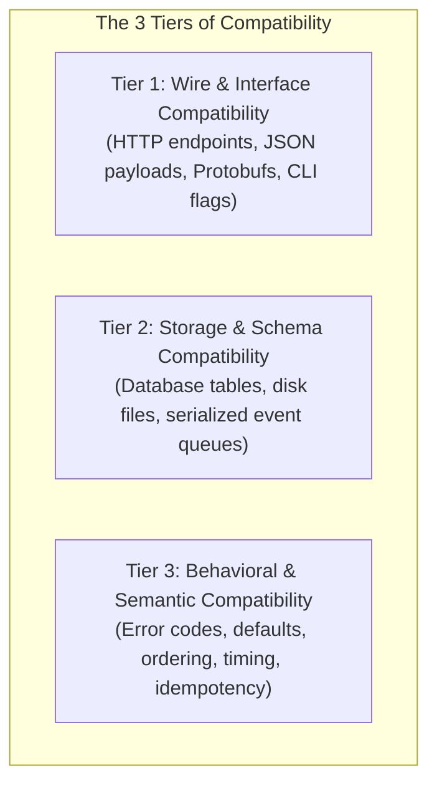
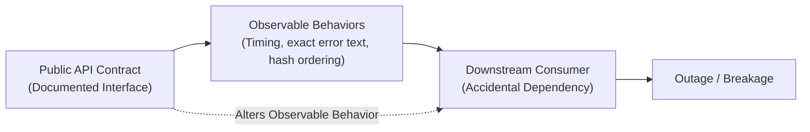
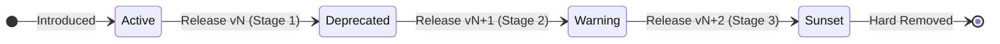

# Compatibility Contracts & Deprecation Lifecycles: Wire, Schema & Semantic Invariance

> **Mandate**: *Software that breaks downstream consumers without notice is not an upgrade; it is an outage.*  
> Upstream systems exist to serve consumers. When an upstream release breaks public APIs, serialized storage formats, or wire protocols without an established deprecation window and migration path, it forces unplanned emergency work onto every downstream client. Release engineering enforces backward and forward compatibility, formalizes the 3-Stage Deprecation Protocol, models Hyrum's Law defensively, and calculates migration complexity before authorizing releases.

---

## 1 · The 3 Tiers of Software Compatibility

A release must evaluate compatibility across three distinct technical planes:



### 1.1 Detailed Compatibility Matrix

| Compatibility Tier | Observable Interface | Breaking Mutation Examples | Non-Breaking Extension Patterns |
| :--- | :--- | :--- | :--- |
| **Tier 1: Wire & Interface** | REST/JSON endpoints, gRPC/Protobuf schemas, GraphQL types, CLI command flags, exported language symbols. | • Renaming or deleting an existing field.<br/>• Changing a field's data type (e.g. `int` to `string`).<br/>• Adding a required (mandatory) parameter.<br/>• Changing HTTP route structure. | • Adding optional fields with safe defaults.<br/>• Tolerant Reader pattern.<br/>• Adding new independent endpoints.<br/>• Field aliasing and deprecation tags. |
| **Tier 2: Storage & Schema** | Relational DDL (PostgreSQL, MySQL), NoSQL documents, Kafka event schemas, local disk config formats. | • Dropping a table or column currently read by active versions.<br/>• Adding a `NOT NULL` constraint without default.<br/>• Mutating serialized enum values in event streams. | • Multi-phase Expand/Contract migrations.<br/>• Nullable new columns.<br/>• Dual-write / dual-read transitional phases. |
| **Tier 3: Behavioral & Semantic** | Return value ordering, status codes, concurrency guarantees, performance characteristics, side-effects. | • Changing HTTP response from `404` to `400`.<br/>• Modifying default sorting from `ASC` to `DESC`.<br/>• Increasing background latency by $10\times$.<br/>• Making an idempotent API stateful. | • Explicit opt-in flags for behavioral changes.<br/>• Content negotiation / API version headers.<br/>• Retaining legacy behavior on default path. |

---

## 2 · Hyrum's Law & Defensive Boundary Engineering

> **Hyrum's Law**: *With a sufficient number of users of an API, it does not matter what you promise on the contract: all observable behaviors of your system will be depended on by somebody.*



### 2.1 Auditing Accidental Contracts
When evaluating whether a change is breaking:
1. **Never rely solely on documented contracts**: Consumers write code against real-world observations (e.g. relying on the exact wording of an error message string rather than error codes).
2. **Encapsulate internals**: Seal internal classes, obfuscate private symbols, and randomize non-deterministic orderings (e.g. Go's randomized map iteration) during development so consumers cannot accidentally depend on accidental behaviors.

---

## 3 · The Universal 3-Stage Deprecation Protocol

Removing features, APIs, or schemas must span a minimum of three distinct release epochs to give downstream teams an orderly migration window:



### 3.1 Protocol Execution Rules

| Stage | Release Epoch | Technical Action & Artifacts | Consumer Experience |
| :--- | :--- | :--- | :--- |
| **Stage 1: Deprecate** | Release $v_N$ | Introduce the modern replacement API. Mark the legacy API with `@deprecated` annotation and compile-time warnings. Document migration guide and target sunset version ($v_{N+2}$). | Code compiles cleanly; IDE shows strikethrough; zero runtime interruption. |
| **Stage 2: Warn** | Release $v_{N+1}$ | Emit loud operational runtime log warnings or telemetry counters (`RateLimitedWarning: Legacy API invoked`). Send proactive outreach to remaining consumers. | Code runs normally but emits visible warnings; logs highlight remaining calls. |
| **Stage 3: Sunset & Remove** | Release $v_{N+2}$ (Major Version Bump) | Hard deletion of legacy code, routes, or schema columns. Stub out legacy endpoint returning HTTP 410 Gone with link to migration guide. | Any unmigrated client fails deterministically with clear remediation pointer. |

* **Minimum Duration**: For public web APIs or widely distributed SDKs, the interval between Stage 1 and Stage 3 must span at least **90 days** or one full major release cycle.

---

## 4 · The Migration Complexity Vector

Before authorizing a release with breaking changes, the engineer calculates the **Migration Complexity Vector** $\vec{M}$:
$$\vec{M} = \langle \text{Surface}, \text{DeprecationElapsed}, \text{AutomatedCodemods} \rangle$$

1. **Surface ($\text{Surface} \in [1, 5]$)**:
   * Level 1: Trivial internal helper or rarely used edge-case flag.
   * Level 3: Common configuration option or utility method.
   * Level 5: Core authentication, primary data model, or foundational communication protocol.
2. **Deprecation Elapsed ($\text{DeprecationElapsed} \in \{\text{Zero}, \text{Partial}, \text{FullWindow}\}$)**:
   * Has the feature traversed the full 3-Stage Deprecation Protocol?
3. **Automated Codemods ($\text{AutomatedCodemods} \in \{\text{None}, \text{Scripted}, \text{ZeroTouch}\}$)**:
   * Does the release supply an automated migration command (e.g. `npx codemod`, `cargo fix`, `dart fix`) that migrates consumer source code automatically?

### 4.1 Authorization Threshold
* If $\text{Surface} \ge 4$ and $\text{DeprecationElapsed} \neq \text{FullWindow}$, the release **must be rejected** unless emergency executive authorization is granted under the Invariant Exception Protocol.

---

## 5 · Non-Breaking API Design Patterns

Engineers should design APIs that evolve organically without breaking contracts:

### 5.1 The Parameter Object Pattern
Never design methods with long positional parameter lists:
```typescript
// BAD: Adding a new parameter breaks all call sites
function queryRecords(filter: string, limit: number, timeoutMs?: number)

// GOOD: Option object permits non-breaking expansion
interface QueryOptions {
  filter: string;
  limit: number;
  timeoutMs?: number;
  includeMetadata?: boolean; // Added in v2.1 without breaking v2.0 callers
}
function queryRecords(options: QueryOptions)
```

### 5.2 The Tolerant Reader Pattern (Postel's Law)
> *"Be conservative in what you send, be liberal in what you accept."*
* When deserializing JSON, Protobuf, or XML:
  * Ignore unknown fields rather than throwing fatal parsing errors.
  * Allow optional fields to default gracefully.
  * Never assume array element order unless explicitly contract-guaranteed.

---

## 6 · Deadly Compatibility Anti-Patterns

* ❌ **The Sudden Death Deletion**: Deleting an API endpoint or database column in a minor or patch release without prior deprecation notice.
* ❌ **The Silent Type Narrowing**: Modifying an input field from `number` to `positive non-zero integer` without updating validation error handling, causing unexpected 400 errors for consumers.
* ❌ **The Default Value Flip**: Changing the default behavior of an existing function (e.g., changing `dryRun` default from `true` to `false`), causing accidental data mutation in consumer scripts.
* ❌ **The Phantom Compatibility Claim**: Claiming an API is backward compatible while omitting tests that execute against previous version clients.
