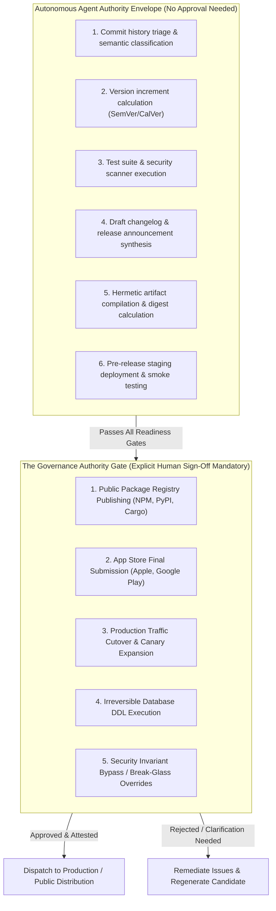
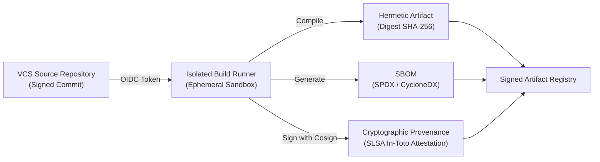

# Governance, Provenance & Human Authority: SBOM, SLSA, Ledger Sealing & Emergency Break-Glass

> **Mandate**: *Autonomous capability without governance is an existential operational hazard; governance without automation is paralysis.*  
> Software releases represent the boundary where internal code mutations become external operational reality. When an autonomous AI agent or automated pipeline publishes an artifact to a public registry, flips traffic on a live payment processor, or mutates a production database, the blast radius affects real humans and businesses. Release engineering establishes clear governance boundaries: agents autonomously execute analysis, validation, packaging, and staging, while high-risk, public, or irreversible distribution mandates explicit human authorization.

---

## 1 · The Human-in-the-Loop Governance Boundary

To eliminate risks of hallucinated or rogue automated publishing, define explicit authority envelopes:



### 1.1 The Governance Rule
An autonomous agent must **never** execute public package registry publication (`npm publish`, `cargo publish`, `twine upload`), push public tags to upstream production remotes, or cut production traffic without presenting the verified release manifest and receiving explicit human authorization.

---

## 2 · Software Provenance & Supply-Chain Hardening (SLSA)

A released artifact must demonstrate verifiable cryptographic lineage from source to binary:



### 2.1 The SLSA Framework Levels (Supply-chain Levels for Software Artifacts)

| SLSA Level | Requirement | Verification Method |
| :--- | :--- | :--- |
| **Level 1: Build Documentation** | Build process is automated via script/workflow; generates an explicit provenance metadata file. | Inspect build workflow configuration file (`.github/workflows/release.yml`, `build.ninja`, `Makefile`). |
| **Level 2: Tamper Resistance** | Build executes in a hosted CI/CD service; provenance is authenticated and signed by the build service. | Verify cryptographic build signature (e.g. GitHub Actions OIDC identity via Sigstore/Cosign). |
| **Level 3: Hermetic & Isolated** | Build runs in an ephemeral, isolated container without ambient internet access; source and dependencies are pinned; reproducible builds. | Verify zero unpinned network fetches during compilation; verify bit-for-bit identical digest from independent rebuild. |

---

## 3 · Software Bill of Materials (SBOM) Generation

Every release package must be accompanied by a machine-readable Software Bill of Materials (SBOM) in standard SPDX 2.3 or CycloneDX 1.5 format:
* **Components Listed**: Exact package names, versions, package URLs (PURL), licenses, and cryptographic hashes of all direct and transitive dependencies.
* **Vulnerability Tracking**: Allows downstream consumers and security scanners to instantly audit whether a released version is affected by newly discovered zero-day CVEs without recompiling or inspecting source code.

---

## 4 · The Immutable Release Ledger

Releases must be permanently recorded in an auditable, version-controlled ledger (`RELEASE_LEDGER.json` or persistent database):

### 4.1 Canonical Release Ledger Schema
```json
{
  "$schema": "https://agent-grimoire.dev/schemas/release-ledger-v1.json",
  "releaseId": "rel_20260925_auth_v2.4.0",
  "version": "2.4.0",
  "versionTopology": "SemVer-2.0.0",
  "timestamp": "2026-09-25T16:14:00Z",
  "source": {
    "vcs": "git",
    "commitSha": "e4f8d9b1c2a37e5f608192a8374b5c6d7e8f9012",
    "branch": "main",
    "treeClean": true
  },
  "artifact": {
    "name": "service-auth",
    "type": "oci-container",
    "digest": "sha256:7a8b9c0d1e2f3a4b5c6d7e8f9a0b1c2d3e4f5a6b7c8d9e0f1a2b3c4d5e6f7a8b",
    "signature": "sig_cosign_v2_f8e7d6c5..."
  },
  "readinessScorecard": {
    "compositeScore": 96.5,
    "functionalTestPass": true,
    "securityCveCount": 0,
    "performanceBudgetPass": true,
    "compatibilityCheckPass": true
  },
  "governance": {
    "status": "APPROVED",
    "approver": "gowtham-lead-architect",
    "approvalAttestation": "GPG-KEY-ID: 0x9A4B3C2D1E0F",
    "breakGlassException": false
  },
  "recovery": {
    "reversibilityClass": "Class2-ConditionallyReversible",
    "rollbackCommand": "kubectl rollout undo deployment/service-auth"
  }
}
```

---

## 5 · The Emergency Fast-Track Protocol (Break-Glass)

During an active Sev-0 production emergency or critical zero-day exploit, the normal release ceremony must yield to rapid incident remediation without sacrificing fundamental safety:

> [!CAUTION] BREAK-GLASS FAST-TRACK CHECKLIST
> In an active Sev-0 incident, an expedited release is authorized under the following strict conditions:
> 1. **Verified Outage Citation**: Reference active incident ticket (`INCIDENT-8921: Remote Code Execution in JSON Parser`).
> 2. **Surgical Patch Scope**: Only cherry-pick the exact remediation commits. Prohibit bundling opportunistic refactors.
> 3. **Non-Bypassed Core Gates**: Compilation, targeted unit test for the vulnerability, and artifact digest generation **must** still execute.
> 4. **Dual-Key Authorization**: Break-glass requires two approving engineers or immediate incident commander authorization.
> 5. **Reconciliation Debt Log**: A high-priority debt ticket is generated automatically requiring complete regression test runs, documentation updates, and post-mortem within 24 hours.

---

## 6 · Credential & Secret Hygiene During Release Publishing

Releasing software often requires interaction with external package registries (NPM tokens, PyPI API keys, Cargo credentials, AWS/GCP service accounts):
* **Zero Ambient Credentials**: Never store plain-text API tokens or registry passwords in shell configuration, environment files, or repository source code.
* **Ephemeral Short-Lived Tokens**: Use OpenID Connect (OIDC) identity federation (e.g. GitHub Actions OIDC to NPM/PyPI/AWS) to exchange temporary, scoped, single-use tokens for publication.
* **Least Privilege Scoping**: Release publishing tokens must be strictly scoped to the specific package repository and expire within minutes of release completion.

---

## 7 · Deadly Governance Anti-Patterns

* ❌ **The Autonomous Public Publish**: An AI agent running `npm publish` or `git push --tags` without human review, distributing unvetted code to thousands of external developers.
* ❌ **The Missing Ledger**: Publishing software updates directly from local developer laptops without recording a tamper-evident release ledger entry.
* ❌ **The Permanent Break-Glass**: Treating emergency fast-track procedures as standard operating procedure to bypass release quality gates.
* ❌ **The Unsigned Artifact**: Distributing compiled binaries without cryptographic signatures, leaving downstream consumers vulnerable to man-in-the-middle tampering.
