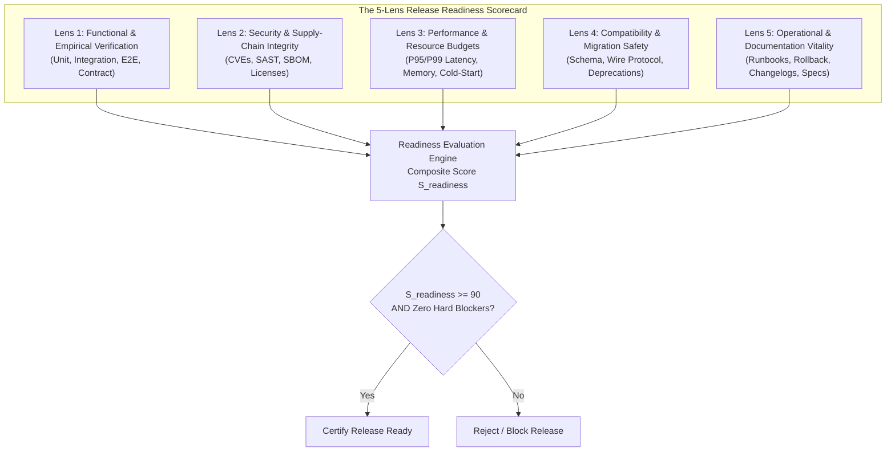
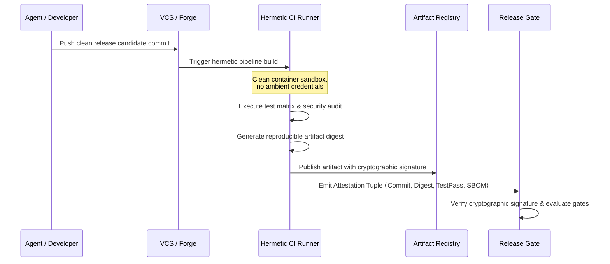
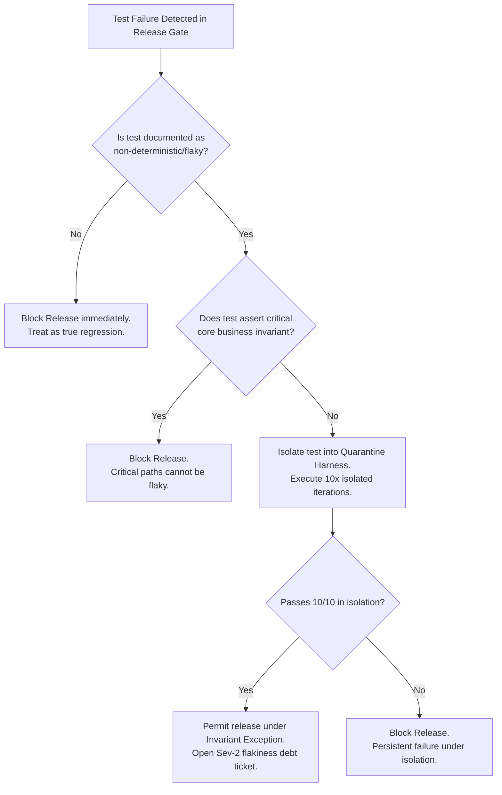
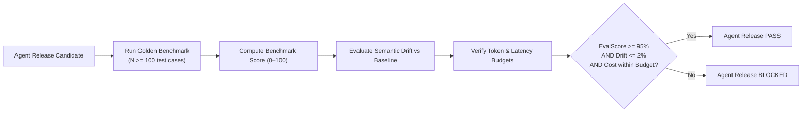

# Readiness Evidence & Quality Gates: The 5-Lens Scorecard, CI Attestations & Supply-Chain Integrity

> **Mandate**: *Readiness is demonstrated through reproducible, falsifiable evidence, never assumed or self-attested.*  
> A build that compiles cleanly is not ready for release. A test suite that passes on an engineer's laptop is not sufficient proof for production distribution. Release readiness is a multi-dimensional certification protocol that evaluates functional correctness, software supply-chain integrity, performance envelopes, compatibility guarantees, and operational recoverability. This reference establishes the formal 5-Lens Readiness Scorecard, mathematical gating formulas, CI attestation verification, and supply-chain auditing across any software archetype.

---

## 1 · The 5-Lens Release Readiness Scorecard

### 1.1 The Five Evaluation Dimensions

| Lens | Mandatory Falsifiable Verification Criteria | Hard Blocker Condition (Veto) | Weight ($w_k$) |
| :--- | :--- | :--- | :--- |
| **1. Functional Verification** | Full test suite execution across target runtime matrix; zero regressions; contract tests pass; critical user flows validated. | Any test failure or unhandled exception in core workflows. | $0.25$ |
| **2. Security & Supply-Chain** | Static analysis (SAST) passes with zero high/critical vulnerabilities; dependencies locked; SBOM generated; zero unapproved licenses. | Any unmitigated Critical/High CVE ($\text{CVSS} \ge 7.0$) in reachable code paths. | $0.25$ |
| **3. Performance & Capacity** | P95/P99 latency within established budget; memory allocation delta $\le 5\%$; zero unbounded connection leaks. | P99 latency regression $> 15\%$ or detected persistent memory leak under load. | $0.20$ |
| **4. Compatibility & Migration** | Database migrations tested bidirectionally (up/down or expand/contract dry run); wire protocol backward compatible. | Destructive schema change without backward-compatible dual-write phase. | $0.20$ |
| **5. Operations & Documentation** | Immutable changelog generated; API reference updated; pre-verified rollback runbook documented. | Missing rollback execution plan or undocumented breaking API changes. | $0.10$ |

---

## 2 · Mathematical Gating Formulation

### 2.1 Composite Readiness Score
Let $G_k \in [0, 100]$ represent the score for Lens $k \in \{1, 2, 3, 4, 5\}$, and $w_k$ represent its relative weight ($\sum_{k=1}^5 w_k = 1.0$). The composite readiness score $\mathcal{S}_{\text{readiness}}$ is calculated as:
$$\mathcal{S}_{\text{readiness}} = \sum_{k=1}^5 w_k \cdot G_k$$

### 2.2 The Veto Function (Zero-Tolerance Hard Gates)
Regardless of the composite score, a release is strictly forbidden if any individual lens triggers a hard blocker veto:
$$\text{IsReady}(\mathcal{R}) \iff \left( \mathcal{S}_{\text{readiness}} \ge 90 \right) \land \left( \prod_{k=1}^5 \text{VetoFree}(L_k) = 1 \right)$$
Where:
$$\text{VetoFree}(L_k) = \begin{cases} 0 & \text{if any Hard Blocker is present in } L_k \\ 1 & \text{otherwise} \end{cases}$$
* *Consequence*: A project with a perfect 100 in Functional, Performance, and Operations but a Critical unpatched Remote Code Execution CVE in Security evaluates to $\text{VetoFree}(L_2) = 0 \implies \text{IsReady} = \text{FALSE}$.

---

## 3 · Ephemeral Local Evidence vs CI Attestations

A release must never rely on local, non-reproducible developer claims (*"tests pass on my machine"*). Release readiness requires **verifiable build provenance**:

### 3.1 The Attestation Tuple Contract
A valid release attestation consists of four cryptographically verifiable components:
$$\text{Attestation} = \langle \text{CommitSHA}, \text{ArtifactDigest}, \text{PipelineID}, \text{ProofSignature} \rangle$$
1. **Source State Lock**: Commit SHA must match a clean, merged state on the canonical release branch.
2. **Hermetic Build Guarantee**: Artifact was built inside a clean, reproducible container/runner with pinned compiler toolchains.
3. **Reproducible Digest**: Cryptographic hash (SHA-256) of the resulting binary/package.
4. **Third-Party Signature**: Signed by the pipeline's identity provider (e.g. Cosign, Sigstore, OIDC token).

---

## 4 · Test Flakiness Filtering & Quarantine Protocol

Non-deterministic, flaky tests erode confidence in release gates. To prevent release paralysis while upholding empirical rigor:

* **The Core Path Invariant**: No test covering financial transactions, authentication, data persistence, or security authorization may ever be quarantined or bypassed. Only auxiliary integration or cosmetic rendering tests may enter quarantine.

---

## 5 · Software Supply-Chain & Dependency Hardening

Modern software releases inherit the vulnerability surface of their transitive dependency trees. Release certification requires strict supply-chain verification:

### 5.1 The 4 Supply-Chain Verification Gates
1. **Lockfile Hermeticity**:
   * Dependency lockfiles (`package-lock.json`, `Cargo.lock`, `poetry.lock`, `go.sum`) must be fully committed and synchronized.
   * Floating version specifiers (`^`, `~`, `latest`) in locked trees are strictly prohibited.
2. **Software Bill of Materials (SBOM)**:
   * Generate an automated, machine-readable inventory of all components in standard format (SPDX 2.3 or CycloneDX 1.5).
3. **Vulnerability Reachability Triage**:
   * Automated vulnerability scans often produce noise for dormant sub-dependencies.
   * If a CVE exists in a transitive package, evaluate **Reachability**: Does the application import, invoke, or pass untrusted input to the vulnerable symbol?
   * If reachable $\to$ **Hard Block**. If unreachable $\to$ Documented mitigation exception permitted with scheduled remediation.
4. **License Compliance**:
   * Audit all dependencies against approved open-source license policies. Flag copyleft licenses (GPL/AGPL) in proprietary commercial releases.

---

## 6 · Probabilistic & Non-Deterministic Release Gates (AI Agents & Swarms)

When releasing autonomous AI agents, prompt configurations, MCP server tools, or fine-tuned model checkpoints, deterministic unit tests are insufficient. The release gate must enforce **Statistical Evaluation Gates**:

### 6.1 The 3 AI Release Invariants
1. **Evaluation Benchmark Score**: The candidate agent must achieve a pass rate $\ge \tau$ (e.g. $95\%$) across a standardized, golden dataset of multi-turn tasks.
2. **Semantic Regression Boundary**: Performance on historical benchmark cases must not degrade by more than $\epsilon$ (e.g. $\le 2\%$) compared to the baseline release.
3. **Resource & Token Budget**: Latency distributions ($P_{95}$) and total token consumption per task must not exceed allocated operational capacity.

---

## 7 · Deadly Readiness Anti-Patterns

* ❌ **The "Just Ship It and Watch Datadog" Anti-Pattern**: Releasing unverified changes directly to production with the intention of diagnosing failures via live customer traffic.
* ❌ **The Flaky Test Ignore Loop**: Re-running a failed CI pipeline 5 times until it randomly passes once, then declaring the release ready.
* ❌ **The Dependency Freeze Bypass**: Building a release without pinned dependencies or downloading latest unpinned packages during production packaging.
* ❌ **The Scope Creep Release**: Bundling unverified "minor refactors" or cosmetic cleanups into a targeted security hotfix release.
