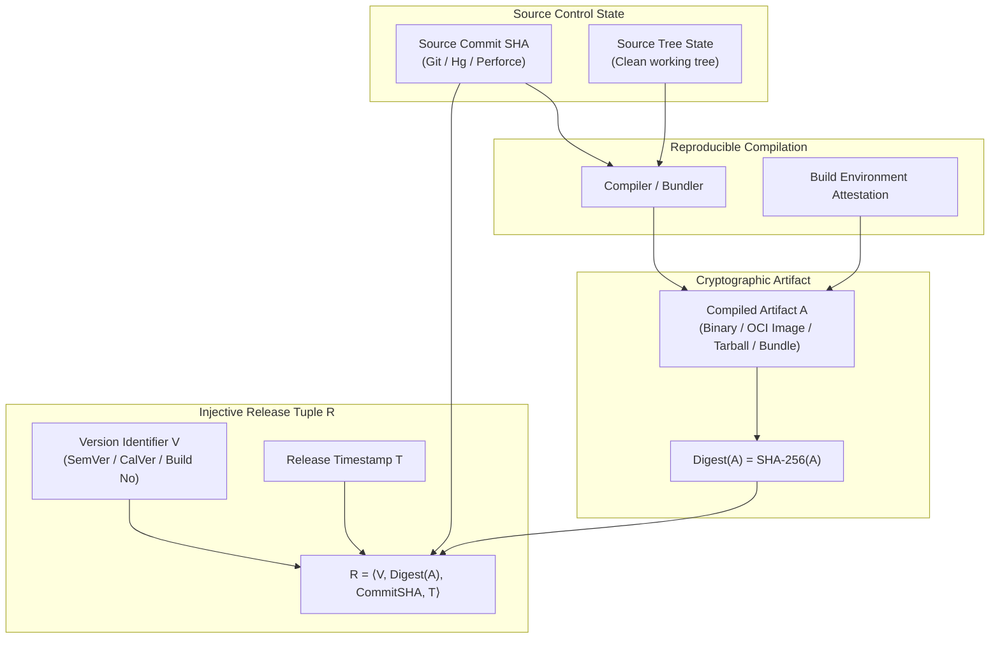
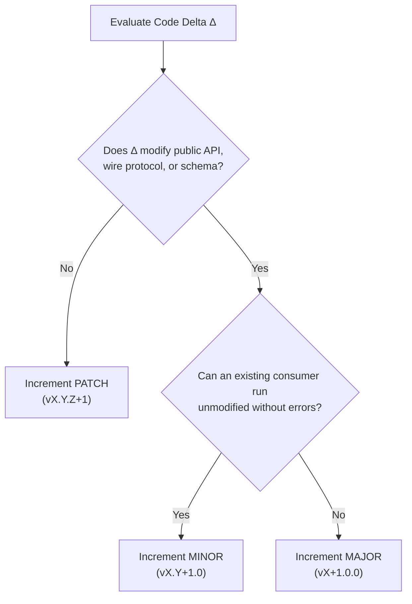
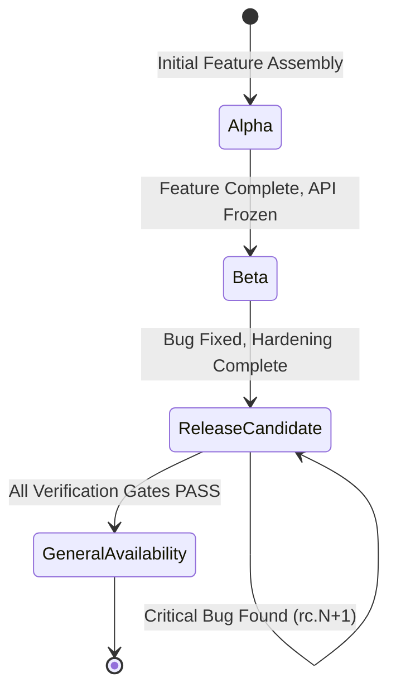
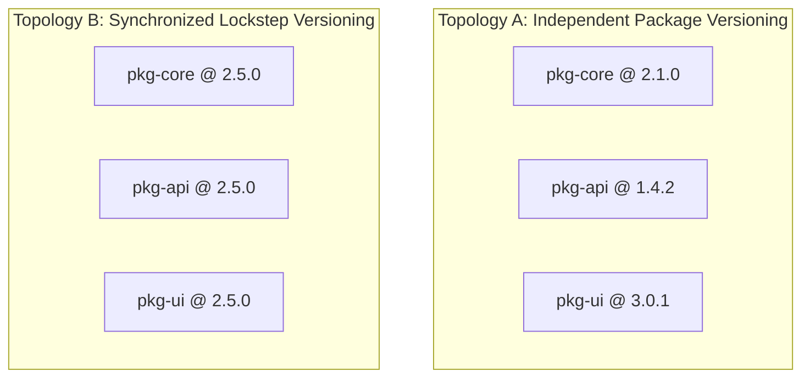

# Release Identity & Version Semantics: Injective Identity, SemVer, CalVer & Monorepo Topologies

> **Mandate**: *You cannot govern, audit, or recover a system whose state cannot be uniquely and immutably identified.*  
> Release identity is the foundational anchor of software provenance. It binds a human-readable or machine-parsable version identifier injectively to a cryptographic digest of the compiled artifact and its exact source tree commit. A version string without a cryptographic digest is an ambiguous pointer; an artifact digest without a version contract is an opaque blob. This reference defines the mathematics of release identity, evaluates the spectrum of versioning topologies, models prerelease promotion lifecycles, and resolves monorepo versioning dependencies without dogmatic platform lock-in.

---

## 1 · The Formal Mathematics of Release Identity

### 1.1 The Injective Mapping Axiom
Let $\mathcal{V}$ be the set of version identifiers, $\mathcal{A}$ be the set of deployable computational artifacts, and $\mathcal{S}$ be the set of source repository states. A release identity mapping $\mathcal{R}: \mathcal{V} \to \mathcal{A} \times \mathcal{S}$ must be **strictly injective**:
$$\forall V_1, V_2 \in \mathcal{V}, \quad V_1 = V_2 \implies \text{Digest}(\mathcal{R}(V_1)) = \text{Digest}(\mathcal{R}(V_2))$$
* **Correlative Rule**: If an artifact changes by a single bit ($\text{Digest}(A') \neq \text{Digest}(A)$), it is mathematically forbidden to assign it the same version identifier $V$.
* **Immutable Registry Rule**: Once a tuple $\langle V, \text{Digest}(A) \rangle$ is published to a package registry, artifact repository, or VCS tag, it must be permanently immutable. Re-tagging or replacing artifacts in-place violates the foundational axiom of software engineering.

### 1.2 Resolving Ambiguous Pointers (The Prohibition of Floating Tags)
Mutable pointers such as `latest`, `stable`, `main`, or `v1` are **routing aliases**, never release identities:
$$\text{Alias}(\text{"latest"}) \to \mathcal{R}_t \quad (\text{Mutable over time } t)$$
A release record, deployment manifest, or dependency lockfile must **never** reference a floating alias. It must reference the explicit, immutable release tuple:
$$\text{ManifestReference} := \langle \text{Identifier}, \text{Digest} \rangle \quad \text{e.g., } \texttt{pkg@2.4.1#sha256:7f83b165...}$$

---

## 2 · The Spectrum of Versioning Topologies

No single versioning scheme is universally optimal for all software archetypes. The engineer must choose the topology that accurately communicates change contracts to downstream consumers:

| Versioning Topology | Formal Schema | Best Fitted Archetypes | Consumer Contract Communicated | Operational Trade-offs |
| :--- | :--- | :--- | :--- | :--- |
| **Semantic Versioning (SemVer 2.0.0)** | `MAJOR.MINOR.PATCH` `[-PRERELEASE][+BUILD]` | Libraries, SDKs, Public APIs, Reusable Tools | **API Contract Stability**:  • Major: Breaking contract • Minor: Backward-compatible feature • Patch: Backward-compatible fix | High consumer trust; requires strict API boundary discipline; prone to debate over what constitutes "breaking". |
| **Calendar Versioning (CalVer)** | `YYYY.MM[.MICRO]` or `YY.0M[.MICRO]` | SaaS Platforms, CLI Tools, OS Distributions, Desktop Apps | **Temporal Currency**:  Communicates freshness and lifecycle support window (e.g. `2026.04` implies release in April 2026). | Ideal for time-based release trains; does not intrinsically signal API breaking changes without explicit sub-version conventions. |
| **ZeroVer** | `0.MAJOR.MINOR` | Early-stage research, experimental prototypes, ephemeral proofs-of-concept | **Zero Stability Guarantee**:  Any release may break contracts at any time. | Convenient for velocity; highly dangerous for production dependencies; signals immature software. |
| **Content-Addressed (Hash-Pinned)** | `sha256:[64 hex]` or `git-[7 hex]` | Internal microservices, container fleets, continuous deployment streams | **Exact Cryptographic Provenance**:  Guarantees byte-for-byte fidelity with zero semantic interpretation. | Eliminates version increment debates; zero human readability; requires external change logs to understand impact. |
| **Sequential Build Numbers** | `MAJOR.MINOR (BUILD_INT)` e.g. `2.4.1 (1894)` | Mobile Apps (iOS/Android), Embedded firmware, Desktop installers | **Monotonic Ordering**:  Required by app store submission engines and hardware bootloaders. | Separates user-facing marketing version (`2.4.1`) from low-level monotonic build sequencing (`1894`). |

### 2.1 The SemVer Decision Matrix
When using Semantic Versioning, calculate the version increment step via this deterministic logic:

---

## 3 · The Prerelease & Promotion Lifecycle

Releases mature through explicit epistemic certainty stages before achieving General Availability (GA):

### 3.1 Prerelease Identifier Syntax
Follow standard dot-separated monotonic notation:
* **Alpha** (`1.4.0-alpha.1`): Active feature development; interfaces subject to rapid mutation. Internal testing only.
* **Beta** (`1.4.0-beta.1`): Feature freeze; public API locked; external integration testing and feedback phase.
* **Release Candidate** (`1.4.0-rc.1`): Sealed candidate build. Zero functional changes permitted; only critical stability/security fixes qualify for `rc.2`.
* **General Availability** (`1.4.0`): The finalized, production-certified release.

### 3.2 The Build-Once Promotion Axiom
When promoting a Release Candidate (`1.4.0-rc.3`) to General Availability (`1.4.0`), **never recompile the code from source**:
$$\text{Digest}(A_{\text{GA}}) \equiv \text{Digest}(A_{\text{RC}})$$
Recompiling introduces the risk of non-deterministic compiler variance, updated transitive sub-dependencies, or timestamp shifts. Promotion is a **metadata and tagging operation** that assigns the GA identity to the exact binary digest previously certified in staging.

---

## 4 · Monorepo Versioning Topologies

In multi-package repositories (e.g. workspaces containing 10–100 interconnected packages), managing release identity requires an explicit topological strategy:

### 4.1 Topology Comparison

| Strategy | Operational Mechanism | Best Fitted For | Trade-offs |
| :--- | :--- | :--- | :--- |
| **Independent Versioning** | Each package maintains its own version number, changelog, and release lifecycle. Bumping `pkg-core` does not bump `pkg-ui` unless `pkg-ui` consumes the change. | Modular SDKs, decoupled utilities, multi-tenant monorepos (e.g. Babel, Turborepo, Yarn workspaces). | Granular, minimal blast radius; complex dependency resolution and cascade management; requires automated changelog tooling. |
| **Synchronized Lockstep** | All packages in the repository share a single global version number. Every release bumps all packages simultaneously, regardless of whether individual packages had changes. | Tightly coupled frameworks, platform suites (e.g. Angular, Jest, React, Ember). | Trivial mental model for consumers; simplifies cross-package dependency pinning (`*` or exact match); produces empty releases for untouched packages. |

### 4.2 The Cascade Resolution Protocol for Independent Monorepos
When package $B$ is modified in an independent monorepo:
1. **Direct Dependency Step**: Determine the semantic increment of $B$ based on its source delta ($\Delta B$).
2. **Topological Traverse**: For every package $A$ that depends on $B$ ($A \to B$):
   * If $\Delta B$ is **breaking** (major bump): Package $A$ must update its dependency range. If $A$ re-exports or exposes $B$'s broken types/APIs, $A$ must also execute a major bump. If $A$ absorbs the break internally without altering its own public contract, $A$ executes a minor or patch bump.
   * If $\Delta B$ is **backward-compatible** (minor/patch): Package $A$ updates its lockfile or minimum dependency bound via a patch bump.
3. **Cycle Prohibition**: Monorepo dependency graphs must be strict Directed Acyclic Graphs (DAGs). Cyclic dependencies ($A \to B \to A$) make deterministic release cascading mathematically impossible.

---

## 5 · Version Authority & Tagging Mechanics Across Forges

Release identity must be bound to persistent, verifiable records across version control systems:

| Version Control / Registry | Canonical Identity Mechanism | Provenance Anchor | Tagging Command / Action Role |
| :--- | :--- | :--- | :--- |
| **Git** | Cryptographically signed, annotated tag (`refs/tags/vX.Y.Z`) | Commit GPG/SSH Signature + Tree SHA | `git tag -s -a vX.Y.Z -m "Release vX.Y.Z"` (Lightweight tags prohibited). |
| **Mercurial (Hg)** | Permanent `.hgtags` changeset commit | Changeset Node Hash | `hg tag vX.Y.Z` |
| **Perforce (Helix Core)** | Labeled changelist / Automatic label | Changelist Number | `p4 tag -l RELEASE_vX.Y.Z ...` |
| **OCI / Docker Registry** | Immutable Image Digest (`@sha256:...`) | Container Manifest Digest | Push with image digest pinning; secondary immutable semantic tag. |
| **App Stores (Apple / Google)** | `CFBundleShortVersionString` + `CFBundleVersion` | Developer Certificate + Notarization Ticket | Binary packaging with signed cryptographic entitlements. |

---

## 6 · Deadly Identity Anti-Patterns

* ❌ **The Lightweight Git Tag Trap**: Using lightweight Git tags (`git tag v1.0.0`) instead of annotated, signed tags (`git tag -a -s`). Lightweight tags are merely pointers to commit objects without metadata, author attribution, timestamp, or cryptographic verification.
* ❌ **The In-Place Re-Tag (History Mutation)**: Moving an existing tag to a new commit (`git tag -f v1.0.0`) because a bug was discovered post-release. Downstream package caches, proxies, and build systems will fail with checksum mismatches or serve stale, corrupt builds.
* ❌ **The Recompile-on-Promote Trap**: Rebuilding a new binary from source when transitioning from Release Candidate to General Availability. If the compiler or dependencies shifted, the tested candidate is not what is released.
* ❌ **The Semantic Drift Fallacy**: Declaring a release as a "patch" while changing an undocumented, private behavior that downstream consumers depend on without auditing the blast radius (Hyrum's Law).
