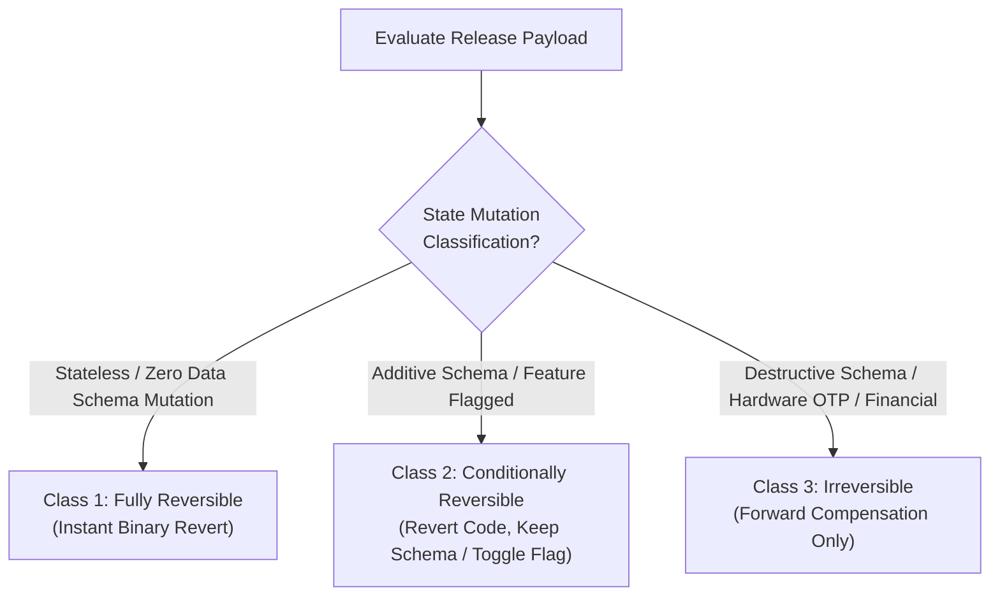
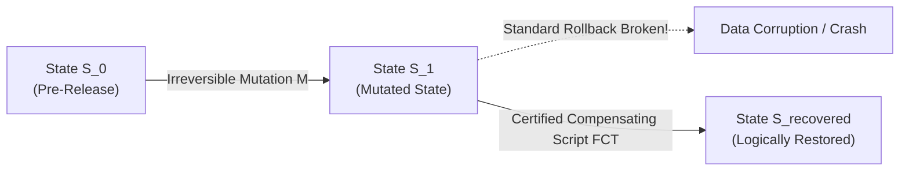
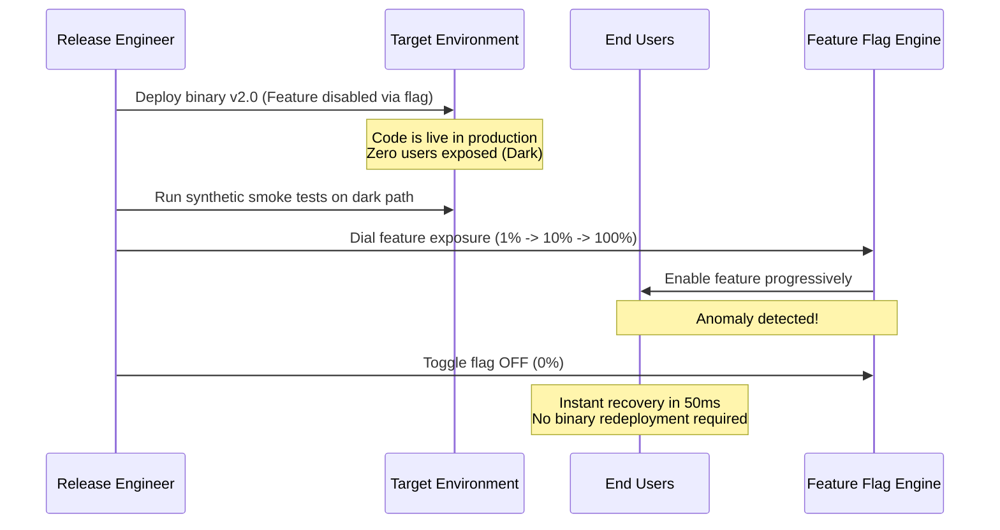

# Rollback Preparedness & Recovery Contracts: Triage, Forward Compensation & Decoupled Flags

> **Mandate**: *You must understand how to survive a failure before you initiate a release.*  
> In engineering, optimism is not a strategy. Every release carries a non-zero probability of introducing regressions, memory leaks, security vulnerabilities, or operational failure. Authorizing a release without a verified, pre-computed recovery path is unacceptable operational risk. This reference formalizes rollback feasibility triage, establishes the Forward-Compensation Transaction (FCT) protocol for irreversible mutations, models feature-flag decoupling, and defines the pre-release recovery runbook across any software archetype.

---

## 1 · Rollback Feasibility Triage

Before authorizing release packaging, the engineer triages the change into one of three feasibility classes:



### 1.1 The 3 Reversibility Classes

| Reversibility Class | System Characteristics | Recovery Mechanism | Recovery Time Objective (RTO) | Pre-Release Requirement |
| :--- | :--- | :--- | :--- | :--- |
| **Class 1: Fully Reversible** | Stateless microservices, client web assets, CLI binaries with zero local disk format changes. | Instant traffic rollback or binary redeployment to $\mathcal{R}_{\text{prev}}$: <br/>$T_{\text{traffic}}(\mathcal{R}_{\text{cand}}) \to T_{\text{traffic}}(\mathcal{R}_{\text{prev}})$ | Instant ($< 60\text{ seconds}$) | Pinned previous binary digest; tested rollback CLI command. |
| **Class 2: Conditionally Reversible** | Additive database changes (new nullable columns), backward-compatible event queues, feature-flagged logic. | Toggle feature flag OFF, or revert binary while leaving additive database schema untouched. | Fast ($< 5\text{ minutes}$) | Backward compatibility verification of $\mathcal{R}_{\text{prev}}$ against new schema; feature flag kill-switch verified. |
| **Class 3: Irreversible** | Destructive DDL (dropped columns/tables), OTP hardware fuses, irreversible data format transformations, financial ledger settlements. | **Forward Compensation Transaction (FCT)**: Code cannot be rolled back without data loss. Must fix forward or execute pre-certified compensating script. | Minutes to Hours | Verified pre-mutation snapshot; dry-run tested FCT script; explicit dual-key human sign-off. |

---

## 2 · The State Asymmetry & Forward-Compensation Protocol

When a release contains Class 3 irreversible mutations, standard binary rollback is impossible:
$$\Delta t_{\text{undo}} = \infty$$



### 2.1 The Mandatory 3-Pillar Forward-Compensation Contract
A release containing Class 3 mutations is strictly blocked until all three pillars are verified:
1. **Pillar 1: Pre-Mutation Snapshot & Backup Attestation**:
   * A verified, restorable snapshot of the persistent storage must exist and be validated *immediately prior* to mutation execution:
     $$\text{SnapshotValid}(\text{Timestamp} \le t_{\text{release}} - \Delta t)$$
2. **Pillar 2: Certified Forward-Compensation Transaction (FCT)**:
   * A deterministic remediation script that undoes the business impact without reverting the binary.
   * *Example*: If a migration backfilled records into an invalid format, the FCT is a script that transforms records into the corrected format rather than restoring a full database backup.
3. **Pillar 3: Dual-Key Human Irreversibility Sign-off**:
   * The release manifest must contain explicit human authorization acknowledging that the release is one-way.

---

## 3 · Feature Flag Decoupling (Dark Shipping)

The safest releases separate **code delivery** from **feature activation**:
$$\text{Release}(\text{Code}) \neq \text{Activate}(\text{Feature})$$



### 3.1 The Dark Shipping Invariant
Whenever a release introduces high-risk algorithmic changes, UI rewrites, or third-party integrations:
* Encapsulate the new execution path behind a dynamic runtime flag.
* Ship the release with the flag defaulted to **OFF**.
* Verify runtime health in production before flipping the flag. If issues arise, flipping the flag takes milliseconds, avoiding the high cost and latency of a binary rollback.

---

## 4 · The Pre-Release Recovery Runbook

Every release record must include a concise, executable recovery runbook with three mandatory sections:

### 4.1 Canonical Recovery Runbook Schema
```markdown
### Pre-Release Recovery Runbook: [Release ID / Version]

#### 1. Abort & Rollback Triggers (When to Roll Back)
- **Error Budget**: Sustained HTTP 5xx error rate > 0.5% over 3 minutes.
- **Latency**: P99 latency exceeds 250ms (baseline: 120ms).
- **Core Signal**: Any unhandled crash in checkout/authentication flow.
- **Telemetry Anomaly**: Deadlock count > 0 in database connection pool.

#### 2. Immediate Rollback Execution Sequence
1. **Traffic Diversion**:
   `kubectl set image deployment/api api=registry.internal/api:v1.3.9`
   *(or: Shift load balancer weight back to Blue environment)*
2. **Feature Kill-Switch**:
   `flag-admin --env=prod --flag=enable-v2-billing --state=disabled`

#### 3. Data & State Compensation (If State was Touched)
- **Schema Compatibility**: Schema changes in this release are additive; v1.3.9 binary runs safely against v1.4.0 database.
- **Compensation Script**: `scripts/compensate-failed-billing-sync.py --dry-run`

#### 4. Forensic Preservation
- Export container crash logs before pod teardown:
  `kubectl logs -l app=api --previous > /var/log/release-incident-$(date +%s).log`
```

---

## 5 · Incident Handoff to `failure-recovery`

If a release triggers an abort threshold post-launch:
1. **Engage Immediate Mitigation**: Execute the runbook's binary rollback or flag disable commands.
2. **Handoff to Incident Recovery**: Pass the incident context to [`failure-recovery`](../../failure-recovery/SKILL.md) for root-cause analysis (RCA), post-mortem documentation, and systematic remediation.
3. **Ledger Taint**: Mark the release version as `TAINTED / YANKED` in the release ledger to prevent downstream redeployment.

---

## 6 · Deadly Recovery Anti-Patterns

* ❌ **The "Rollback is Always Possible" Assumption**: Assuming you can always roll back code, only to discover that the database migration immediately dropped tables or modified column constraints that crash the old binary.
* ❌ **The Untested Rollback Command**: Documenting a rollback command that contains syntax errors or targets deprecated cluster credentials, stalling engineers during a high-stress outage.
* ❌ **The Destructive Rollback**: Restoring a full database snapshot from 2 hours ago to fix an application bug, inadvertently destroying 2 hours of legitimate customer transactions.
* ❌ **The Unpreserved Crime Scene**: Deleting failing containers or wiping logs during rollback without capturing memory dumps, network traces, or stack traces required for root-cause forensics.
