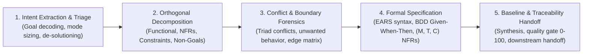

# Requirements Analysis: Universal Intent Engineering Protocol

> **Mandate**: *Requirements engineering is the disciplined bridge between human intent and computational reality.* Define what problem must be solved and why, establish empirical boundaries of satisfaction, surface implicit assumptions, and guard against premature implementation without constraining architectural creativity or micromanaging agent cognition.

---

## 1 · The 5-Phase Requirements Lifecycle

Every user request, feature prompt, or architectural initiative traverses this 5-phase protocol:



1. **Phase 1 — Intent Extraction & Triage**: Decode the raw request to extract the root Job-to-be-Done. Apply the **Intent De-Solutioning Filter** to strip premature implementation mechanisms into candidate preferences. Size the cognitive mode (`micro`, `standard`, `architectural`, `ambiguity-rescue`). Apply the **Clarification Gate**: if an ambiguity involves high reversal cost (breaking contracts, persistent schema changes, irreversible data mutations), solicit user clarification; for low-reversal-cost forks, apply the **Autonomous Defaulting Axiom** with sensible defaults.
2. **Phase 2 — Orthogonal Decomposition**: Disentangle the request into Functional Requirements (FR), Quality Attributes (NFR), Constraints, and Assumptions. Define **Non-Goals** to eliminate scope creep.
3. **Phase 3 — Conflict & Boundary Forensics**: Audit language against the **Ambiguity Filter** (strip unmeasurable adjectives). Explore the operational boundaries (input ranges, boundary values, error conditions). Resolve competing constraints via trade-off matrices.
4. **Phase 4 — Formal Specification**: Express functional behavior using clear event-state rules (e.g. EARS syntax: Ubiquitous, Event, State, Optional, Unwanted). Define verifiable acceptance criteria via BDD Given-When-Then scenarios. Bind quality attributes to measurable metrics $\langle M, T, C \rangle$ (Metric, Target, Condition).
5. **Phase 5 — Baseline & Traceability Handoff**: Audit specification against the quality rubric. Emit the confirmed requirement baseline (in a project spec document or structured intent block) and hand off to `project-analysis` or `planning`.

---

## 2 · Progressive Disclosure (Reference Routing)

To preserve context bandwidth and prevent cognitive overload, consult reference manuals strictly on demand:

| Context Trigger | Mandatory Reference Manual | Purpose |
| :--- | :--- | :--- |
| **Vague prompts, clarification gates, defaults, EARS patterns** | [`references/elicitation-and-ambiguity.md`](references/elicitation-and-ambiguity.md) | Clarification Gate criteria, Autonomous Defaulting Axiom, Ambiguity filter words, EARS grammar. |
| **Decomposing requests, NFRs, ISO 25010, non-goals, constraints** | [`references/decomposition-and-nfrs.md`](references/decomposition-and-nfrs.md) | The 2-Tier Ontological Sieve, ISO 25010 NFR catalog, $(M, T, C)$ measurement triads, scope ceilings. |
| **BDD acceptance criteria, edge-case bounds, domain invariants** | [`references/formal-spec-and-bdd.md`](references/formal-spec-and-bdd.md) | Given-When-Then semantics, operational neighborhood, contract invariants, state tables. |
| **Traceability matrix, downstream handoff, living baseline deltas** | [`references/traceability-and-baseline.md`](references/traceability-and-baseline.md) | Living baseline state machine, requirements change protocol, downstream skill handoff contracts. |
| **Scoring requirements, hard vetoes, quality audit gates** | [`references/specification-quality-rubric.md`](references/specification-quality-rubric.md) | 0–100 quality scoring gate, hard rejection triggers, pre-flight checklist. |
| **End-to-end case walkthroughs & concrete execution traces** | [`examples/requirements-walkthrough.md`](examples/requirements-walkthrough.md) | Complete practical trace: raw ambiguous request $\to$ EARS $\to$ BDD $\to$ Baseline spec. |
| **Micro-mode, conflict resolution, & edge-case demonstrations** | [`examples/micro-sizing-and-edge-cases.md`](examples/micro-sizing-and-edge-cases.md) | Fast 3-Line Intent blocks, trade-off resolution, brownfield requirements collisions. |

---

## 3 · Adaptive Cognitive Sizing (The 4 Modes)

Size requirements engineering to task risk, scope, and blast radius. Never apply heavy paperwork to trivial edits; never skip rigorous specifications on core systems:

| Mode | Trigger & Scope | Analysis Protocol | Target Output |
| :--- | :--- | :--- | :--- |
| **`micro`** | Quick bug fix, localized utility, small patch with low reversal risk. | Instant intent extraction $\to$ verify testability $\to$ edge check. **Zero boilerplate**. | **3-Line Requirement Intent** block directly preceding code edit. |
| **`standard`** | Feature addition, API endpoint, service integration, schema extension. | Functional decomposition $\to$ measurable NFRs $\to$ concrete acceptance criteria $\to$ edge cases. | Feature Requirements section (in plan, issue, or spec doc). |
| **`architectural`** | Greenfield subsystem, cross-cutting auth/crypto engine, multi-agent protocol. | Full 5-phase lifecycle: Actor mapping $\to$ EARS taxonomy $\to$ ISO 25010 NFRs $\to$ Non-Goals $\to$ Traceability. | Formal Requirements Document / Spec Artifact per project convention. |
| **`ambiguity-rescue`** | Contradictory, fundamentally underspecified, or chaotic prompt. | Proactive ambiguity triage $\to$ Trade-off matrix $\to$ Targeted clarification interview via available interaction tools. | Disambiguated Requirement Baseline confirmed with user. |

### The 3-Line Requirement Intent Protocol (For `micro` Mode)
When operating in `micro` mode, emit this block directly preceding implementation:
```markdown
> **Intent**: [Precise problem being solved and why]
> **Boundary**: [Input/state domain and negative edge condition handled]
> **Acceptance**: [Deterministic, falsifiable test assertion confirming success]
```

---

## 4 · The 7 Universal Requirements Invariants

Regardless of language, framework, or computational paradigm, every valid requirement upholds these 7 timeless laws:

### 4.1 Invariant 1: Intent-Mechanism Separation (Problem Space Primacy)
Specify **what** the system must accomplish and **why**, never **how** it is constructed. Requirements must remain free of premature implementation mechanisms unless explicitly mandated as an unchangeable external constraint.

### 4.2 Invariant 2: Verifiability & Falsifiability Mandate (The Testability Law)
Every requirement must be deterministically verifiable or falsifiable through an empirical test, proof, or measurement triad $\langle M, T, C \rangle$. Unfalsifiable statements are strictly forbidden.

### 4.3 Invariant 3: Epistemic Explication & Bounded Defaults (The Assumption Law)
Every unstated environmental, behavioral, or context premise must be brought to the surface. If uncertainty has low reversal cost, the agent must bind it with an explicit sensible default in the assumptions register rather than halting for trivial queries.

### 4.4 Invariant 4: Boundary & Unwanted-Path Completeness (The Negative Space Law)
Every functional capability must specify its behavior under invalid inputs, system limits, network partitions, and resource exhaustion.

### 4.5 Invariant 5: Multi-Axis Constraint Orthogonality (The ISO 25010 Law)
Functional capabilities are bounded by orthogonal quality attributes: **Performance/Efficiency**, **Security/Privacy**, **Reliability/Fault-Tolerance**, **Usability/Accessibility**, and **Maintainability/Operability**, each bounded by measurable targets.

### 4.6 Invariant 6: Global Coherence & Non-Contradiction (The Consistency Law)
No requirement within a baseline may logically contradict another. Conflicting constraints (e.g., Performance vs Security, Consistency vs Availability) must be surfaced and resolved before baseline confirmation.

### 4.7 Invariant 7: Living Baseline & Traceability (The Alignment Law)
Every requirement must trace to an authentic user intent or business goal, and downstream engineering artifacts (architecture, tests, code) must trace back to the requirement baseline. Requirements updates must be tracked attributable to source needs.

---

## 5 · Universal Archetype Adaptation

The protocol adapts to any technical domain without modifying its invariants:

* **Cloud & Distributed Microservices**: Latency percentiles, network partition boundaries, eventual consistency models, and multi-tenant data isolation.
* **Embedded, Real-Time & Systems**: Deterministic execution cycle budgets, memory ceilings, hardware interrupt response times, and watchdog failure states.
* **Compilers, Parsers & CLI Tools**: Formal grammar specifications, standard exit codes, stream behaviors (`stdin`/`stdout`/`stderr`), and deterministic resource consumption.
* **Data, ML & Pipelines**: Data drift thresholds, schema evolution rules, backpressure handling, idempotency guarantees, and throughput volume envelopes.
* **Mobile & Desktop Applications**: Offline-first synchronization, resource budgets, OS lifecycle suspend/resume transitions, and platform permission states.
* **Autonomous AI Agents & Swarms**: Model stochasticity boundaries, tool schema validation contracts, task completion verification gates, and finite loop halting guarantees.

---

## 6 · Guardrails & Anti-Patterns

- ❌ **No Clarification Interrogation**: Never ask open-ended questions about decisions that can be reasonably defaulted. Solicit user input only when high reversal cost, unresolvable contradictions, or security/data integrity are at stake.
- ❌ **No Smuggled Implementation**: Never allow technology choices to masquerade as functional requirements. Strip them into candidate preferences for `solution-discovery`.
- ❌ **No Unbounded Edge Hallucination**: Never invent esoteric multi-disaster edge cases beyond the operational domain. Push them to Non-Goals.
- ❌ **No Unfalsifiable Adjectives**: Never accept "fast", "intuitive", "scalable", or "secure" without an operational measurement target.
- ❌ **No Happy-Path-Only Specifications**: Never specify positive behavior without specifying the corresponding unwanted behavior mitigation.
- ❌ **No Static Stone Tablets**: Never treat a baseline as immutable when downstream discoveries reveal physical or architectural roadblocks; execute structured requirement updates.

---

## 7 · Verification & Decision Gate

Before declaring requirements analysis complete and handing off downstream:
1. **De-Solutioning Verified**: Confirm zero implementation mechanisms are disguised as requirements.
2. **Quality Gate Cleared**: Ensure specification meets clarity, testability, and completeness criteria.
3. **Dual-Path Checked**: Confirm functional requirements contain unwanted behavior / error handling clauses.
4. **NFRs Quantified**: Confirm all quality attributes have explicit measurable targets.
5. **Non-Goals Defined**: Confirm explicit out-of-scope boundaries are documented.
6. **Downstream Ready**: Emit the confirmed requirement baseline to guide planning and implementation.
