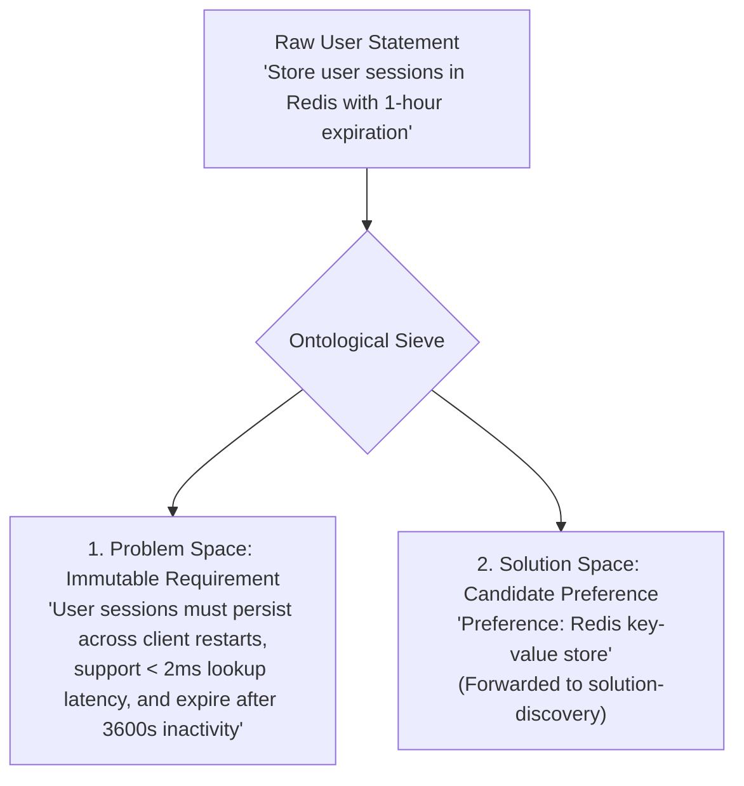
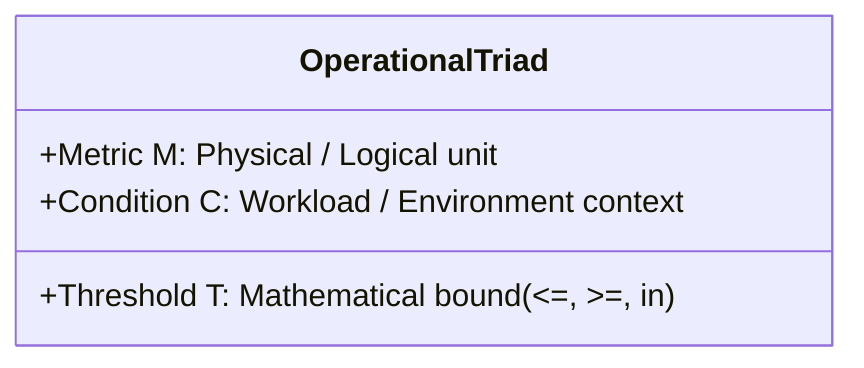
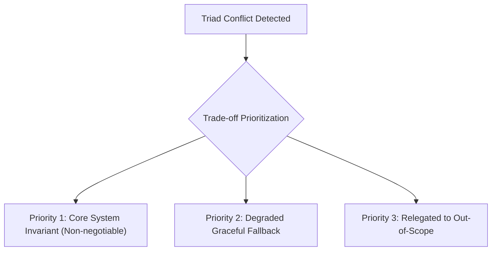

# Requirements Decomposition, ISO 25010 NFRs & Scope Ceilings

> **Purpose**: Establish the multi-dimensional decomposition mechanics that separate core functional intent from implementation details, quantify non-functional quality attributes via the Operational Measurement Triad $\langle M, T, C \rangle$, and cap scope creep through mandatory non-goals.

---

## 1 · The 2-Tier Ontological Sieve (Intent vs Mechanism)

A fundamental flaw in software design is prematurely baking technology choices into requirements. The **Ontological Sieve** filters every raw requirement statement $S$:

$$S \xrightarrow{\text{Sieve}} \text{Intent}(S) \oplus \text{Mechanism}(S)$$



### The Sieve Rules:
1. **The Problem Space Invariant**: The requirement captures *what capability is needed, what business value it unlocks, and what operational constraints bind it*. It contains **zero** specific libraries, frameworks, database vendors, or class hierarchies.
2. **The Candidate Preference Protocol**: If the user explicitly mentions a technology (e.g., *"use Postgres"*, *"use Tailwind"*, *"use Kafka"*), record it as a **Candidate Preference ($\text{Pref}_{\text{user}}$)**. Pass it to `solution-discovery` as the first evaluated candidate, but do not make it an immutable functional requirement unless it qualifies as a Hard Environmental Constraint.
3. **The Hard Environmental Constraint Exception**: A technology is admitted as an immutable requirement **IF AND ONLY IF** it represents a pre-existing, non-negotiable external reality (e.g., *"Must integrate with existing corporate LDAP server on Windows Server 2019"*, or *"Must run on an ARM Cortex-M4 microcontroller with 64KB RAM"*).

---

## 2 · Multi-Dimensional Classification Matrix

Every requirement belongs to exactly one orthogonal category:

| Category | Definition | Invariant Question | Example |
| :--- | :--- | :--- | :--- |
| **Functional Requirement (FR)** | Observable behavior or capability the system must exhibit. | *What does the system do in response to a stimulus?* | `WHEN a payment succeeds, the system SHALL emit a receipt PDF.` |
| **Non-Functional Requirement (NFR)** | Quality attribute or operational envelope bounding the capability. | *How well must the system perform this capability?* | `The receipt PDF generation SHALL complete within < 500ms (p95).` |
| **Constraint (CON)** | Inviolable boundary condition imposed by physics, law, or environment. | *What limits are non-negotiable and outside our control?* | `Must comply with GDPR Article 17 (Right to Erasure).` |
| **Assumption (ASM)** | Hypothesized truth accepted without proof to maintain progress. | *What are we presuming about the external world?* | `Assumed: Downstream webhooks accept HTTPS on port 443.` |
| **Non-Goal (NGL)** | Explicitly rejected capability or out-of-scope feature. | *What are we intentionally NOT building in this iteration?* | `Non-Goal: Generating localized non-English receipts.` |

---

## 3 · ISO/IEC 25010 NFR Catalog & The Operational Triad $\langle M, T, C \rangle$

Subjective NFRs ("fast", "secure", "reliable") are bugs in specification. Every NFR must be formulated as an **Operational Measurement Triad**:

$$\text{NFR} = \langle \text{Metric } M, \text{ Quantitative Threshold } T, \text{ Test Condition } C \rangle$$



### 1. Performance Efficiency
* **Response Latency**: $\langle \text{API response time (p99)}, \le 120\text{ms}, \text{at 1,000 QPS with payload size } \le 10\text{KB} \rangle$.
* **Throughput**: $\langle \text{Batch ingestion rate}, \ge 50,000\text{ events/sec}, \text{on a 4-core worker instance} \rangle$.
* **Resource Footprint**: $\langle \text{Resident Set Size (RSS) memory}, \le 64\text{MB}, \text{under maximum queue capacity of } 100,000\text{ messages} \rangle$.

### 2. Security & Trust Boundaries
* **Authentication Timing**: $\langle \text{Password hash verification time}, \in [250\text{ms}, 400\text{ms}], \text{using Argon2id with 64MB memory cost} \rangle$.
* **Data Protection**: $\langle \text{Data-at-rest encryption}, = \text{AES-256-GCM}, \text{for all PII database columns and disk caches} \rangle$.
* **Zero Ambient Authority**: $\langle \text{Access control check}, = 100\%\text{ coverage}, \text{every public API endpoint verifies cryptographic bearer token} \rangle$.

### 3. Reliability & Fault-Tolerance
* **Error Budget / Availability**: $\langle \text{Successful request ratio}, \ge 99.95\%, \text{measured over any rolling 30-day window} \rangle$.
* **Recovery Time Objective (RTO)**: $\langle \text{Crash recovery time}, \le 3000\text{ms}, \text{process restart to ready-for-traffic without human intervention} \rangle$.
* **Data Loss Ceiling (RPO)**: $\langle \text{Data loss window during sudden power loss}, = 0\text{ transactions}, \text{all acknowledged writes synced via write-ahead log (WAL)} \rangle$.

### 4. Usability & Ergonomics
* **Task Interaction Steps**: $\langle \text{Checkout navigation steps}, \le 2\text{ transitions}, \text{from cart view to confirmation for authenticated users} \rangle$.
* **Error Comprehension**: $\langle \text{Validation error clarity}, = 100\%\text{ of fields}, \text{returns failing field name + machine code + human remedial action} \rangle$.
* **Accessibility**: $\langle \text{WCAG Compliance}, = \text{Level AA}, \text{across all rendered interactive UI components and color contrast ratios} \ge 4.5:1 \rangle$.

### 5. Maintainability & Operability
* **Observability Signals**: $\langle \text{Trace context propagation}, = 100\%\text{ of egress requests}, \text{injects W3C TraceContext headers} \rangle$.
* **Configuration Parity**: $\langle \text{Environment variable schema coverage}, = 100\%, \text{validated at process boot with fail-fast fatal exit if missing} \rangle$.

---

## 4 · The Triad Trade-off Matrix (Conflict Forensics)

When requirements compete, physics and mathematics dictate that not all can be maximized simultaneously (e.g., Latency vs Consistency, Security vs Convenience).



### Classic Conflict Archetypes & Resolutions:
1. **Consistency vs Availability (CAP Dilemma)**:
   - *Conflict*: Real-time multi-region sync vs uninterrupted offline writes.
   - *Resolution*: Specify exact boundary: Local writes are acknowledged immediately with eventual monotonic merge; financial balance updates require quorum.
2. **Sub-millisecond Latency vs Heavy Encryption**:
   - *Conflict*: Low-latency audio streaming vs end-to-end zero-knowledge encryption.
   - *Resolution*: Asymmetric handshake once per session; symmetric authenticated stream cipher (ChaCha20-Poly1305) on hardware-accelerated frames.
3. **Feature Richness vs Memory Footprint**:
   - *Conflict*: Deep AST code analysis vs low embedded RAM footprint.
   - *Resolution*: Streaming single-pass lexical analysis; cache AST subtrees lazily and prune immediately after inspection.

---

## 5 · The Scope Ceiling & Mandatory Non-Goals Mandate

Scope creep is the primary driver of project failure. Every specification **MUST** conclude with an explicit **Non-Goals / Out-of-Scope Section**:

```markdown
### Mandatory Non-Goals (Scope Ceilings)
- **NGL-001**: The system will NOT support multi-currency conversion in this phase (USD only).
- **NGL-002**: The system will NOT provide automated push notifications to mobile devices.
- **NGL-003**: The system will NOT support custom third-party plugin scripting.
```

*Rule*: If a feature is not listed in Functional Requirements and not listed in Non-Goals, it is **Out-of-Scope by default**. Speculative expansion is strictly forbidden.
