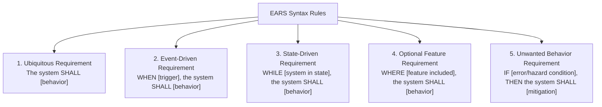

# Requirements Elicitation, Disambiguation & EARS Syntax Manual

> **Purpose**: Provide the rigorous linguistic, structural, and interview mechanisms for transforming raw, fuzzy human requests into crystal-clear intent while preventing the "Clarification Loop of Death" through the Autonomous Defaulting Axiom.

---

## 1 · The Clarification Gate & The Autonomous Defaulting Axiom

A major failure mode of AI agents is turning every minor ambiguity into an interrogation of the user. An autonomous agent must be proactive, self-reliant, and decisive while knowing exactly when human alignment is mandatory.

### The Clarification Gate Formula
An agent is permitted to query the user **IF AND ONLY IF** at least one condition of the Clarification Gate is met:

$$\text{QueryUser} \iff (C_{\text{reversal}} > 2\text{ hours}) \lor (\text{Direct Contradiction}) \lor (\text{Security / Irreversible Data Risk})$$

* **$C_{\text{reversal}} > 2\text{ hours}$**: High-cost architectural fork where choosing path A vs path B alters database schema, primary module hierarchy, or fundamentally redefines product identity.
* **Direct Contradiction**: The user prompt contains two requirements that cannot physically or logically co-exist (e.g., zero backend storage + instant cross-client sync).
* **Security / Data Hazard**: Missing specifications on authorization boundaries, data deletion retention, or external exposure of private records.

### The Autonomous Defaulting Axiom
For all other ambiguities ($C_{\text{reversal}} \le 2\text{ hours}$):
1. **Never ask open-ended questions** (e.g., "What framework do you want?", "Should errors be logged?").
2. **Adopt an industry-standard, resilient default** derived from established software conventions or existing repository patterns.
3. **Record the default in the Assumptions Register** with explicit justification.
4. **Proceed immediately** with forward progress.

### The Single-Turn Structured Clarification Protocol
When the Clarification Gate is triggered and user input is mandatory:
- **Never ask multiple questions consecutively**.
- **Never ask open-ended prose questions**.
- Use `ask_question` with structured options, formatting each choice as the user's direct response, with the agent's recommended option listed first prefixed by `(Recommended)`:

```markdown
Question: "How should expired webhook events be handled when downstream receivers are offline?"
Options:
- "(Recommended) Retry with exponential backoff up to 24 hours, then route to Dead Letter Queue (DLQ)"
- "Drop expired webhook events immediately after 3 failed retries"
- "Persist events indefinitely until receiver manually acknowledges"
```

---

## 2 · The Assumptions Register Schema

Every assumption made during elicitation must be logged with its epistemic grounding and fallback impact:

| Assumption ID | Category | Premise Adopted | Justification / Default Source | Reversal Cost | Fallback Action if Invalid |
| :--- | :--- | :--- | :--- | :---: | :--- |
| **`ASM-001`** | Protocol | JSON over HTTP/2 for API payload. | Matches host repo standards. | Low | Swap serializer behind adapter. |
| **`ASM-002`** | Auth | Bearer JWT token in Authorization header. | Industry standard REST pattern. | Low | Update middleware extractor. |
| **`ASM-003`** | Storage | Multi-tenant isolation at row-level. | Default security baseline. | High | Table-per-tenant partition. |

---

## 3 · The Ambiguity Taxonomy & Language Filter

Vague natural language is the leading cause of software defects. Before formalizing requirements, purge all fuzzy terms:

### Forbidden Vagueness Words (The Purge List)
| Forbidden Word | Why It Fails | Replacement Quantitative Operational Triad $\langle M, T, C \rangle$ |
| :--- | :--- | :--- |
| *"fast"* / *"performant"* | Unfalsifiable | *"p99 response latency $\le 150\text{ms}$ under 500 requests/sec."* |
| *"scalable"* | Meaningless buzzword | *"System throughput scales linearly up to $10,000\text{ QPS}$ with horizontal worker instances."* |
| *"secure"* | Undefined attack model | *"All data encrypted at rest via AES-256-GCM; all ingress endpoints require TLS 1.3 + HMAC verification."* |
| *"user-friendly"* / *"intuitive"* | Subjective opinion | *"Task completion flow requires $\le 3$ user interactions; form errors highlight failing field with actionable copy."* |
| *"robust"* / *"resilient"* | Unbounded aspiration | *"System recovers to operational state within $< 5\text{ seconds}$ following process termination without data corruption."* |
| *"etc."* / *"and so forth"* | Concealed scope leak | Explicit enumeration of permissible inputs or explicit non-goals. |

### Syntactic & Passive Voice Cleansing
- **Active Agent Mandate**: Replace passive statements (*"The file will be processed"*) with explicit subject-action clauses (*"The parser module SHALL validate the file format"*).
- **Quantifier Pinning**: Replace loose quantifiers (*"some users"*, *"large payloads"*) with explicit ranges (*"users with `admin` role"*, *"payloads exceeding $5\text{MB}$"*).

---

## 4 · The EARS (Easy Approach to Requirements Syntax) Rulebook

EARS is the international industry standard for natural-language requirements specification. It eliminates grammatical ambiguity through 5 formal syntactic templates:



### 1. Ubiquitous Requirements (Universal Invariants)
Applied when the behavior must hold at all times under all circumstances without condition.
> **Syntax**: `The <system/component> SHALL <system response>.`  
> *Example*: `The encryption engine SHALL encrypt all customer identifiers using AES-256 before disk persistence.`

### 2. Event-Driven Requirements (Stimulus-Response)
Applied when a discrete external or internal trigger initiates a system action.
> **Syntax**: `WHEN <trigger event occurs>, the <system/component> SHALL <system response>.`  
> *Example*: `WHEN a user clicks 'Submit Order', the checkout manager SHALL validate cart inventory within 200ms.`

### 3. State-Driven Requirements (Active Operating Modes)
Applied while the system is in a defined lifecycle state or operational mode.
> **Syntax**: `WHILE <system is in specific state>, the <system/component> SHALL <system response>.`  
> *Example*: `WHILE the network connection is disconnected, the sync manager SHALL queue outbound mutations in local durable storage.`

### 4. Optional Feature Requirements (Conditional Capabilities)
Applied only when an optional subsystem, feature flag, or hardware capability is present.
> **Syntax**: `WHERE <optional feature is present/enabled>, the <system/component> SHALL <system response>.`  
> *Example*: `WHERE biometric hardware is available, the authentication provider SHALL present TouchID/FaceID as the primary unlock prompt.`

### 5. Unwanted Behavior Requirements (The Negative Space & Mitigations)
Applied to handle invalid inputs, hardware faults, network outages, boundary overflows, or rate limits.
> **Syntax**: `IF <error, limit, or hazard condition occurs>, THEN the <system/component> SHALL <mitigation response>.`  
> *Example*: `IF the webhook receiver returns HTTP 5xx or times out after 3000ms, THEN the dispatcher SHALL re-queue the payload with exponential backoff up to 5 attempts.`

### Complex Hybrid Patterns
When states, events, and errors intersect:
> **Syntax**: `WHILE <in state>, WHEN <trigger>, IF <error condition>, THEN the <system> SHALL <mitigation>, ELSE the <system> SHALL <nominal response>.`
