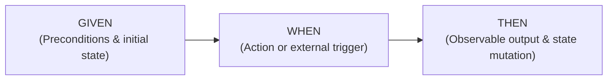
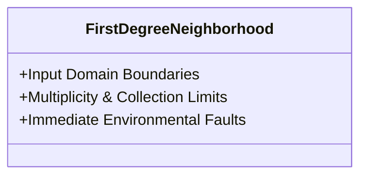
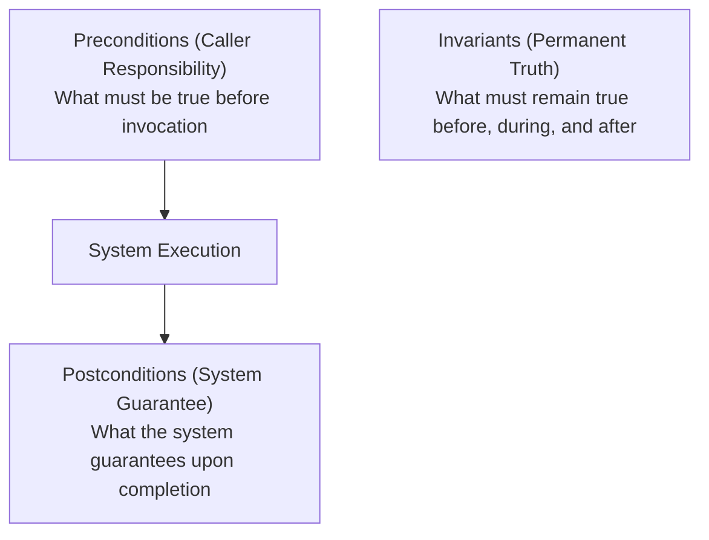

# Formal Specification, BDD & Boundary Analysis Manual

> **Purpose**: Establish deterministic, executable specification techniques using BDD (Given-When-Then), formalize boundary-value analysis within the bounded 1st-degree operational neighborhood, and model state invariants without implementation leakage.

---

## 1 · BDD Specification by Example (Given-When-Then)

Behavior-Driven Development (BDD) bridges requirements to automated test suites (`testing`) by specifying concrete, falsifiable examples of system behavior.



### The 4 Rules of BDD Requirements:
1. **Rule 1 — Business Language, Not UI Scripting**:
   - ❌ *Bad*: `GIVEN user clicks button '#submit-btn' with CSS selector...`
   - ✅ *Good*: `GIVEN an authenticated customer with an active shopping cart...`
2. **Rule 2 — Single Action per Scenario**:
   - Each `WHEN` clause must contain exactly **one** primary stimulus. Do not chain multiple actions (`WHEN user logs in AND clicks checkout AND enters card...`). Break them into separate sequential scenarios.
3. **Rule 3 — Deterministic Assertions in `THEN`**:
   - The `THEN` clause must assert externally observable state or side effects, never private internal implementation flags.
4. **Rule 4 — Negative Scenarios are Mandatory**:
   - For every happy-path scenario, there must be at least one scenario demonstrating error handling, rejection, or fallback.

### Standard BDD Specification Template
```gherkin
Scenario: Successful webhook delivery with retry on transient failure
  Given a registered webhook destination "https://api.partner.com/events"
  And the destination is currently returning HTTP 503 Service Unavailable
  When an event "order.created" is emitted for order ID "ord-9821"
  Then the dispatcher shall schedule a retry attempt with exponential backoff within 2 seconds
  And the event status shall transition to "PENDING_RETRY"
  And after 3 failed attempts, the event shall be routed to the Dead Letter Queue
```

---

## 2 · The 1st-Degree Operational Neighborhood (Boundary Analysis)

To prevent infinite edge-case hallucination while guaranteeing robust boundary handling, requirements engineering restricts boundary exploration strictly to the **1st-Degree Operational Neighborhood**:



### 1. Input Domain Boundaries
For every input variable $x$ bounded by $[x_{\min}, x_{\max}]$:
* $x = \text{null}$ or undefined.
* $x = \text{empty string / zero-length bytes / blank whitespace}$.
* $x = x_{\min} - 1$ (Immediate underflow $\to$ Must trigger EARS Unwanted Behavior).
* $x = x_{\min}$ (Minimum nominal boundary $\to$ Must succeed).
* $x = x_{\max}$ (Maximum nominal boundary $\to$ Must succeed).
* $x = x_{\max} + 1$ (Immediate overflow $\to$ Must trigger EARS Unwanted Behavior).
* $x = \text{Hostile/Malformed payload}$ (Malformed UTF-8, script injection, unparseable JSON).

### 2. Multiplicity & Collection Limits
For any collection, list, pagination, or queue:
* $N = 0$ (Empty collection $\to$ Zero state behavior, must return valid empty structure without crashing).
* $N = 1$ (Single element $\to$ Edge condition for loops, separators, delimiters).
* $N = N_{\text{nominal}}$ (Standard expected payload).
* $N = N_{\max}$ (Configured ceiling, e.g., batch size 100).
* $N = N_{\max} + 1$ (Truncation or 413 Payload Too Large mitigation).

### 3. Immediate Environmental Faults
Every external interaction must define mitigations for these 5 physical disruptions:
1. **Network Timeout**: Gateway or socket fails to respond within deadline.
2. **Connection Refused / Network Partition**: Host unreachable.
3. **Permission / Authentication Revocation**: Valid credential expires mid-session.
4. **Disk Full / Read-Only Filesystem**: Persistence fails due to OS storage exhaustion.
5. **Concurrent Mutation Collision**: Simultaneous updates to identical resource identifier.

---

## 3 · Bertrand Meyer's Design by Contract (Domain Invariants)

Requirements define the operational contract between the system and its environment:



### 1. Preconditions (Requires)
Obligations placed upon the caller/user. If violated, the system is not obligated to perform the primary function, but MUST execute a safe mitigation.
> *Example*: `Requires: Order balance must be >= $0.00; Customer account must not be flagged for fraud.`

### 2. Postconditions (Ensures)
Guarantees the system provides upon successful execution.
> *Example*: `Ensures: Order state is 'PAID'; Inventory quantity is decremented by exactly purchased units; Payment transaction ID is permanently recorded.`

### 3. Domain Invariants (Maintains)
Fundamental truths that must never be violated across the entire lifecycle of the entity.
> *Example*: `Maintains: The sum of account balances in a double-entry ledger must always equal zero.`

---

## 4 · State Machine Transition Tables

When requirements govern a multi-state lifecycle (e.g., Order, Ticket, Connection, Worker), tabular state transition models prevent unreachable deadlocks and illegal transitions:

| Initial State | Event / Trigger | Guard Condition | Next State | System Action / Side Effect |
| :--- | :--- | :--- | :--- | :--- |
| **`UNINITIALIZED`** | `InitCommand` | Valid config present | **`IDLE`** | Allocate memory buffers; bind socket. |
| **`UNINITIALIZED`** | `InitCommand` | Config invalid | **`FAILED`** | Emit fatal diagnostic to stderr; exit(1). |
| **`IDLE`** | `StartJob(id)` | Worker pool available | **`RUNNING`** | Spawn job runner; start watchdog timer. |
| **`IDLE`** | `StartJob(id)` | Worker pool exhausted | **`QUEUED`** | Enqueue job; increment pending metric. |
| **`RUNNING`** | `JobCompleted` | Exit code == 0 | **`IDLE`** | Record success metric; notify caller. |
| **`RUNNING`** | `WatchdogTimeout`| Elapsed > deadline | **`RECOVERING`** | Terminate job runner; dump stack trace. |
| **`RUNNING`** | `ShutdownSignal` | SIGTERM received | **`TERMINATING`**| Flush write buffers; complete active unit. |
| **`RECOVERING`** | `CleanupDone` | Resources freed | **`IDLE`** | Reset worker state; log incident. |
