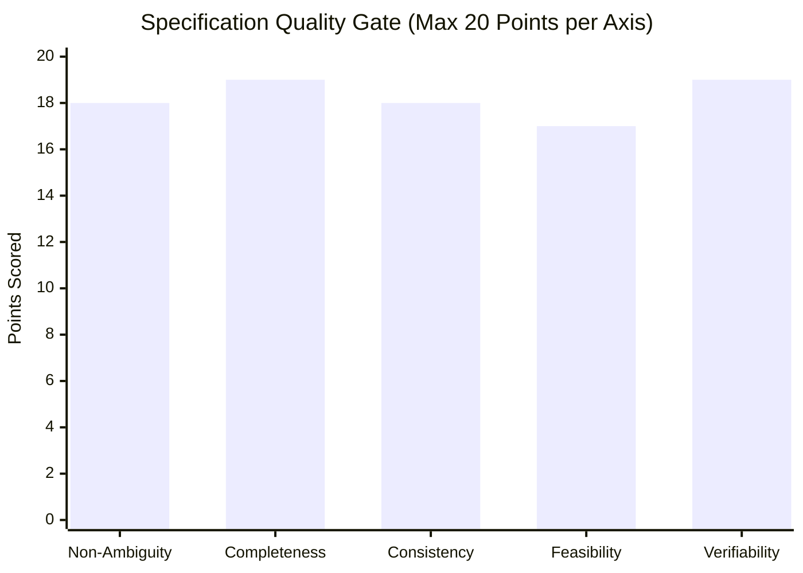

# Specification Quality Rubric & Verification Gate (0–100)

> **Purpose**: Establish an objective, evidence-based quality scoring gate that audits requirements baselines before downstream handoff, enforcing zero tolerance for ambiguous, unfalsifiable, or implementation-polluted specifications.

---

## 1 · The 0–100 Specification Quality Gate

Every requirement baseline must be audited across 5 orthogonal quality axes (20 points maximum per axis):

### Passing Threshold
$$\text{Total Score} \ge 85 / 100 \quad \text{AND} \quad \forall \text{axis}_i, \text{Score}_i \ge 15 / 20$$
*Any baseline scoring $< 85$ overall or $< 15$ on any single category is rejected for immediate revision before code or architecture begins.*

---

## 2 · Granular Scoring Rubric

### Axis 1: Non-Ambiguity & Precision (0–20 Points)
* **18–20 pts (Flawless)**: Zero vagueness words ("fast", "intuitive", "scalable"). Active voice used throughout. Every functional requirement strictly adheres to formal EARS templates. Every technical term has a single, unambiguous definition.
* **14–17 pts (Minor Defects)**: 1–2 borderline subjective adjectives present, but bounded by context. Minor passive voice constructs that do not obscure the acting subject.
* **9–13 pts (Moderate Ambiguity)**: Multiple unquantified statements ("system should be responsive"). Loose quantifiers ("several files", "high load") without numerical bounds.
* **0–8 pts (Critical Failure)**: Pervasive fuzzy prose, vague wishes, contradictory terminology, or unreadable stream-of-consciousness text.

### Axis 2: Completeness & Boundary Coverage (0–20 Points)
* **18–20 pts (Flawless)**: Covers both Golden Path and Negative Space. Every functional requirement defines an EARS *Unwanted Behavior* clause. Input extremes ($0, 1, \min, \max$) and physical disruptions (timeouts, disconnects, full disk) are formally addressed. Mandatory Non-Goals section explicitly caps scope.
* **14–17 pts (Minor Defects)**: Happy path fully mapped; 1st-degree boundaries addressed, but minor edge condition (e.g., empty collection behavior) is implicit rather than stated. Non-goals documented.
* **9–13 pts (Major Gaps)**: Only happy path is specified. Error handling, rate limits, or network timeouts are omitted. Non-goals section is absent.
* **0–8 pts (Critical Failure)**: Massive architectural holes; unstated personas, unhandled failure modes, or completely absent boundary definitions.

### Axis 3: Consistency & Conflict Resolution (0–20 Points)
* **18–20 pts (Flawless)**: Zero internal contradictions. Competing constraints (e.g., performance vs security, offline availability vs immediate consistency) are surfaced and formally resolved via the Triad Trade-off Matrix. Requirements do not duplicate or clash with existing baseline rules.
* **14–17 pts (Minor Defects)**: Minor tension between two quality attributes, but hierarchy of priority is readily inferable.
* **9–13 pts (Unresolved Conflicts)**: Direct contradiction between functional statements (e.g., REQ-002 demands complete statelessness while REQ-005 requires in-memory session persistence).
* **0–8 pts (Critical Failure)**: Fundamentally self-contradictory requirements (e.g., demanding CAP theorem violations without trade-off choices).

### Axis 4: Feasibility & Implementation Agnosticism (0–20 Points)
* **18–20 pts (Flawless)**: 100% confined to the Problem Space. Zero smuggled implementation details (no unneeded library names, database engines, or class structures). Realistically achievable within physical laws and host system hardware constraints.
* **14–17 pts (Minor Defects)**: Confined to problem space, but makes a strong assumption about underlying runtime capabilities without verifying host platform compatibility.
* **9–13 pts (Implementation Smuggling)**: Prematurely specifies implementation mechanisms ("Must write a Python script using Pandas and SQLite") instead of specifying data transformation requirements.
* **0–8 pts (Critical Failure)**: Physically impossible requirements (e.g., zero-latency distributed transactions over WAN) or pure code-level micro-prescription.

### Axis 5: Verifiability & Falsifiability (0–20 Points)
* **18–20 pts (Flawless)**: 100% of requirements are deterministically falsifiable. Every functional requirement has a concrete BDD Given-When-Then acceptance scenario. Every NFR is defined as an Operational Measurement Triad $\langle M, T, C \rangle$.
* **14–17 pts (Minor Defects)**: All functional requirements have test scenarios; 1 NFR lacks an explicit test condition $C$, though metric $M$ and threshold $T$ are clear.
* **9–13 pts (Weak Testability)**: Multiple requirements lack acceptance criteria or rely on unfalsifiable assertions ("must look clean", "should feel fast").
* **0–8 pts (Untestable Spec)**: Zero BDD scenarios, zero measurable metrics, complete absence of empirical verification criteria.

---

## 3 · Hard Veto Triggers (Immediate Rejection)

The presence of **any single trigger below** causes an immediate failure (Score = 0 for that category), halting progression until rectified:

1. **Smuggled Implementation Veto**: A specific library, tool, or database vendor is mandated as an immutable requirement when it is NOT a pre-existing environmental constraint.
2. **Unfalsifiable NFR Veto**: An operational quality contains subjective adjectives without numerical thresholds and test conditions.
3. **Missing Unwanted Behavior Veto**: A major user capability has zero specifications for error, timeout, or invalid input handling.
4. **Unbounded High-Cost Assumption Veto**: An assumption with $C_{\text{reversal}} > 2\text{ hours}$ was made autonomously without passing through the Clarification Gate.
5. **Absence of Non-Goals Veto**: The specification fails to define what is explicitly out of scope, leaving the project open to infinite scope creep.

---

## 4 · Pre-Flight Requirements Verification Checklist

Run this 6-point verification before declaring requirements complete:

- [ ] **1. Intent De-Solutioning**: Are all specific tools/frameworks extracted into candidate preferences rather than locked requirements?
- [ ] **2. EARS Grammar**: Does every functional requirement follow Ubiquitous, Event, State, Optional, or Unwanted syntax?
- [ ] **3. Dual-Path Completeness**: Does every positive requirement have a corresponding unwanted behavior clause?
- [ ] **4. Triad NFRs**: Is every non-functional requirement structured as $\langle M, T, C \rangle$?
- [ ] **5. Scope Ceiling**: Are non-goals explicitly listed with `NGL-xxx` tags?
- [ ] **6. Quality Score**: Does the specification score $\ge 85/100$ on the rubric above?
