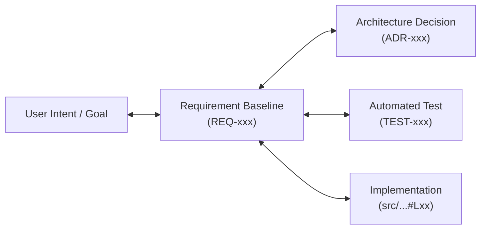
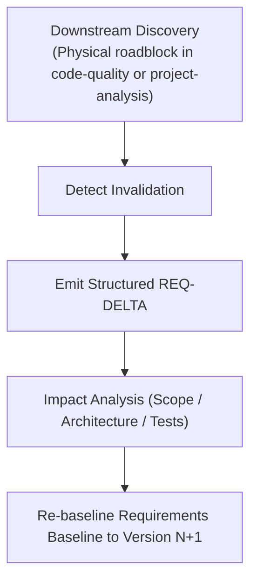
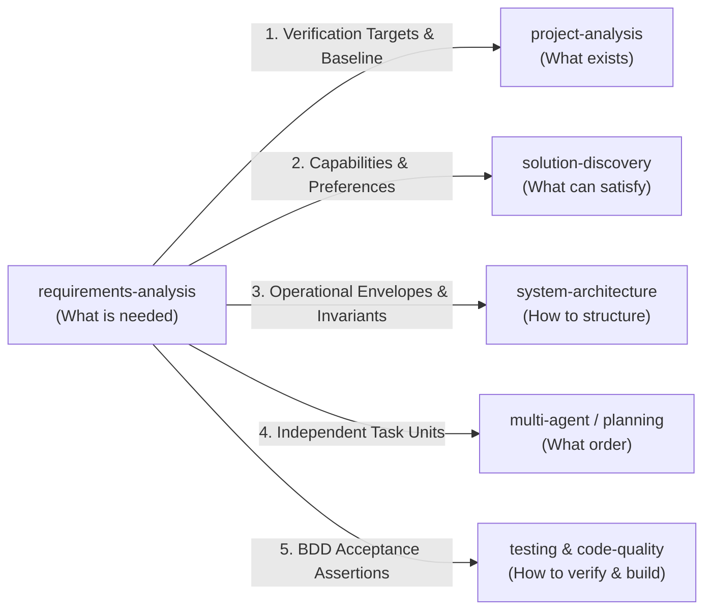

# Requirements Traceability, Living Baselines & Downstream Handoffs

> **Purpose**: Establish bidirectional traceability from human intent to executable verification via the Requirements Traceability Matrix (RTM), define the Living Baseline Re-negotiation Protocol (`REQ-DELTA`), and govern clean handoff contracts to adjacent engineering skills.

---

## 1 · The Requirements Traceability Matrix (RTM)

A requirements baseline must never exist in isolation. The **Requirements Traceability Matrix (RTM)** maintains an unbreakable bidirectional link between user goals, requirements, architectural decisions, and automated tests.



### RTM Table Schema
Every baseline deliverable must include or generate an RTM summary:

| REQ ID | Category | EARS Statement Summary | BDD Acceptance Scenario | Downstream ADR | Test Identifier | Verification Status |
| :--- | :--- | :--- | :--- | :--- | :--- | :--- |
| **`REQ-001`** | FR (Event) | `WHEN order placed, emit PDF within 500ms` | `Scenario: Order receipt PDF emitted` | `ADR-004` | `test_pdf_generation` | `[VERIFIED]` |
| **`REQ-002`** | FR (Unwanted)| `IF storage full, THEN spool to fallback queue`| `Scenario: Storage full fallback spool` | `ADR-005` | `test_storage_full_spool` | `[VERIFIED]` |
| **`REQ-003`** | NFR (Perf) | `p99 latency <= 120ms at 1000 QPS` | `Scenario: Sustained load latency check` | `ADR-006` | `bench_event_dispatcher` | `[VERIFIED]` |

### Bidirectional Traceability Rules:
1. **Forward Traceability**: Every requirement `REQ-xxx` must point to at least one test case `TEST-xxx`. If a requirement has no test, it violates Invariant 2 (Verifiability).
2. **Backward Traceability**: Every test case and architectural decision must point to a parent `REQ-xxx`. If code exists without a tracing requirement, it is speculative over-engineering.

---

## 2 · The Living Baseline Re-negotiation Protocol (`REQ-DELTA`)

When downstream exploration in `project-analysis`, `solution-discovery`, or `code-quality` uncovers a physical, algorithmic, or architectural roadblock that invalidates a requirement, the agent must **NOT** crash, loop, or silently ignore the specification. It triggers a **Living Baseline Re-negotiation**.



### The `REQ-DELTA` Schema
When a requirement adjustment is necessary, emit this structured delta block:

```markdown
### REQ-DELTA: [REQ-ID] (Revision from v1.0 to v1.1)

- **Requirement Affected**: [REQ-004: Sub-1ms vector search over 10M embeddings on CPU]
- **Invalidated Assumption**: [CPU SIMD instructions cannot complete cosine similarity across 10M 1536-dim vectors within 1ms without GPU/TPU accelerator]
- **Evidence Anchor**: `[VERIFIED: benchmarks/bench_search.rs#L45]` (Achieves 45ms p99 on host CPU)
- **Proposed Adjustment**:
  - *Option A (Scope Adjustment)*: Relax latency envelope to `p99 <= 50ms on host CPU` with zero new infrastructure dependencies.
  - *Option B (Architectural Shift)*: Retain `sub-5ms` requirement by introducing an approximate nearest neighbor (HNSW) index or external vector engine candidate.
- **Decision Adopted**: Option A (Adopted based on project offline zero-external-dependency constraint).
- **Updated Requirement Statement**: `The search engine SHALL return top-10 nearest neighbors within <= 50ms (p99) on host CPU across 10M embeddings.`
```

---

## 3 · Downstream Skill Handoff Contracts

`requirements-analysis` establishes the clean boundary contract before handing off control to adjacent skills in the Agent Grimoire router:



### 1. Handoff to `project-analysis`
* **Payload Delivered**: Confirmed Requirement Baseline (`REQUIREMENTS.md` or scoped intent block) with functional boundaries.
* **Objective for Downstream**: Inspect the host repository to locate existing code seams, affected modules, and calculate the blast radius of implementing the requirements.

### 2. Handoff to `solution-discovery`
* **Payload Delivered**: Functional capability definitions + Candidate Preferences ($\text{Pref}_{\text{user}}$) extracted via the Ontological Sieve.
* **Objective for Downstream**: Evaluate candidate libraries/built-ins across the 10-Axis Evaluation Matrix without confusing user preferences with immutable requirements.

### 3. Handoff to `system-architecture`
* **Payload Delivered**: ISO 25010 NFR envelopes $\langle M, T, C \rangle$, Domain Invariants, State Transition Models, and Non-Goals.
* **Objective for Downstream**: Structure module DAGs, define boundary interfaces, and produce load-bearing ADRs that satisfy all specified constraints.

### 4. Handoff to `multi-agent-orchestration` / `planning`
* **Payload Delivered**: Decomposed `REQ-xxx` units and RTM dependencies.
* **Objective for Downstream**: Schedule execution sequences, worktree assignments, and worker task contracts.

### 5. Handoff to `testing` & `code-quality`
* **Payload Delivered**: BDD Given-When-Then scenarios and 1st-Degree Boundary conditions.
* **Objective for Downstream**: Author failing characterization/unit tests *before* writing production code to ensure strict falsifiability.
