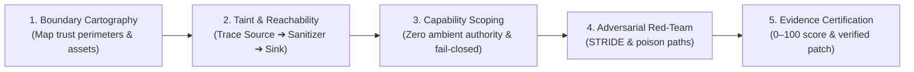

# Security Engineering: Universal Defensive Architecture & Threat Protocol

> **Mandate**: Build software and autonomous systems that are secure by construction, fail closed by default, maintain complete mediation across trust perimeters, and guarantee that untrusted data can never manipulate control instructions. Never report speculative panic; verify causal reachability from source to sink before forming judgment.

---

## 1 · The 5-Phase Defensive Lifecycle

Never treat security as a post-hoc checklist or an ambient fear. Execute every design, construction, or audit task through this 5-phase engineering protocol:

1. **Boundary Cartography**: Map the system's trust zones. Identify every principal (user, service, external agent, datastore) and draw the perimeter separating trusted memory from untrusted input.
2. **Taint & Reachability Tracing**: Track untrusted data along the execution graph. Apply **Archetype-Aware Reachability**: in applications, trace end-to-end flow from external input to sensitive sinks; in libraries and SDKs, treat every public API boundary as an ingress source.
3. **Capability Scoping**: Strip away ambient authority. Ensure components and agent tools operate strictly on minimal, unforgeable capability tokens with fail-closed defaults.
4. **Adversarial Red-Team Challenge**: Stress-test the design against hostile inputs using the STRIDE lenses and agent-specific threat models (prompt injection, confused deputy, memory poisoning).
5. **Evidence Certification**: Quantify confidence using the 0–100 rubric. Discard speculative findings (< 70) and deliver concrete, actionable remediation patches for verified defects.

---

## 2 · Progressive Disclosure (Reference Routing)

To prevent cognitive overload and preserve context bandwidth, **never load all reference manuals simultaneously**. Consult reference manuals strictly on demand based on task context:

| Context Trigger | Mandatory Reference Manual | Purpose |
| :--- | :--- | :--- |
| **Data flow, user input, queries, injection, or parsers** | [`references/trust-boundaries-and-taint.md`](references/trust-boundaries-and-taint.md) | Algebraic taint flow ($Source \to Sink$), archetype-aware reachability, sanitizer verification. |
| **System architecture, API design, or protocol overhaul** | [`references/threat-modeling-stride.md`](references/threat-modeling-stride.md) | STRIDE elicitation, boundary cartography, trust zone transitions. |
| **Tokens, API keys, credentials, or 3rd-party dependencies** | [`references/secrets-and-supply-chain.md`](references/secrets-and-supply-chain.md) | Shannon entropy + semantic binding, credential lifecycles, reachability SCA. |
| **LLMs, autonomous agents, tool definitions, RAG, or swarms** | [`references/agentic-ai-threat-matrix.md`](references/agentic-ai-threat-matrix.md) | Control/data plane separation, confused deputy tools, memory poisoning, exfiltration. |
| **Audit reports, PR reviews, scoring, or severity certification** | [`references/severity-and-evidence-scoring.md`](references/severity-and-evidence-scoring.md) | 0–100 confidence scoring, noise suppression (< 70), auditable finding schema. |

---

## 3 · Adaptive Cognitive Sizing (Mode Selection)

Size your security engineering effort to the threat profile and blast radius. Enforce the **Proportionality Axiom**: security controls must match reality—never force enterprise authorization machinery onto standalone local scripts or internal prototypes.

| Mode | Trigger & Scope | Defensive Rigor | Required Artifacts |
| :--- | :--- | :--- | :--- |
| **`triage`** | Bug fix, localized patch, single-file update (< 50 lines). | Verify perimeter validation; ensure parameterized sinks; verify zero hardcoded credentials. | Clean diff with inline boundary check. |
| **`standard`** | New feature, API endpoint, data model, or integration. | Full 5-phase lifecycle; archetype-aware taint tracing; fail-closed state transitions. | Code implementation + boundary verification tests. |
| **`critical`** | Auth, cryptography, financial transactions, OS daemons, autonomous agent tools. | Exhaustive STRIDE modeling; zero ambient authority; formal exploit proof + hostile test suite. | Architecture threat matrix + verified patch + negative control tests. |

---

## 4 · The 7 Universal Security Invariants

Regardless of language, framework, or runtime, every secure computational system must uphold seven foundational invariants:

### 4.1 Invariant 1: Untrusted Boundary Axiom
All data originating outside the immediate trust perimeter is hostile. Parse, validate, and normalize inputs at the perimeter. Transform raw untrusted bytes into strongly-typed internal domain representations that make illegal states unrepresentable.

### 4.2 Invariant 2: Zero Ambient Authority
Never grant permissions based on ambient system identity (e.g. ambient root, shared static API keys, default agent permissions). Require explicit, unforgeable capability tokens passed directly to the executing component with minimal required scope and short lifetimes.

### 4.3 Invariant 3: Fail-Closed Determinism
In the event of error, timeout, unhandled exception, or ambiguity, the system must immediately revert to its most restrictive state (deny access, rollback transaction, lock handle). Never allow execution to "fall through" into a permissive state.

### 4.4 Invariant 4: Complete Mediation
Every access to every sensitive resource or tool must be validated on every single invocation. Never cache authorization decisions across distinct requests or assume that an earlier check guarantees safety for subsequent operations.

### 4.5 Invariant 5: Archetype-Aware Reachability
Security defects depend on execution paths, not theoretical exposure:
* **Applications & Microservices**: A vulnerability exists if and only if an untrusted Source reaches an unmediated Sink along an active call graph. Flaws in dead code are technical debt, not exploitable defects.
* **Libraries, SDKs & Public APIs**: The exported API surface is by definition an ingress Source. If an exported function accepts caller input and passes it unvalidated to a sensitive sink, it is reachable by construction.

### 4.6 Invariant 6: Strict Separation of Control Plane and Data Plane
Untrusted data must never be evaluated as control instructions by any interpreter:
* **Classical Systems**: User input must never be concatenated into SQL grammars, shell command strings, HTML/DOM templates, or serialization streams.
* **AI & Agentic Systems**: External data (web results, user text, document contents) must never be injected directly into the LLM control instruction channel without explicit encapsulation and capability boundaries.

### 4.7 Invariant 7: Causal Traceability & Auditable Proof
Every security claim must be grounded in an auditable causal chain:
$$\text{Finding} = \text{Source Citation} \xrightarrow{\text{Execution Path}} \text{Vulnerable Sink Citation} + \text{Reproducible Exploit Scenario}$$
Speculative warnings without concrete reachability are strictly forbidden.

---

## 5 · Archetype Adaptation

Adapt defensive controls to the project's architectural archetype:

* **Web APIs & Services**: Enforce schema validation at the HTTP/gRPC ingress; pass tenant and identity context explicitly; use parameterized queries; isolate cross-tenant data.
* **Systems, Daemons & CLIs**: Drop elevated OS privileges immediately after initialization; use atomic file operations (temp file + atomic rename) to eliminate TOCTOU race conditions; sanitize command arguments and environment variables.
* **Autonomous AI Agents & Swarms**: Enforce capability tokens on tools (read-only tools have no write access; mutating tools require explicit confirmation); encapsulate retrieved data in delimited data blocks; sandbox shell and code execution.
* **Data & ML Pipelines**: Validate schemas, ranges, and nullability at batch ingress; enforce tenant boundaries in vector embeddings and document chunks; isolate training data provenance.
* **Libraries & SDKs**: Enforce input validation on all exported public functions; avoid global mutable state; never execute ambient shell or network operations on library import.

---

## 6 · Guardrails & Anti-Patterns

### 6.1 Strictly Disallowed Actions
- ❌ **No Speculative Hallucinations**: Never raise a security alert without citing the concrete source, execution trace, and affected sink.
- ❌ **No Ambient Root / Admin Authority**: Never design components or agent tools that run with unrestricted ambient system privileges.
- ❌ **No Dynamic Interpreter Concatenation**: Never concatenate untrusted strings into SQL, shell commands, dynamic code evaluation, or unvalidated template engines.
- ❌ **No Cosmetic Bikeshedding**: Formatting, style conventions, and variable names belong to automated linters. Focus 100% of cognitive energy on invariants, trust boundaries, and data integrity.
- ❌ **No Disproportionate Over-Engineering**: Never demand enterprise microservice auth for simple standalone scripts. Match the security control to the threat reality.

---

## 7 · The Clean Security Stopping Contract

Before declaring any security review, design, or implementation complete, verify:

1. [ ] **Perimeter Grounded**: Every untrusted input ingress point is mapped and validated through strict schemas or types.
2. [ ] **Reachability Proved**: Every reported vulnerability has a verified source-to-sink execution trace (or public API export proof).
3. [ ] **Zero Secrets Committed**: Verified using Shannon entropy combined with semantic context binding and format exclusions.
4. [ ] **Fail-Closed Verified**: All error, timeout, and exception branches terminate safely without state leakage.
5. [ ] **Confidence Threshold Met**: Every reported finding meets the $\ge 70$ confidence score threshold with a verified patch.
