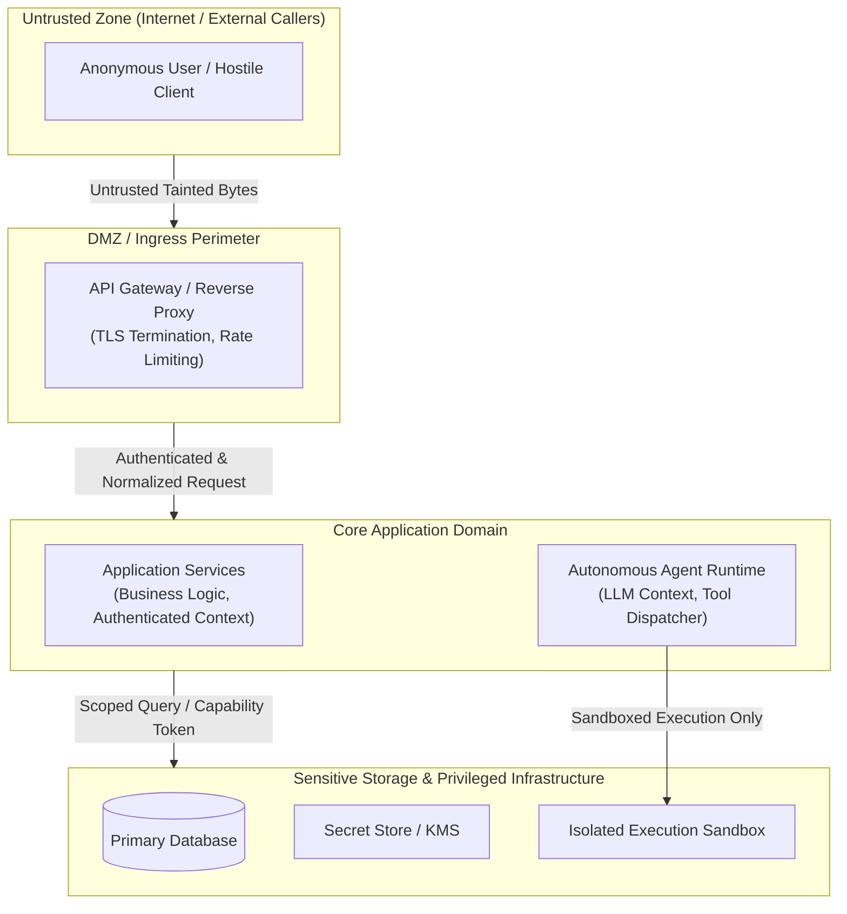

# Architectural Threat Modeling: STRIDE & Boundary Cartography

> **Mandate**: Find security vulnerabilities at design time before they become implementation debt. Threat modeling is not bureaucratic paperwork; it is a systematic adversarial mental exercise. Map trust boundaries, enumerate threat vectors using the STRIDE cognitive lenses, and establish deterministic mitigations.

---

## 1 · Boundary Cartography: Drawing the Trust Zones

Before auditing code or writing implementations, delineate the system's architecture into **Trust Zones**:



### The 4 Trust Boundary Rules
1. **Perimeter Crossing Requires Validation**: Any transition from a lower-trust zone to a higher-trust zone requires explicit authentication, authorization, and schema validation.
2. **Explicit Capability Tokens**: Higher-trust zones must never trust callers based on ambient network location; require explicit, cryptographic capability tokens.
3. **Data In Transit vs. Data At Rest**:
   - *In Transit*: Encrypt all data crossing network boundaries (TLS 1.3+). Authenticate mutual endpoints (mTLS) for inter-service communication.
   - *At Rest*: Encrypt sensitive assets with unique data-encryption keys (DEKs) managed by a central key management service (KMS).
4. **Proportionality Check**: For a standalone CLI tool or local utility script, the entire architecture resides in a single local user zone. Threat modeling focuses exclusively on local file permissions and untrusted command arguments, without inventing cloud infrastructure.

---

## 2 · The STRIDE Cognitive Lenses (Dual Systems & Agentic Mapping)

Apply STRIDE systematically across both classical components and modern autonomous agent runtimes:

| Category | Classical System Risk | Autonomous / Agentic System Risk | Canonical Mitigation |
| :--- | :--- | :--- | :--- |
| **S**poofing | Forging JWTs, session hijacking, IP/header spoofing. | Impersonating an agent principal, forging tool execution messages. | Cryptographically signed tokens, mutual authentication, origin binding. |
| **T**ampering | Modifying database records, in-flight payload manipulation, parameter tampering. | Indirect prompt injection, poisoning RAG embeddings, tool argument corruption. | HMAC verification, immutable audit logs, strict delimited data encapsulation. |
| **R**epudiation | State-changing operations performed without audit logs; forged timestamps. | Agent executing destructive actions without provenance or user attribution. | Append-only tamper-evident audit logs, non-repudiable transaction receipts. |
| **I**nformation Disclosure | Leaking stack traces, unauthenticated API endpoints, IDOR/BOLA data leaks. | RAG retrieval context bleed, system prompt leakage, SSRF via tools. | Tenant-isolated vector namespaces, stripped error details, egress URL filtering. |
| **D**enial of Service | Algorithmic complexity attacks (ReDoS), connection pool exhaustion, memory bombs. | Unbounded recursive agent tool loops, model context window exhaustion, quota drain. | Strict execution deadlines, recursion depth limits, token budget circuit breakers. |
| **E**levation of Privilege | Exploiting SUID binaries, bypassing RBAC/ABAC roles, SQL injection auth bypass. | The Confused Deputy problem: untrusted input commanding an agent to execute privileged tools. | Zero ambient authority, explicit human-in-the-loop (HITL) gates, capability tokens. |

---

## 3 · The Threat Modeling Workflow

Execute this 4-step workflow when designing a new feature, API, or subsystem:

```
Step 1: Asset & Actor Identification
  ├── Identify sensitive assets (Customer PII, private keys, database state, tool credentials)
  └── Identify actor personas (Anonymous caller, Authenticated tenant, Admin, Autonomous worker)

Step 2: Flow & Transition Mapping
  ├── Trace every data transition across trust perimeters
  └── Identify every interpreter, evaluator, or external API call

Step 3: STRIDE Audit
  └── Evaluate each boundary against the 6 STRIDE lenses

Step 4: Mitigation & Verification
  ├── Formulate deterministic controls (fail-closed, parameterized, capability-scoped)
  └── Define automated verification tests (unit, integration, or negative hostile tests)
```

---

## 4 · Structured Threat Matrix Schema

When documenting threat models for complex features or architectural reviews, output findings in this auditable schema:

| Threat ID | STRIDE | Asset / Boundary | Attack Vector | Inherent Risk | Required Mitigation | Verification Test |
| :--- | :--- | :--- | :--- | :--- | :--- | :--- |
| **TM-01** | Elevation | Agent Tool Ingress | Malicious webpage instructs agent to invoke `delete_database` tool. | **P0 (Blocker)** | Require explicit confirmation gate for destructive tools; strip ambient write permissions. | Hostile agent prompt injection simulation test. |
| **TM-02** | Info Leak | Document Search API | Query retrieves document embeddings belonging to another tenant (BOLA). | **P1 (Critical)** | Enforce hard tenant ID filter in vector database metadata query before cosine ranking. | Multi-tenant cross-isolation retrieval test. |
| **TM-03** | DoS | JSON Parser Ingress | Unbounded payload size or deeply nested JSON causes stack overflow. | **P2 (Moderate)** | Enforce maximum payload size (e.g. 1MB) and recursion depth limit at edge parser. | Fuzz test with deeply nested brackets. |
