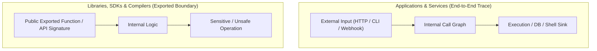

# Trust Boundaries & Taint Analysis: Universal Information Flow Protocol

> **Mandate**: In computational systems, vulnerabilities do not exist in isolation; they exist as paths along a directed execution graph. Trace untrusted data from its ingress Source, through transformational Sanitizers, to sensitive Sinks. Never report a vulnerability without proving that taint can reach an unmediated sink along an active execution path.

---

## 1 · The Algebraic Model of Information Flow

Let any software system be modeled as a directed graph $G = (V, E)$ where nodes $V$ represent execution units (functions, instructions, threads, services) and edges $E$ represent data and control flow.

* **$\mathcal{S}$ (Sources)**: The set of ingress nodes that receive data from outside the current trust boundary.
* **$\mathcal{T}$ (Sanitizers / Guards)**: The set of transformations that constrain, validate, decode, or type-bind data, neutralizing hostile payloads or rejecting out-of-spec input.
* **$\mathcal{K}$ (Sinks)**: The set of sensitive operations whose behavior, integrity, or confidentiality can be compromised if controlled by an untrusted actor.

$$\mathbf{Exploitable\ Vulnerability} \iff \exists \text{ path } P = (s, v_1, v_2, \dots, k) \quad \text{where } s \in \mathcal{S},\ k \in \mathcal{K},\ \text{and } \mathcal{T} \cap P = \emptyset$$

If every path from $s$ to $k$ passes through an adequate sanitizer $t \in \mathcal{T}$, the flow is **certified safe**. If no path exists between $s$ and $k$, the flaw is **unreachable** and must be classified as inert technical debt, not a vulnerability.

---

## 2 · Archetype-Aware Reachability

Reachability analysis differs fundamentally depending on the software archetype being inspected:



### 2.1 Applications, Microservices & Daemons
* **Ingress Bound**: Data must originate from an actual external source (HTTP request body, URL query parameter, external webhook, network socket, configuration file, or CLI argument).
* **Execution Path**: A contiguous call graph must link the ingress handler to the vulnerable sink. If the code is dead, unimported, or behind an unreachable conditional branch, the vulnerability is suppressed.

### 2.2 Libraries, Compilers, SDKs & Frameworks
* **The Exported Ingress Rule**: In a library, callers do not yet exist inside the repository. Therefore, **any public, exported function or method signature is designated as an Ingress Source by definition**.
* **Contract Verification**: If an exported function accepts an argument and routes it into an unmediated execution sink (e.g. dynamic evaluation, shell execution, memory copy) without enforcing input invariants, it is vulnerable by construction.

---

## 3 · Universal Source & Sink Taxonomies

Regardless of whether code is written in C, Rust, Go, TypeScript, Python, or an LLM prompt environment, sources and sinks conform to four universal categories:

### 3.1 Ingress Sources ($\mathcal{S}$)
1. **Direct User Ingress**: CLI flags, standard input (`stdin`), HTTP request bodies/headers/cookies, gRPC messages, WebSocket frames.
2. **Upstream Data Ingress**: Records retrieved from multi-tenant databases, shared cache keys, message queues, cloud storage buckets.
3. **Ambient Environment Ingress**: Operating system environment variables, local configuration files, metadata services (`169.254.169.254`), DNS lookups.
4. **Cognitive Ingress (AI/Agentic)**: External web search results, user documents loaded for RAG, conversation history, outputs from third-party tools.

### 3.2 Sensitive Sinks ($\mathcal{K}$)
1. **Interpreter & Execution Sinks**: SQL query evaluators, OS process spawners, dynamic language `eval`, regex compilers (ReDoS), template engines.
2. **Persistence Sinks**: Relational/NoSQL databases, persistent cache stores, filesystem writes, log collectors (log injection / log forging).
3. **Network & Exfiltration Sinks**: Outgoing HTTP/gRPC clients (SSRF), raw socket writers, DNS resolvers, webhook dispatchers.
4. **Cognitive Sinks (AI/Agentic)**: LLM system prompt context, agent tool execution arguments, shared agent memory scratchpads.

---

## 4 · The Multi-Hop Taint Tracing Protocol

When conducting a code review or defensive construction pass, trace taint across intermediate hops using this 4-step procedure:

```
[Source: req.body.path]
       │
       ▼ (Hop 1: Assignment)
[let target = req.body.path]
       │
       ▼ (Hop 2: String concatenation)
[let fullPath = baseDir + "/" + target]   <── Path Traversal Risk!
       │
       ▼ (Hop 3: Verification Check)
[Sanitizer: resolve & verify under baseDir?]
  ├── NO  ──► [Sink: fs.readFile(fullPath)]  ──► VULNERABILITY (P0)
  └── YES ──► [Sink: fs.readFile(safePath)]   ──► CERTIFIED SAFE
```

1. **Anchor the Source**: Identify the exact line and identifier where untrusted data crosses the perimeter.
2. **Track Transformations & Propagations**: Follow the identifier across assignments, object destructuring, string interpolations, and function parameter passings.
3. **Evaluate the Sanitizer Gate**:
   - Does the sanitizer convert untrusted data into a strictly validated domain type?
   - Does it use a robust parsing algorithm or a fragile blacklist regex?
   - Can the sanitizer be bypassed with alternative encodings (URL encoding, double encoding, null bytes, unicode normalization)?
4. **Inspect the Sink Boundary**:
   - Is the sink using parameterized/prepared interfaces?
   - Does the sink execute with elevated or ambient permissions?

---

## 5 · Cross-Language Invariant Mapping

Apply these mental models to identify sources, sanitizers, and sinks across major programming languages:

| Paradigm / Language | Ingress Sources ($\mathcal{S}$) | Adequate Sanitizers ($\mathcal{T}$) | High-Risk Sinks ($\mathcal{K}$) |
| :--- | :--- | :--- | :--- |
| **TypeScript / Node** | `req.body`, `req.query`, `process.argv` | Zod schemas, parameterized SQL (`pg.query($1)`), `path.normalize` + prefix check | `db.query(`${str}`)`, `child_process.exec`, `eval()`, `res.send()` |
| **Python** | `request.data`, `sys.argv`, `os.environ` | Pydantic models, SQLAlchemy parameterized bindings, `shlex.quote` | `cursor.execute(f"...")`, `os.system()`, `pickle.loads()`, `subprocess.Popen(shell=True)` |
| **Go** | `r.Body`, `os.Args`, `c.Param()` | Struct unmarshaling with validation tags, `sql.DB.Query(query, args...)` | `db.Query(fmt.Sprintf(...))`, `exec.Command("sh", "-c", ...)`, `template.HTML()` |
| **Rust** | `axum::Json`, `std::env::args` | Serde deserialization into typed enums/structs, `sqlx::query!` | Raw pointer dereferences (`unsafe`), `Command::new("sh").arg("-c")`, raw transmute |
| **Autonomous Agent** | User prompt, tool return string, web scrape | Delimited data wrappers, schema-validated tool arguments, read-only capability tokens | Unsandboxed shell tool, unconfirmed file write tool, direct system prompt concatenation |
