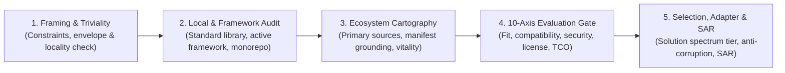
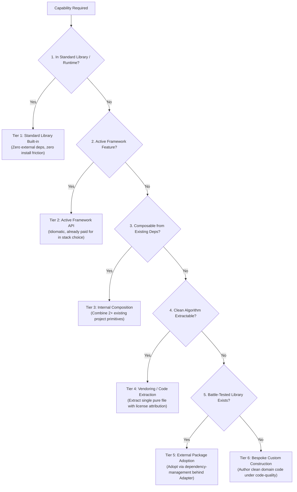

# Solution Discovery: Universal Technology Selection & Capability Protocol

> **Mandate**: *Never jump reflexively from "we need capability X" to "write bespoke code for X from scratch", and never blindly adopt external dependencies without evidence.* Discover locally first; evaluate candidates across 10 empirical constraint axes; select the simplest viable tier on the Solution Spectrum; insulate all external adoptions behind anti-corruption adapters; and ground every decision in inspectable code evidence.

---

## 1 · The 5-Phase Discovery Lifecycle

Every technology selection, capability search, or build-vs-adopt decision traverses this 5-phase protocol:

1. **Phase 1 — Framing & Triviality Check**: Define the exact capability required, its invariant success conditions, and operational constraints (latency, memory, concurrency). Apply the **Triviality & Locality Axiom**: if the capability is a pure algorithmic transformation under ~30 lines with no external I/O, **bypass discovery and build directly in-place** (see Section 2).
2. **Phase 2 — Local & Framework Audit (Framework-First)**: Before looking outside the repository, exhaustively inspect:
   - Language standard library and runtime built-ins.
   - Active framework capabilities, middleware, plugins, and official extensions.
   - Local monorepo packages, shared submodules, and already-installed project dependencies.
3. **Phase 3 — Ecosystem Cartography & Manifest Grounding**: When internal discovery indicates an external capability is justified:
   - Discover candidates from primary, inspectable sources (upstream repositories, release history, test suites).
   - Enforce **Manifest Grounding**: verify candidate package existence in authoritative registries before evaluation to eliminate AI slopsquatting and hallucinated dependencies.
   - If running in an air-gapped or offline environment, trigger the **Offline Ingress Protocol** (see [`references/source-hierarchy.md`](references/source-hierarchy.md)).
4. **Phase 4 — 10-Axis Evaluation Gate**: Score candidate options against the 10 multidimensional criteria (Technical Fit, Compatibility, Vitality, Security, License, Maturity, Integration Cost, Performance, Ecosystem, Overlap). Enforce hard veto gates for license contamination, abandonware, and unpatched CVEs (see [`references/evaluation-matrix.md`](references/evaluation-matrix.md)).
5. **Phase 5 — Selection, Adapter Insulation & Decision Recording**:
   - Classify the decision into exactly one tier on the **5-Tier Solution Spectrum** (see Section 3).
   - If adopting an external library, mandate the **Anti-Corruption Adapter Pattern**: encapsulate third-party types behind project-owned interfaces (see [`references/adapter-and-isolation.md`](references/adapter-and-isolation.md)).
   - Emit a durable **Solution Adoption Record (SAR)** capturing rationale, metrics, and rejected alternatives (see [`references/adoption-record-template.md`](references/adoption-record-template.md)).

---

## 2 · Progressive Disclosure (Reference Routing)

To preserve context bandwidth and prevent cognitive overload, consult specialized reference manuals on demand:

| Context Trigger | Mandatory Reference Manual | Purpose |
| :--- | :--- | :--- |
| **Scoring candidates, hard vetoes, security/license gates** | [`references/evaluation-matrix.md`](references/evaluation-matrix.md) | Granular 10-axis scoring rubric, red flag thresholds, vitality velocity metrics, and hard rejection gates. |
| **Researching repos, verifying packages, offline mode** | [`references/source-hierarchy.md`](references/source-hierarchy.md) | 3-tier epistemic evidence ladder, primary inspectable source rules, manifest grounding, and air-gapped protocols. |
| **Build vs. adopt, vendoring, framework reuse, trade-offs** | [`references/solution-spectrum.md`](references/solution-spectrum.md) | The 5-Tier Solution Spectrum, TCO economic balance, custom-build justification, and triviality threshold rules. |
| **Insulating dependencies, wrapping libraries, adapters** | [`references/adapter-and-isolation.md`](references/adapter-and-isolation.md) | Hexagonal architecture, port-and-adapter patterns, blast radius containment, and preventing third-party type leakage. |
| **Documenting technology decisions, ADRs, rationale** | [`references/adoption-record-template.md`](references/adoption-record-template.md) | Standardized Markdown schema for Solution Adoption Records (SAR) ensuring permanent repository memory. |
| **Practical execution traces & edge-case demonstrations** | [`examples/solution-discovery-walkthrough.md`](examples/solution-discovery-walkthrough.md) | End-to-end case walkthroughs covering rate-limiting, air-gapped zero-dep constraints, and zombie library avoidance. |

---

## 3 · Adaptive Cognitive Sizing (The 4 Discovery Modes)

Size your discovery effort to the architectural risk, blast radius, and lifecycle phase of the task. Never apply enterprise committee bureaucracy to a localized utility; never skip exhaustive evaluation on core infrastructure:

| Mode | Trigger & Scope | Discovery Strategy | Target Output |
| :--- | :--- | :--- | :--- |
| **`micro`** | Pure logic, helper function, localized calculation (< 30 lines). | Triviality check. Inspect standard library. If absent, author clean, typed implementation inline. | Direct code implementation (zero external research). |
| **`standard`** | Non-trivial utility, CLI parser, validation schema, format parser. | Local dependency audit -> Framework check -> 2-3 candidate scan -> Manifest grounding -> Rapid 10-axis screen. | Adapter-wrapped adoption or custom build + brief commit justification. |
| **`architectural`** | Database driver, auth/crypto engine, state store, UI component kit, ORM/query layer. | Full 5-phase lifecycle: Workload envelope mapping -> Monorepo audit -> Multi-candidate deep dive -> Transitive tree audit -> Proof-of-concept benchmark. | Formal Solution Adoption Record (`SAR-xxx.md`) + Anti-Corruption Adapter. |
| **`emergency`** | Active CVE mitigation, broken dependency build, abandoned package replacement. | Scoped replacement search strictly filtering for drop-in API compatibility and verified maintenance vitality. | Attributable replacement patch + rollback plan via `dependency-management`. |

---

## 4 · The 5-Tier Solution Spectrum

Engineering decisions are rarely binary ("build vs. adopt"). Select the simplest viable tier that satisfies all operational constraints:

1. **Tier 1 — Standard Library / Runtime Built-in**: Prefer modern runtime features (`fetch`, `crypto.subtle`, `structuredClone`, `std::filesystem`, `itertools`) over external packages.
2. **Tier 2 — Active Framework Feature**: Use framework primitives (Next.js middleware, Django auth, Spring security, Flutter slivers) before adding third-party plugins.
3. **Tier 3 — Internal Composition**: Synthesize the capability by composing existing project utilities or already-installed dependencies.
4. **Tier 4 — Vendoring / Extraction**: When a 10MB library is needed for a single 40-line algorithm, extract the standalone routine under a compatible permissive license with explicit copyright attribution, avoiding massive transitive dependency trees.
5. **Tier 5 — External Package Adoption**: Adopt an established, actively maintained package when domain complexity (e.g., SQLite, Tree-sitter, libsodium, full-featured RFC implementations) makes in-house construction uneconomical.
6. **Tier 6 — Bespoke Custom Construction**: Build from scratch when candidate libraries are bloated, insecure, unmaintained, introduce hostile licenses, or when the capability represents proprietary core business differentiation.

---

## 5 · The 10 Candidate Evaluation Criteria

When evaluating candidate packages for Tier 5 adoption, score each option against these 10 constraint axes:

| Criterion | Evaluation Question | Hard Veto Trigger (Immediate Rejection) |
| :--- | :--- | :--- |
| **1. Technical Fit** | Does it satisfy the required capability without excess complexity? | Fails > 20% of core functional requirements. |
| **2. Project Compatibility** | Does it match the runtime, engine versions, and architecture? | Requires newer runtime than project target or incompatible native bindings. |
| **3. Vitality & Maintenance** | Is it actively maintained with frequent releases and issue triage? | Zero commits in > 18 months, unmaintained issues, archived repository. |
| **4. Security & Supply Chain** | Is it free of unpatched CVEs, arbitrary scripts, and ownership churn? | Unpatched High/Critical CVE, obfuscated binaries, or post-install scripts. |
| **5. Licensing Integrity** | Is the license legally compatible with the host project? | Copyleft (GPL/AGPL) candidate in a proprietary or permissive codebase. |
| **6. Maturity & Quality** | Does it possess thorough automated test suites and production use? | Zero test suite in upstream repository; pre-1.0 with breaking churn. |
| **7. Integration Cost & TCO** | What is the transitive dependency weight, bundle size, and glue code? | Pulls > 20 transitive dependencies for a non-critical utility. |
| **8. Performance & Resources** | Can it operate within the project's latency, memory, and QPS envelope? | Allocates excessively on hot path or blocks the event loop. |
| **9. Ecosystem & Community** | Is documentation clear, authoritative, and backed by active peers? | Documentation missing, broken, or purely generated marketing text. |
| **10. Capability Overlap** | Does it duplicate a capability already present in the codebase? | Re-implements a function already satisfied by an existing dependency. |

---

## 6 · Guardrails & Anti-Patterns

1. **The Left-Pad Anti-Pattern**: Never install a package for trivial string, math, or array manipulation. If it can be implemented reliably in < 30 lines, write it internally.
2. **The Slopsquatting Anti-Pattern**: Never install or recommend a package based solely on an LLM suggestion without primary manifest verification in the authoritative registry.
3. **The Leaky Abstraction Anti-Pattern**: Never allow third-party package types, exceptions, or interfaces to escape the adapter layer into core domain function signatures.
4. **The Zombie Attraction Anti-Pattern**: Never choose a package because it has 20,000 GitHub stars if commit activity ceased 3 years ago and issues are unanswered.
5. **The Transitive Blindness Anti-Pattern**: Never evaluate only the root package's license and size without auditing the full transitive dependency graph.

---

## 7 · Verification & Decision Gate

Before declaring solution discovery complete and proceeding to implementation:

1. **Manifest Grounding Certified**: Verify candidate exists, author is authentic, and version is pinned.
2. **Transitive Audit Verified**: Run dry-run install via `dependency-management` to confirm clean lockfile resolution with zero license conflicts.
3. **Anti-Corruption Adapter Specified**: Define the project-owned interface signature before writing glue code.
4. **Solution Adoption Record Emitted**: For `architectural` decisions, record the decision in `docs/adr/` or `SAR-xxx.md` following the standard template.
5. **Evaluation Gate Passed**: Confirm the selected option clears all 10 criteria without triggering a hard veto.
