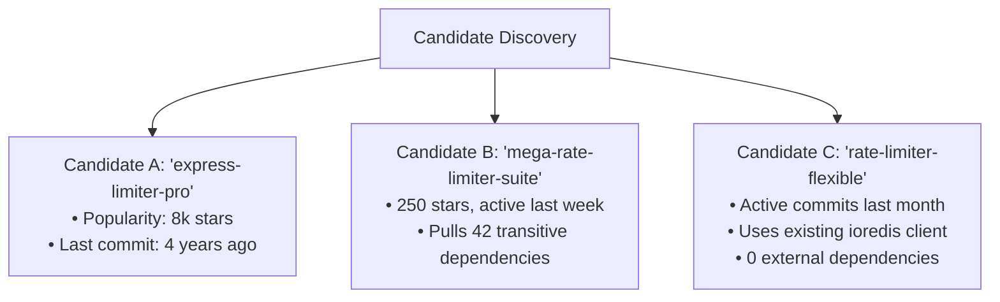

# Solution Discovery Walkthrough: Distributed Rate-Limiting

> **Context**: A high-throughput TypeScript / Node.js backend requires distributed rate limiting across multiple API container instances to defend against abuse. The operational envelope specifies 10,000 QPS capacity, p99 latency overhead < 2ms, and integration with an existing Redis cluster.

---

## Step 1 · Framing & Triviality Check

- **Required Capability**: Token-bucket or sliding-window rate limiter distributed across cluster nodes.
- **Triviality Check**: Distributed rate limiting requires atomic synchronization, clock-skew resilience, and sliding-window logic. This is **not** a trivial < 30 line pure helper. External discovery is justified.
- **Cognitive Sizing Mode**: `architectural` (touches API gateway ingress, shared state, and latency SLAs).

---

## Step 2 · Local & Framework Audit (Framework-First)

1. **Standard Library / Runtime Built-Ins (Tier 1)**:
   - Node.js runtime provides no distributed clustering state primitives. Fails Tier 1.
2. **Active Framework Primitives (Tier 2)**:
   - The application uses Express / Fastify. Fastify provides a basic in-memory rate limiter, but it is node-local and does not share token state across Docker replicas. Fails Tier 2.
3. **Internal Composition (Tier 3)**:
   - Inspection of `package.json` reveals `ioredis@5.3.2` is already installed and in active production use for session caching.
   - *Hypothesis*: Can we find an established rate-limiting library that uses our existing Redis client, avoiding an unvetted secondary network driver?

---

## Step 3 · Ecosystem Cartography & Manifest Grounding

The agent queries the package registry and inspects three candidate options:



### Manifest Grounding Pass
- **Candidate A**: Exists on npm, but upstream Git repo shows last commit was May 2021.
- **Candidate B**: Exists, but inspection of `package.json` reveals `dependencies` has 42 packages including HTTP clients and unrelated utilities.
- **Candidate C**: Exists, links to verified GitHub repo, 0 runtime dependencies, supports native `ioredis` injection.

---

## Step 4 · 10-Axis Candidate Evaluation

| Evaluation Axis | Candidate A (`express-limiter-pro`) | Candidate B (`mega-rate-limiter-suite`) | Candidate C (`rate-limiter-flexible`) |
| :--- | :--- | :--- | :--- |
| **1. Technical Fit** | High (Express middleware). | Med (Over-featured enterprise suite). | High (Token bucket, sliding window, Redis atomic). |
| **2. Compatibility** | Low (Tied to older Express versions). | Med (ESM-only export issues). | High (TypeScript native, supports existing `ioredis`). |
| **3. Vitality & Maintenance** | **HARD VETO**: Zombie repository (0 commits in 42 months, 64 open PRs). | High (Releases every month). | High (Active maintainer triage, weekly commits). |
| **4. Security & Supply Chain** | Low (3 Moderate CVEs in dependencies). | Low (Heavy transitive surface). | High (0 known CVEs, 0 install scripts). |
| **5. Licensing Integrity** | Pass (MIT). | Pass (Apache-2.0). | Pass (MIT). |
| **6. Maturity & Quality** | Med (Tests pass on Node 12 only). | Med (Basic tests). | High (100% test coverage, comprehensive benchmarks). |
| **7. Integration Cost & TCO** | Low (Must fork to fix Node 18 bugs). | **HARD VETO**: Transitive Bloat (42 dependencies). | High (0 dependencies; reuses existing connection). |
| **8. Performance** | Med. | Low (High memory overhead). | High (Executes atomic Redis Lua script in < 1ms). |
| **9. Ecosystem & Docs** | Low (Docs site 404). | Med. | High (Comprehensive guides, clean TS examples). |
| **10. Capability Overlap** | High (No overlap). | Low (Duplicates logging & telemetry). | High (No duplicate packages). |
| **Verdict** | **REJECTED (Zombie)** | **REJECTED (Bloat)** | **ACCEPTED (Tier 5 Adoption)** |

---

## Step 5 · Anti-Corruption Adapter Implementation

The agent does **not** expose `rate-limiter-flexible` directly to the route handlers. It constructs an adapter:

```typescript
// src/core/ports/rate_limiter.port.ts
export interface RateLimiterPort {
  consume(key: string, points?: number): Promise<{ allowed: boolean; retryAfterSec?: number }>;
}

// src/infrastructure/adapters/redis_rate_limiter.adapter.ts
import { RateLimiterRedis } from 'rate-limiter-flexible';
import type { Redis } from 'ioredis';
import { RateLimiterPort } from '../../core/ports/rate_limiter.port';
import { InfrastructureError } from '../../core/errors';

export class RedisRateLimiterAdapter implements RateLimiterPort {
  private readonly limiter: RateLimiterRedis;

  constructor(redisClient: Redis) {
    this.limiter = new RateLimiterRedis({
      storeClient: redisClient,
      keyPrefix: 'rl:api',
      points: 100, // 100 points
      duration: 60, // per 60 seconds
    });
  }

  async consume(key: string, points = 1): Promise<{ allowed: boolean; retryAfterSec?: number }> {
    try {
      await this.limiter.consume(key, points);
      return { allowed: true };
    } catch (err: unknown) {
      if (err && typeof err === 'object' && 'msBeforeNext' in err) {
        return {
          allowed: false,
          retryAfterSec: Math.ceil((err as { msBeforeNext: number }).msBeforeNext / 1000),
        };
      }
      throw new InfrastructureError('Rate limiter storage failure', { cause: err });
    }
  }
}
```

---

## Step 6 · Verification & Emitted SAR

1. **Unit Testing**: Verified adapter with mocked Redis and real Redis test containers. Hostile path (Redis down) fails gracefully with defined domain exception.
2. **Clean Lockfile Verification**: `npm ci` executes cleanly with zero audited vulnerabilities.
3. **Artifact Emitted**: Saved durable record to [`docs/adr/SAR-001-rate-limiter.md`](../references/adoption-record-template.md).
