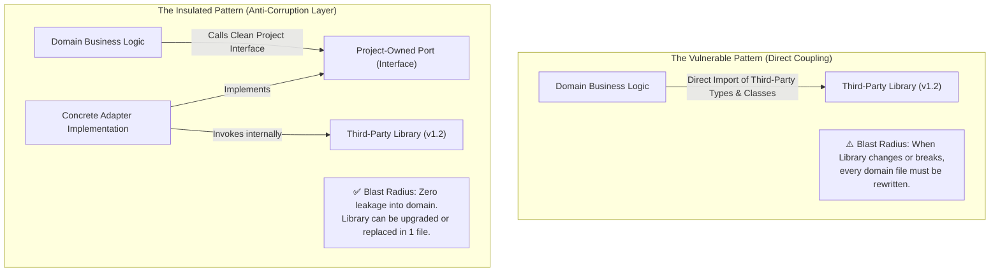

# Adapter & Isolation: The Anti-Corruption Layer Mandate

> **Mandate**: Never allow third-party library types, exceptions, or conventions to leak into core domain models. Every adopted external capability must be encapsulated behind a project-owned interface (Port) and an insulating implementation (Adapter). If an external dependency rots, breaks, or must be replaced, the blast radius of that change must be confined strictly to the adapter file.

---

## 1 · The Anti-Corruption Layer Architecture

Directly importing third-party dependencies into domain business logic creates catastrophic coupling:



---

## 2 · The Three Golden Invariants of Isolation

### Invariant 1: Project Ownership of Data Contracts (Ports)
- The domain declares **what** it needs using its own types, enums, and data models.
- Core business entities must never reference third-party SDK objects, request/response models, or client instances.
- *Rule*: If `package.json` / `Cargo.toml` were deleted, the domain interface definitions must still compile without missing types.

### Invariant 2: Causal Error Translation
- Third-party libraries throw arbitrary, vendor-specific runtime exceptions (e.g. `AxiosError`, `RedisTimeoutException`, `StripeCardError`).
- The adapter **must catch and translate** all third-party errors into structured, domain-meaningful errors conforming to [`code-quality`](../../code-quality/SKILL.md) causal error hygiene.
- Never let raw external exceptions bubble uncaught through domain layers to HTTP or CLI handlers.

### Invariant 3: Zero Third-Party Ambient Authority
- Ingress to the external library must be mediated through an explicit constructor or factory receiving scoped configuration.
- The library must not rely on global process state or ambient singletons unless strictly unavoidable.

---

## 3 · Structural Implementation Pattern

### Step 1: Define the Project-Owned Port (Interface)
The interface resides in domain/application space with zero external imports:

```typescript
// src/core/ports/rate_limiter.ts
// ✅ PURE PROJECT DOMAIN - ZERO EXTERNAL IMPORTS

export interface RateLimitRequest {
  readonly clientKey: string;
  readonly capacity: number;
  readonly refillRatePerSecond: number;
}

export interface RateLimitDecision {
  readonly allowed: boolean;
  readonly remainingTokens: number;
  readonly retryAfterMs?: number;
}

export interface RateLimiterPort {
  evaluate(request: RateLimitRequest): Promise<RateLimitDecision>;
}
```

### Step 2: Implement the Concrete Adapter
The adapter resides in the infrastructure layer, imports the third-party library, and maps both inputs, outputs, and errors:

```typescript
// src/infrastructure/adapters/redis_rate_limiter_adapter.ts
// ✅ INFRASTRUCTURE LAYER - ONLY FILE TOUCHING THIRD-PARTY LIBRARY

import { RateLimiterPort, RateLimitRequest, RateLimitDecision } from '../../core/ports/rate_limiter';
import { DomainError } from '../../core/errors';
import type { ThirdPartyTokenBucketClient } from 'some-token-bucket-pkg'; // 3rd party import isolated here

export class RedisRateLimiterAdapter implements RateLimiterPort {
  constructor(private readonly client: ThirdPartyTokenBucketClient) {}

  async evaluate(request: RateLimitRequest): Promise<RateLimitDecision> {
    try {
      // 1. Map domain request to third-party parameters
      const result = await this.client.consumeTokens({
        key: request.clientKey,
        tokens: 1,
        maxTokens: request.capacity,
      });

      // 2. Map third-party response back to pure domain contract
      return {
        allowed: result.isAllowed,
        remainingTokens: result.tokensRemaining,
        retryAfterMs: result.waitDurationMs,
      };
    } catch (err: unknown) {
      // 3. Translate external library exceptions to domain causal errors
      throw new DomainError('Rate limiting evaluation failed', {
        cause: err,
        context: { clientKey: request.clientKey },
      });
    }
  }
}
```

---

## 4 · Blast Radius Containment & Swappability

The ultimate verification of an Anti-Corruption Layer is the **One-Day Swappability Test**:

> **The Swappability Test**: If the third-party library suffers a critical unpatched vulnerability, is abandoned by maintainers, or changes its license to commercial-only, can an engineer swap in an alternative library or in-house implementation **without modifying a single line of domain business logic**?
>
> If the answer is **Yes**: The adapter is well-designed and blast radius is contained.
> If the answer is **No**: Third-party coupling has corrupted the domain; refactor immediately.
