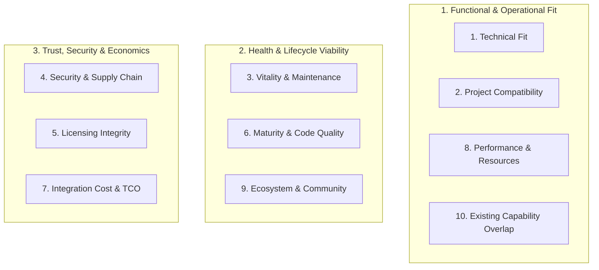

# Evaluation Matrix: The 10-Axis Candidate Scoring Rubric

> **Mandate**: Evaluate every technology candidate with objective, inspectable engineering evidence. Stars, download counts, and marketing slogans are visibility signals, never decision criteria. Reject candidates that violate hard security, licensing, or compatibility invariants immediately.

---

## 1 · Overview of the 10 Evaluation Axes

Every candidate under consideration for external adoption (Tier 5 on the Solution Spectrum) must be evaluated across these 10 orthogonal axes:

---

## 2 · Granular Evaluation Rubric & Hard Veto Triggers

| Axis | What to Inspect (Primary Code Evidence) | Scoring Guidance (High / Medium / Low) | Hard Veto Trigger (Immediate Rejection) |
| :--- | :--- | :--- | :--- |
| **1. Technical Fit** | Upstream API documentation, exported interface types, feature matrix against requested requirements. | **High (Pass)**: Satisfies 100% of required capabilities cleanly. **Med**: Satisfies 80%, requires small adapter glue. **Low**: Requires extensive custom workarounds. | Fails > 20% of core required capabilities or forces architectural paradigm mismatch. |
| **2. Project Compatibility** | `engines` in package manifest, compiler target version, platform-native C-bindings, ESM/CJS compatibility. | **High (Pass)**: Exact match with runtime, compiler, and target architecture. **Med**: Minor polyfill required. **Low**: Requires outdated runtime or unsupported build flags. | Requires newer language/runtime version than host project or unsupported platform architecture. |
| **3. Vitality & Maintenance** | Git commit log recency, release cadence over last 24 months, open PR turnaround time, maintainer responses to issues. | **High (Pass)**: Commits in last 3 months, active releases, responsive triage. **Med**: Releases within 12 months, stable maintenance. **Low**: Sparse commits, stale PRs. | **Zombie Abandonware**: Zero commits in > 18 months, unmaintained critical issues, or archived repository. |
| **4. Security & Supply Chain** | GitHub Security Advisories, OSV/CVE database, build/install script execution (`preinstall`, `build.rs`), publisher 2FA. | **High (Pass)**: Clean advisory history, zero install scripts, signed releases. **Med**: Historical CVEs quickly patched. **Low**: Unpatched Moderate CVEs. | **Security Hazard**: Unpatched High/Critical CVE, arbitrary obfuscated install scripts, or untrusted publisher churn. |
| **5. Licensing Integrity** | Upstream `LICENSE` file, SPDX identifiers, transitive dependency license scanning. | **High (Pass)**: Permissive license (MIT, Apache-2.0, BSD-3, ISC) matching project. **Med**: Permissive with notice requirements. **Low**: Weak copyleft (MPL-2.0, LGPL). | **License Contamination**: Strong copyleft (GPL-2.0/3.0, AGPL) in a proprietary or permissive codebase without explicit legal sign-off. |
| **6. Maturity & Quality** | Upstream `test/` directory, test coverage reports, CI badge status, SemVer stability (v1.0+). | **High (Pass)**: Comprehensive unit & integration tests, green CI, v1.0+. **Med**: Basic unit tests, stable API. **Low**: Sparse tests, frequent breaking changes. | Upstream repository contains zero automated test suites or broken master branch builds. |
| **7. Integration Cost & TCO** | Transitive dependency count, bundle size (minified + gzipped), memory overhead, API surface complexity. | **High (Pass)**: Zero or minimal (< 3) transitive deps, lean bundle size. **Med**: Moderate transitive tree (< 10 deps). **Low**: Heavy transitive tree (> 15 deps). | **Transitive Bloat**: Pulls > 20 transitive dependencies for a non-critical utility (triggers Vendoring or Custom Build). |
| **8. Performance & Resources** | Upstream benchmarks, memory allocation profiles, hot-path sync blocking vs. async non-blocking design. | **High (Pass)**: Operates comfortably within project latency/memory budget. **Med**: Acceptable overhead for non-critical path. **Low**: Noticeable latency or allocation footprint. | Violates hard latency ceilings (e.g. introduces 50ms latency on a 5ms SLA) or leaks memory on repeated runs. |
| **9. Ecosystem & Community** | Quality of official guides, active user discussions, StackOverflow/GitHub search health, multiple maintainers. | **High (Pass)**: Comprehensive, searchable, up-to-date documentation. **Med**: Functional docs, community examples. **Low**: Outdated docs, unanswered questions. | Incomplete, purely AI-hallucinated, or non-existent documentation with no code examples. |
| **10. Capability Overlap** | Existing project dependencies, standard library, monorepo shared packages. | **High (Pass)**: Provides completely unique, unrepresented capability. **Med**: Replaces a deprecated internal helper. **Low**: Partially overlaps existing utility. | **Accidental Duplication**: Re-implements or duplicates a capability already provided by an installed dependency. |

---

## 3 · The Vitality Velocity Metric

To differentiate truly stable software from abandoned projects, calculate the **Vitality Velocity Score ($V_v$)**:

$$V_v = \frac{C_{\text{recent}} \times 0.4 + R_{\text{cadence}} \times 0.3 + T_{\text{issue}} \times 0.3}{1 + A_{\text{months}}}$$

Where:
- $C_{\text{recent}}$: Normalized commit frequency in the last 6 months ($0.0 - 1.0$).
- $R_{\text{cadence}}$: Release cadence regularity ($1.0$ if tagged release in last 6 months, $0.5$ in last 12 months, $0.0$ if $> 18$ months).
- $T_{\text{issue}}$: Issue triage ratio (closed issues / total created issues in last 6 months).
- $A_{\text{months}}$: Number of months since the last maintainer activity.

**Thresholds**:
- $V_v \ge 0.5$: **Active & Vital** (Safe for Tier 5 adoption).
- $0.2 \le V_v < 0.5$: **Mature / Dormant** (Permissible only if code is feature-complete, zero CVEs, and well-tested).
- $V_v < 0.2$: **Zombie Abandonware** (Hard veto; reject candidate).

---

## 4 · The Final Scorecard Synthesis

When comparing candidates, formulate the decision matrix:

| Candidate | Tech Fit (0-10) | Compatibility (0-10) | Vitality (0-10) | Security (0-10) | License (Pass/Fail) | TCO / Weight (0-10) | Composite Score | Recommendation |
| :--- | :---: | :---: | :---: | :---: | :---: | :---: | :---: | :--- |
| **Candidate A** | 9 | 10 | 8 | 9 | PASS | 8 | **88 / 100** | **Adopt (Wrap in Adapter)** |
| **Candidate B** | 8 | 6 | 2 | 7 | PASS | 3 | **52 / 100** | Reject (Zombie / Bloat) |
| **Candidate C** | 9 | 9 | 9 | 4 | FAIL (GPL) | 9 | **VETO** | Reject (License Veto) |
| **Custom Build** | 8 | 10 | 10 | 10 | PASS | 7 | **90 / 100** | Viable Alternative |
