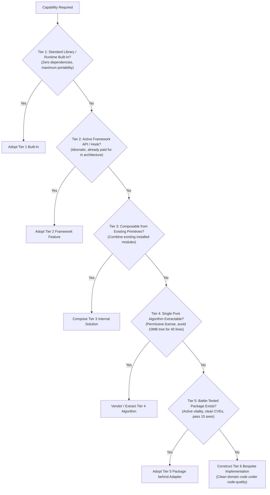

# Solution Spectrum: The 5-Tier Capability & Economic Model

> **Mandate**: Technology selection is not a binary choice between "adopt an external package" and "build from scratch". Engineering maturity lies in evaluating the full spectrum of solutions—from zero-cost standard library primitives to framework composition, code extraction, and defensive bespoke builds.

---

## 1 · The Solution Spectrum Architecture

Before writing custom code or installing an external package, evaluate options along this structured progression:

---

## 2 · Granular Spectrum Tiers

### Tier 1 — Standard Library & Runtime Built-Ins
- **Cost**: Zero external dependencies, zero license friction, zero supply-chain liability.
- **When to Use**: Modern runtimes contain rich capabilities previously outsourced to packages:
  - *TypeScript / JavaScript*: Native `fetch`, `crypto.subtle`, `structuredClone`, `URLPattern`, `AbortController`, `Set` union/intersection methods.
  - *Python*: `dataclasses`, `pathlib`, `asyncio`, `itertools`, `hashlib`, `concurrent.futures`.
  - *Go / Rust / C++*: Standard concurrency channels, standard collections, `std::filesystem`.
- **Decision Rule**: If the standard library fulfills $\ge 90\%$ of the requirement with acceptable performance, **use it unconditionally**.

### Tier 2 — Active Framework Primitives
- **Cost**: Zero additional dependencies (already part of host framework).
- **When to Use**: Capabilities natively supported by the framework in use:
  - E.g., Next.js Server Actions / Middleware, Django built-in ORM/Auth, FastAPI dependency injection, Flutter state/animation widgets.
- **Decision Rule**: Never import a third-party state manager, auth wrapper, or router if the active framework provides an idiomatic first-party solution.

### Tier 3 — Internal Composition
- **Cost**: Zero new dependencies; utilizes existing, already-audited packages in `package.json` / `Cargo.toml`.
- **When to Use**: The capability can be constructed by piping together two existing libraries or internal modules.
  - *Example*: A rate-limiter can be composed from an existing Redis client and a 20-line sliding-window script, avoiding a dedicated rate-limiting dependency.

### Tier 4 — Vendoring & Code Extraction
- **Cost**: Zero runtime dependency churn; one-time review cost.
- **When to Use**: The project needs a specific, self-contained algorithmic routine (e.g. Levenshtein distance, base64url encoding, topological sort) that is locked inside a library with 30 transitive dependencies.
- **The Vendoring Protocol**:
  1. Verify the upstream library has an unambiguously permissive license (MIT, Apache-2.0, BSD-3-Clause).
  2. Extract only the specific pure function and its immediate helper routines into `src/vendor/` or `internal/vendor/`.
  3. Retain original copyright notices, license text, and commit provenance at the top of the vendored file.
  4. Port or author unit tests verifying that the extracted function behaves correctly.

### Tier 5 — External Package Adoption
- **Cost**: Permanent supply-chain, upgrade, and security surface.
- **When to Use**: The capability involves high domain complexity, intricate standards compliance, or security-critical internals that are hazardous to build in-house:
  - *Examples*: Cryptographic engines (libsodium), SQL parsing / AST manipulation (Tree-sitter), full-featured PDF engines, SQLite drivers, complex timezone databases.
- **The Adoption Invariant**: Must clear all 10 axes of the [Evaluation Matrix](evaluation-matrix.md) and be encapsulated behind an [Anti-Corruption Adapter](adapter-and-isolation.md).

### Tier 6 — Bespoke Custom Construction
- **Cost**: In-house authoring, documentation, and perpetual maintenance debt.
- **When to Use**:
  1. *Competitive Moat*: The capability is the core, proprietary intellectual property of the business.
  2. *Market Void*: No existing library exists (greenfield domain).
  3. *Unacceptable Liabilities*: All existing third-party packages fail the 10-axis evaluation (abandoned, viral licenses, massive CVEs, or unacceptable bloat).
- **Construction Rule**: Must adhere to [`code-quality`](../../code-quality/SKILL.md) and pass [`testing`](../../testing/SKILL.md) hostile failure path verification.

---

## 3 · The Total Cost of Ownership (TCO) Model

To determine whether to Adopt (Tier 5) or Build (Tier 6), evaluate the Total Cost of Ownership equation:

$$\text{TCO}_{\text{Adopt}} = C_{\text{eval}} + C_{\text{adapt}} + \sum_{t=1}^{N} \left( M_{\text{upgrade}} + S_{\text{vuln}} + B_{\text{dep\_tree}} \right)$$

$$\text{TCO}_{\text{Build}} = C_{\text{author}} + C_{\text{test}} + \sum_{t=1}^{N} \left( M_{\text{bugs}} + M_{\text{drift}} \right)$$

Where:
- $C_{\text{eval}}, C_{\text{adapt}}$: Cost to vet package and author anti-corruption adapter.
- $M_{\text{upgrade}}$: Ongoing cost of SemVer breaking updates.
- $S_{\text{vuln}}$: Risk and labor of responding to upstream security advisories.
- $B_{\text{dep\_tree}}$: Build-time latency and bundle size drag of transitive dependencies.
- $C_{\text{author}}, C_{\text{test}}$: Initial engineering effort to write custom implementation with 100% test coverage.
- $M_{\text{bugs}}, M_{\text{drift}}$: Ongoing maintenance cost of fixing in-house edge cases and standards drift.

**Economic Rule**: If $\text{TCO}_{\text{Build}} < \text{TCO}_{\text{Adopt}}$, or if the capability is a pure algorithmic helper, author custom code. If $\text{TCO}_{\text{Adopt}} \ll \text{TCO}_{\text{Build}}$ (high RFC complexity), adopt an external library.

---

## 4 · The Triviality & Locality Axiom

Never trigger external discovery for trivial utilities. Apply this heuristic:

> **The 30-Line Rule**: If a capability can be implemented as a pure function in fewer than 30 lines of readable, well-typed code, with no external network/filesystem I/O and no intricate cryptographic/RFC specifications:
> 1. **Do not search package registries.**
> 2. **Do not add a dependency.**
> 3. **Implement it locally** using [`code-quality`](../../code-quality/SKILL.md) conventions with unit test coverage.

*Examples of Trivial Capabilities*:
- Clamping a number between minimum and maximum.
- Truncating a string with ellipsis.
- Chunking an array into fixed-size batches.
- Simple object key-camelCasing.
- Exponential backoff jitter math.

---

## 5 · The Invariant Exception Protocol

In rare scenarios, project constraints justify deviating from the standard spectrum progression. An agent may invoke the Invariant Exception Protocol only under these verified conditions:

1. **Extreme Low-Latency / HFT / Kernel Constraints**: Third-party libraries introduce dynamic memory allocations, garbage collection pauses, or synchronization locks on a sub-microsecond path.
   - *Resolution*: Custom zero-allocation build (Tier 6) with ADR documentation.
2. **Proprietary Core IP**: The algorithm or data pipeline constitutes patentable or trade-secret core business value.
   - *Resolution*: Strictly in-house implementation (Tier 6). Third-party code is prohibited to protect ownership.
3. **Formal Air-Gapped / Zero-Dependency Policy**: The repository or customer contract legally prohibits adding new external packages.
   - *Resolution*: Limit strictly to Tiers 1, 2, 3, or Tier 6 custom builds.
