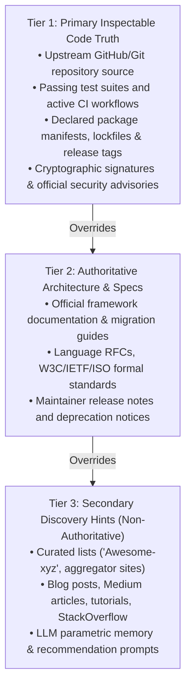
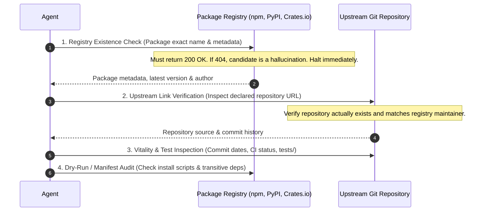
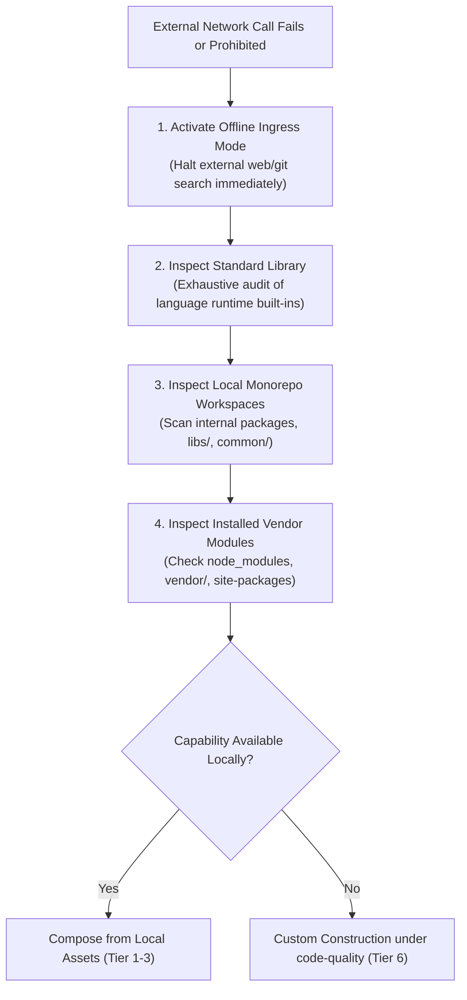

# Source Hierarchy: Epistemic Grounding & Ecosystem Research

> **Mandate**: Software engineering decisions must be grounded in primary, inspectable code evidence. Upstream repositories, commit histories, unit test suites, and cryptographic package manifests are authoritative sources of truth. Tutorials, community lists, and LLM training memories are merely discovery hints, never proof of correctness or stability.

---

## 1 · The 3-Tier Epistemic Evidence Ladder

When researching potential solutions, assign epistemic weight strictly according to this hierarchy:

### Tier 1 — Primary Inspectable Code Truth (Weight: 1.0)
- **Direct Code Inspection**: The actual implementation files in the upstream repository. Inspect function signatures, exported types, and error handling directly.
- **Upstream Automated Tests**: Inspect the repository's `tests/` or `spec/` directory. If automated tests are absent, failing, or mocked to triviality, the candidate's claims of maturity are unsubstantiated.
- **Package Manifests & Lockfiles**: Inspect declared `dependencies`, `peerDependencies`, `engines`, and build scripts (`package.json`, `Cargo.toml`, `pyproject.toml`, `go.mod`).
- **Release History**: Verify that the latest published package matches an immutable signed Git tag with corresponding commit history.

### Tier 2 — Authoritative Architecture & Specifications (Weight: 0.7)
- **Official Documentation**: Upstream docs hosted by the official project domain or repository wiki.
- **Formal Specifications & RFCs**: RFCs (e.g., OAuth 2.1, WebAuthn, HTTP/3, POSIX), standard library documentation, and language specifications.
- **Security Advisory Feeds**: GitHub Advisory Database, OSV (Open Source Vulnerabilities), NVD/CVE, and vendor security bulletins.

### Tier 3 — Secondary Discovery Hints (Weight: 0.2 — Discovery Only)
- **Aggregators & Curated Lists**: GitHub "Awesome" repositories, tool comparison websites, package search engines.
- **Community Articles & Tutorials**: Blog posts, Medium, Dev.to, Reddit, StackOverflow.
- **LLM Parametric Memory**: Packages or libraries suggested by AI models.
- **Rule of Non-Reliance**: Tier 3 sources are strictly for **initial hypothesis generation**. An agent must *never* cite a blog post or LLM prompt as proof that a package is safe, maintained, or compatible. Every Tier 3 candidate must be validated against Tier 1 sources before adoption.

---

## 2 · Manifest Grounding & Slopsquatting Defense

LLMs are prone to package hallucinations (suggesting non-existent packages with plausible names) and malicious actors actively publish typosquatted or "slopsquatted" packages targeting AI suggestions.

### The Mandatory 4-Step Grounding Gate
Before evaluating any external package candidate, execute this validation sequence:

1. **Registry Existence Verification**: Query the target package ecosystem metadata directly. If the package returns `Not Found`, discard the candidate immediately—it is an AI hallucination.
2. **Upstream Link Matching**: Confirm that the package manifest points to a real, verifiable Git repository matching the publisher identity. Beware of dummy packages linking to unrelated legitimate repos.
3. **Download / Vitality Cross-Check**: Verify the package has legitimate version release history spanning at least several months. Zero-day newly registered packages with generic names must be treated as hostile until audited.
4. **Install Script Audit**: Inspect the manifest for pre/post-install execution hooks (`scripts.preinstall`, `scripts.postinstall`, `build.rs`). Any obfuscated, network-fetching, or arbitrary shell-executing script is a hard rejection trigger.

---

## 3 · Contradiction Resolution Protocol

When conflicting technical information arises during research, apply these resolution rules:

| Conflict Scenario | Winning Source | Rationale |
| :--- | :--- | :--- |
| **Tutorial claims feature X exists; Upstream code lacks export X.** | **Upstream Code** | Code is reality. Tutorials frequently document speculative, unreleased, or deprecated APIs. |
| **README states Node 16+ support; `package.json#engines` states Node 18+.** | **`package.json`** | The manifest governs package manager installation and runtime compatibility enforcement. |
| **GitHub repo has 15k stars; Last commit was 3.5 years ago.** | **Commit History** | Stars represent historical popularity; commit recency governs operational viability. |
| **Blog recommends Package A; Project framework provides native hook.** | **Framework Hook** | Framework-first integration minimizes external supply-chain surface and preserves idiomatic architecture. |

---

## 4 · The Offline & Air-Gapped Ingress Protocol

When an agent operates in an air-gapped, offline, or secure enterprise environment where external web search and public registries are unreachable:

1. **Graceful Network Degradation**: If network tools return connection timeouts, DNS errors, or policy blocks, do not thrash or retry. Immediately switch execution mode to `offline-ingress`.
2. **Local Monorepo Scrutiny**: Inspect sibling workspace directories (`packages/*`, `libs/*`, `internal/*`). In enterprise codebases, required capabilities (e.g. logging, auth clients, crypto utilities) are often already implemented in shared internal modules.
3. **Vendor Tree Inspection**: Audit existing vendored packages or pre-installed runtime dependencies.
4. **Clean Fallback to Custom Construction**: If the capability cannot be satisfied by standard libraries or local modules, proceed directly to **Tier 6: Bespoke Custom Construction** under [`code-quality`](../../code-quality/SKILL.md) and [`system-architecture`](../../system-architecture/SKILL.md).
