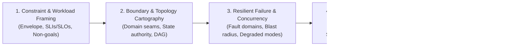

# System Architecture: Universal Structural Design & Trade-Off Protocol

> **Mandate**: *Architecture is the art of bound trade-offs under physical and operational constraints.* Requirements and constraints strictly precede structure. Every design must declare what it optimizes for, what it sacrifices, how it isolates failure, and where state authority resides. Never build speculative enterprise complexity for today's prototype; never permit cyclic coupling across architectural boundaries. Structural simplicity is earned through rigorous constraint analysis, not assumed by default.

---

## 1 · The 5-Phase Architectural Lifecycle

Every structural design, modular decomposition, or architectural audit task traverses this 5-phase protocol:



1. **Phase 1 — Constraint & Workload Framing (Requirements Before Structure)**: Formulate the quantitative **Workload Envelope** ($QPS_{read}$, $QPS_{write}$, payload distributions, latency ceilings, concurrency peaks, storage growth). Define hard correctness criteria (consistency, ordering, durability) and explicit **Non-Goals** to eliminate speculative scope creep before drawing a single box.
2. **Phase 2 — Boundary & Topology Cartography**: Partition the problem into **Bounded Contexts** along domain seams. Enforce **Deterministic State Authority** (single-writer or mathematically deterministic convergence). Guarantee an **Architectural Boundary DAG** where dependencies flow un-cyclically from unstable delivery mechanisms to stable domain policies.
3. **Phase 3 — Resilient Failure & Concurrency Modeling**: Partition the system into isolated **Fault Domains** so that failure in one subsystem cannot cause an unconstrained cascade. Establish backpressure, circuit breaking, timeouts, jittered exponential backoff, and explicit **Degraded Operating Modes**.
4. **Phase 4 — Trade-Off Discipline & ADR Synthesis**: Apply the **Simplest Viable Topology Axiom** (never distribute what can run efficiently in-process). Formalize every load-bearing trade-off (*"We choose A over B because of C, explicitly accepting drawback D"*) and emit an immutable **Architecture Decision Record (ADR)**.
5. **Phase 5 — Adversarial Review & Drift Gate**: Subject the design to the **6 Adversarial Critic Lenses** (boundaries, cycles, state authority, blast radius, premature abstraction, agent safety). Quantify structural confidence on the **0–100 Architectural Integrity Scale**. Halt drift before code implementation.

---

## 2 · Progressive Disclosure (Reference Routing)

To prevent cognitive overload and preserve LLM context bandwidth, **never load all reference manuals simultaneously**. Consult reference manuals strictly on demand based on task context:

| Context Trigger | Mandatory Reference Manual | Purpose |
| :--- | :--- | :--- |
| **QPS, capacity, latency, memory limits, SLOs, Little's Law** | [`references/constraint-first-design.md`](references/constraint-first-design.md) | Workload envelope math, Little's Law ($L = \lambda W$), Amdahl's Law, Universal Scalability Law, SLO/SLI error budgets. |
| **Module seams, DB schemas, state mutation, CRDTs, cycles** | [`references/boundaries-coupling-and-data-ownership.md`](references/boundaries-coupling-and-data-ownership.md) | Domain seams, Deterministic State Authority (single-writer & CRDTs), Acyclic Module DAGs, coupling metrics ($C_a, C_e, I, D$). |
| **Timeouts, retries, network partitions, cascading errors, backpressure** | [`references/failure-modes-and-resilience.md`](references/failure-modes-and-resilience.md) | Fault domains, circuit breakers, backpressure, idempotency keys, CAP/PACELC partition handling, graceful degradation. |
| **Architectural choices, ADRs, trade-offs, edge-case exceptions** | [`references/trade-off-discipline-and-adrs.md`](references/trade-off-discipline-and-adrs.md) | Load-bearing trade-offs, immutable ADR schema, Invariant Exception Protocol for extreme edge cases (HFT, kernel, real-time). |
| **LLMs, tools, MCP servers, subagents, prompt/token budgets** | [`references/agentic-system-architecture.md`](references/agentic-system-architecture.md) | Agentic topology matrix (Code vs Skill vs MCP vs Subagent), token economics, tool contract schemas, Zero Ambient Authority. |
| **Pre-implementation review, PR audit, refactoring gate, anti-patterns** | [`references/architectural-critique-and-anti-patterns.md`](references/architectural-critique-and-anti-patterns.md) | 6 Adversarial review lenses, cycle/leak detection, 0–100 integrity scoring, anti-pattern catalog (distributed monolith, shared DB). |

---

## 3 · Adaptive Cognitive Sizing (The 6 Execution Modes)

Size your architectural effort to the scope, operational risk, and lifecycle phase of the task. Do not write essays for simple internal modules, and never skip structural scaffolding on distributed or agentic platforms:

| Mode | Trigger & Scope | Architectural Discipline | Required Output & Protocol |
| :--- | :--- | :--- | :--- |
| **`spike`** | Quick proof-of-concept, unproven algorithm exploration, disposable prototype. | Bypasses formal ADRs; verifies basic memory/process safety; permits temporary debt. | Code header: `[SPIKE: exploratory - target cleanup YYYY-MM-DD]`. |
| **`micro-arch`** | Internal module refactor, single component seam, interface contract (< 200 lines). | Verify single responsibility, acyclic module DAG, explicit input/output boundaries, error bubbling. | **Zero boilerplate**. 3-Line Structural Intent block directly preceding code. |
| **`system-design`** | New service, monolithic application, desktop/CLI tool, domain module overhaul. | Full 5-phase lifecycle; domain boundaries, deterministic state authority, sequence flows, failure handling. | `SYSTEM_DESIGN.md` (or inline architectural RFC) + targeted `ADR-001.md`. |
| **`distributed-scale`** | Multi-service mesh, event streaming, distributed caching, partition tolerance, high QPS. | Rigorous workload envelope math, CAP/PACELC trade-offs, network partition handling, idempotency, observability. | `DISTRIBUTED_ARCHITECTURE.md` + Workload Envelope Matrix + Failure Playbook. |
| **`agentic-system`** | Autonomous agentic swarms, MCP servers, tool ecosystems, skill hierarchies, LLM workflows. | Agentic Topology Selection (Skill vs Subagent vs MCP vs Workflow), Context/Token Budgets, Tool Contracts, Least Privilege. | `AGENT_SYSTEM_SPEC.md` + Tool Contract Schemas. |
| **`critic-audit`** | Pre-implementation design review, PR architectural audit, legacy debt audit, boundary verification. | Adversarial stress-testing across 6 lenses (Coupling, Cycles, Cohesion, Leaks, Blast Radius, Premature Abstraction). | `ARCHITECTURE_AUDIT.md` (0–100 score + finding matrix with concrete remedies). |

### The 3-Line Structural Intent Protocol (For `micro-arch` mode)
To prevent philosophical essay bloat on small components, summarize structural intent in exactly 3 lines before emitting code:
```markdown
> **Seam**: [Component A] ➔ [Component B] via [Interface/Contract] (Direction: Acyclic DAG)
> **Authority**: [Component A] holds mutable authority; [Component B] receives immutable view / event
> **Failure Boundary**: [Local catch / Bubbled error / Degraded fallback]
```

> **Boundary**: This skill owns *logical system design* — module decomposition, API contracts, state authority, and trade-off analysis. For *physical resource provisioning* (VMs, IaC, networking, drift reconciliation), activate `infrastructure` instead.

---

## 4 · The 7 Universal Architecture Invariants

Regardless of language, framework, or runtime, every robust computational system upholds these 7 foundational invariants:

### 4.1 Invariant 1: Workload & Constraint Primacy (Anti-Astronautics)
Structure strictly follows quantified constraints, never aesthetic dogma or technology hype. A system design is invalid until its workload envelope ($QPS$, payload distribution, memory bounds, latency ceilings, and durability requirements) is explicitly formulated.

### 4.2 Invariant 2: Deterministic State Authority (Convergence Law)
Every piece of mutable state must have unambiguous write authority:
* **Centralized Systems**: Exactly one authoritative owner module or service. Shared mutable databases, cross-boundary direct table writes, and uncoordinated state stores are forbidden.
* **Distributed / Concurrent Systems**: If multiple nodes or threads mutate state concurrently (e.g. CRDTs, Raft/Paxos consensus, Operational Transformation, or lock-free ring buffers), the system **must** provide a mathematically proven, conflict-free deterministic convergence law.

### 4.3 Invariant 3: Architectural Boundary DAG (Acyclic Dependency Law)
The dependency graph between architectural boundaries (packages, modules, namespaces, services) must form a strict Directed Acyclic Graph (DAG). Stable domain policies must never depend on volatile I/O mechanisms or external delivery details.  
*(Clarification: Encapsulated internal in-memory object graphs, such as doubly-linked trees or graph node pointers within a single boundary, are fully permitted).*

### 4.4 Invariant 4: Fault Domain Isolation & Blast-Radius Bounding
A failure in one subsystem must never cause an unconstrained catastrophic cascade across the entire system. Every external integration, remote call, child process, or tool invocation must execute within an isolated fault domain bounded by timeouts, circuit breakers, backpressure, and explicit fallback/degradation behavior.

### 4.5 Invariant 5: Control Plane & Data Plane Decoupling
Control operations (routing, policy enforcement, orchestration, schema evolution, agent reasoning) must be logically or physically decoupled from high-throughput data operations (payload processing, serialization, streaming, batch crunching). A spike in data traffic must never starve or stall control coordination.

### 4.6 Invariant 6: Load-Bearing Trade-Off Conservation
Complexity cannot be destroyed; it can only be moved, consolidated, or traded. Every architectural decision buys specific properties (latency, availability, isolation, scalability) at the direct expense of others (consistency, simplicity, operational cost). Any design claiming "zero drawbacks" is an unverified hypothesis.

### 4.7 Invariant 7: Simplest Viable Topology & Proportionality
Match structural complexity to problem reality. Do not introduce distributed services, message brokers, or multi-agent swarms when an in-process modular monolith, a SQLite database, or a deterministic 10-line script satisfies the workload envelope. Complexity must earn its keep.

---

## 5 · The Invariant Exception Protocol (Extreme Edge Cases)

No single static set of rules can accommodate 100% of computational extremes without breaking. When physical realities (e.g., sub-microsecond latency in HFT, 32KB microcontroller memory, hard real-time worst-case execution time, or physical network cuts) conflict with standard architectural invariants, the system invokes this protocol:

> [!CAUTION] INVARIANT EXCEPTION PROTOCOL
> An agent may deliberately bypass an architectural invariant (e.g., bypassing an abstraction boundary for CPU cache alignment, or violating strong consistency during a network partition) **IF AND ONLY IF**:
> 1. **Physical Constraint Citation**: Explicitly cites the hardware/runtime constraint (e.g., *"100ns latency budget prevents dynamic dispatch"* or *"CAP network partition forces AP mode"*).
> 2. **Boundary Containment**: Isolates the violation inside a strictly quarantined module behind an opaque boundary.
> 3. **Micro-ADR**: Records the trade-off and accepted technical liability in an immutable record.

---

## 6 · Universal Archetype Adaptation

The 7 invariants adapt dynamically across every software archetype:

* **Modular Monoliths & Monorepos**: Enforce boundary encapsulation via private package visibility or internal interfaces; strictly forbid circular package imports; execute transactions within single process boundaries.
* **Distributed Cloud & Microservices**: Use explicit network contracts (Protobuf/gRPC/OpenAPI); enforce the single-writer database pattern (no shared databases); manage partial failure via circuit breakers and idempotency keys.
* **Embedded, Systems & CLIs**: Model workload envelopes against hardware limits (RAM, stack depth, CPU cycles); decouple POSIX flag parsing from business engines; handle OS signals and process exit codes deterministically.
* **Frontend & Client Applications**: Enforce unidirectional data flow (View $\to$ Intent $\to$ State Mutation $\to$ Render); decouple UI rendering from async network synchronization; provide optimistic updates with deterministic rollback.
* **Autonomous AI Agents & Swarms**: Apply the Agentic Topology Matrix (Code vs Skill vs MCP vs Subagent); enforce strict context token budgeting; scope tool capability tokens with Zero Ambient Authority; isolate subagent worktrees.
* **Data, Stream & Batch Pipelines**: Enforce schema validation at ingress; decouple stream coordination from worker processing; ensure all transform stages are idempotent to tolerate retry without duplication.

---

## 7 · Guardrails & Anti-Patterns

### 7.1 Strictly Disallowed Actions
- ❌ **No Premature Microservices**: Never decompose an application into distributed network services before hitting concrete organizational or workload scaling limits.
- ❌ **No Cyclic Module Coupling**: Never allow package A to import package B while package B imports package A across architectural boundaries.
- ❌ **No Shared Mutable Database Integration**: Never allow two distinct services to write directly to the same database tables. Data sharing across services occurs via contracts or events.
- ❌ **No Unstated Trade-Offs**: Never propose an architecture claiming "pure upside". State the latency, complexity, or consistency penalty explicitly.
- ❌ **No Architecture Astronautics**: Never introduce enterprise event brokers, multi-region replication, or multi-agent swarms for simple CRUD or localized utilities.
- ❌ **No Unbounded Agent Tool Capabilities**: Never give an AI agent ambient root authority or unrestricted mutating access without confirmation gates.

---

## 8 · The Clean Architecture Stopping Contract

An architectural task is strictly **COMPLETE** only when:
1. **Workload Envelope Quantified**: Throughput, latency target, and capacity constraints are explicitly defined.
2. **Boundary Cartography Verified**: Every module seam has a clear acyclic dependency direction, and state authority is unambiguously assigned.
3. **Failure Playbook Documented**: Blast radius is contained with timeouts, circuit breakers, and degraded fallbacks.
4. **ADR Synthesized**: Load-bearing trade-offs are committed to an immutable record, including any Invariant Exceptions.
5. **Adversarial Gate Passed**: Structural integrity scored $\ge 70$ across all 6 review lenses with zero unresolved circular dependencies.
