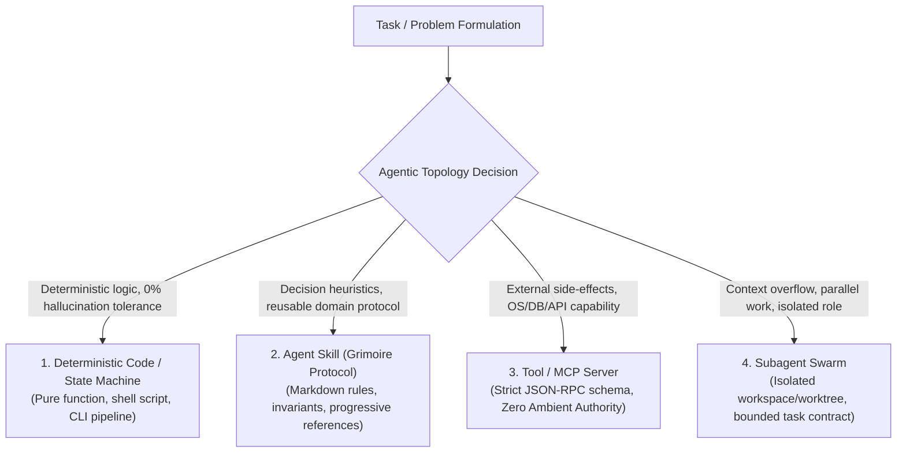
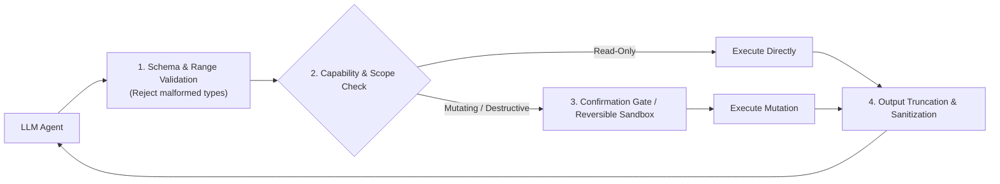

# Agentic System Architecture: Autonomous AI & Tool Topology

> **Mandate**: Autonomous AI agents are non-deterministic, stochastic execution units interacting with deterministic tools over unreliable I/O. Designing an agentic system requires the same rigor as distributed systems engineering: clear execution primitives, strict context/token budgets, least-privilege tool contracts, and bounded failure control to prevent cascading hallucination loops.

---

## 1 · The 4 Agentic Primitives & Topology Selection

Never treat "an agent" as a generic silver bullet. Architectures for AI systems decompose into four distinct execution primitives:



### 1.1 The Agentic Topology Decision Matrix

| Primitive | When to Choose | Architectural Guarantees | Failure Mode to Guard |
| :--- | :--- | :--- | :--- |
| **Deterministic Code** | Parsing strict ASTs, computing hashes, executing math, data migrations. | $100\%$ repeatable, zero token cost, nanosecond execution. | Over-engineering an LLM prompt when 5 lines of code suffice. |
| **Agent Skill** | Guiding LLM behavior across multi-step domain workflows (testing, UX, architecture). | Invariant enforcement, mental models, progressive disclosure. | Prompt bloat; violating token budgets with un-routed text. |
| **Tool / MCP Server** | Giving an LLM the ability to read or mutate the outside world (git, DB, filesystem). | Strongly-typed schemas, input sanitization, auditable logging. | **Confused Deputy**: executing destructive actions without capability checks. |
| **Subagent Swarm** | Long-running tasks that exceed working context; parallel exploration; adversarial review. | Isolated context window, clean worktrees, dedicated task contract. | Context thrashing, runaway coordination overhead, split-brain git merges. |

---

## 2 · Token Economics & Context Budgeting

An LLM's context window is its **Random Access Memory (RAM)**. When working context fills up with noisy tool outputs, the model suffers from **attention drift, recency bias, and hallucination**.

```markdown
Context Window Budget Allocation (e.g. 128k - 1M tokens):
┌─────────────────────────────────────────────────────────────┐
│ System Prompt & Role Definition                     ( 5-10%) │
├─────────────────────────────────────────────────────────────┤
│ Active Skill & Reference Manuals (Progressive)      (10-15%) │
├─────────────────────────────────────────────────────────────┤
│ User Request & Project Context Grounding            (15-20%) │
├─────────────────────────────────────────────────────────────┤
│ Dynamic Conversation & Tool Execution Buffer        (35-40%) │
├─────────────────────────────────────────────────────────────┤
│ Headroom for Complex Multi-Step Reasoning           (20-25%) │
└─────────────────────────────────────────────────────────────┘
```

### 2.1 The 3-Tier Memory Hierarchy
1. **Working Memory (In-Context Window)**: High-speed, immediate attention. Reserved strictly for current task context, immediate tool responses, and active code diffs.
2. **Episodic Memory (Append-Only Transcripts / Logs)**: Persisted session logs (`transcript.jsonl`) that record past actions and tool outputs. Re-read on demand using targeted byte offsets, never dumped raw into working memory.
3. **Semantic Memory (Repository Knowledge & Vector Index)**: Long-term architectural documentation (`AGENTS.md`, ADRs, codebase maps). Filtered via lexical or semantic retrieval before entering the context window.

---

## 3 · Tool Contract Engineering & Least Privilege

Every tool exposed to an LLM must behave as a hardened API endpoint enforcing **Zero Ambient Authority**:



### 3.1 The 3 Tool Capability Tiers
* **Tier 1: Read-Only (Safe)**: Tools that inspect state without mutation (e.g. `view_file`, `search_code`, `git status`). Can be executed autonomously without human confirmation.
* **Tier 2: Mutating & Reversible (Low Blast Radius)**: Tools that edit local project files or run non-destructive tests (e.g. `replace_file_content`, `run_test`). The agent must verify success via post-action checks.
* **Tier 3: Mutating & Irreversible (High Blast Radius)**: Tools that delete production data, force-push git branches, execute arbitrary external network requests, or modify cloud infrastructure. **Requires explicit human approval or sandbox isolation.**

### 3.2 Output Truncation & Summarization
Tools must never return 100,000 lines of raw logs into the agent's context. Enforce max-byte limits (e.g. 45KB per call) and provide offset parameters so the agent can page through output selectively.

---

## 4 · Failure Control & Cascading Hallucination Dampers

Because LLMs are probabilistic, failures in multi-turn reasoning can trigger positive feedback loops where the agent repeatedly invents false explanations for tool failures.

### 4.1 The 3-Strike Circuit Breaker
If an agent executes the same failing tool command 3 times consecutively with the same error:
1. Halt automated retries immediately.
2. Force the agent to output an explicit **Causal Hypothesis** explaining *why* the approach failed.
3. Switch strategy or escalate to the human user rather than spinning in an infinite retry loop.

### 4.2 Adversarial Dual-Agent Architecture (Builder + Critic)
For mission-critical tasks (architecture review, security audits, financial calculations):
* **The Builder Agent**: Generates solutions, code, and structural proposals.
* **The Critic Agent**: Operates in a fresh context window with an adversarial prompt; actively attempts to break the Builder's proposal against edge cases and invariant violations.
