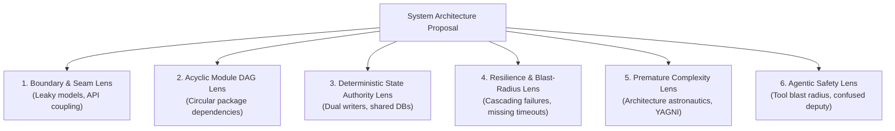

# Architectural Critique, Anti-Patterns, and Integrity Scoring

> **Mandate**: Great architecture is proven through ruthless adversarial stress-testing. Before any code is committed or a design is approved, subject the proposal to independent, fresh-eyes inspection across the 6 Adversarial Lenses. Filter out subjective style preferences and certify structural defects with mathematical rigor.

---

## 1 · The 6 Adversarial Review Lenses

When reviewing a proposed system design, pull request, or legacy architecture, inspect the system through six distinct structural lenses:



### Lens 1: Boundary & Seam Integrity
* **Violation Check**: Are internal database models (e.g. ORM entities, internal storage structs) directly returned in public HTTP/RPC responses?
* **Failure Mode**: Any internal schema migration instantly breaks external API consumers.
* **Remedy**: Decouple domain entities from public data transfer contracts (DTOs / protobufs) using an anti-corruption layer.

### Lens 2: Acyclic Module DAG (Cycle Detection)
* **Violation Check**: Can you trace an import path from `Package A` $\to$ `Package B` $\to$ `Package A`?
* **Failure Mode**: Components cannot be tested, compiled, or deployed independently. Refactoring one forces lockstep changes across both.
* **Remedy**: Apply Dependency Inversion (introduce an interface) or extract common types into a shared foundational package.

### Lens 3: Deterministic State Authority
* **Violation Check**: Do two distinct microservices or background workers write directly to the same database table without coordination?
* **Failure Mode**: Race conditions, un-audited state mutations, and impossible schema migrations.
* **Remedy**: Establish a single authoritative owner service or implement a mathematically deterministic convergence law (CRDT/Raft).

### Lens 4: Resilience & Blast-Radius Containment
* **Violation Check**: What happens if external dependency $Z$ hangs for 60 seconds? Does the caller block indefinitely?
* **Failure Mode**: Upstream thread pool starvation collapses the entire user-facing application.
* **Remedy**: Enforce strict client timeouts ($\le 2\text{s}$), bulkheaded thread pools, and circuit breakers with static fallbacks.

### Lens 5: Premature Complexity & Astronautics (YAGNI Check)
* **Violation Check**: Is an application handling 10 requests per second built on a 15-microservice Kubernetes mesh with Kafka, GraphQL, and Redis clusters?
* **Failure Mode**: 90% of engineering bandwidth is consumed by infrastructure maintenance and distributed debugging rather than business logic.
* **Remedy**: Collapse the architecture into an in-process Modular Monolith with a single ACID datastore.

### Lens 6: Agentic Safety & Capability Scoping
* **Violation Check**: Does an autonomous AI agent have tools that can execute arbitrary destructive shell commands (`rm -rf`, `DROP TABLE`) without an explicit confirmation gate or isolated sandbox?
* **Failure Mode**: A single prompt injection or hallucinated parameter destroys critical data.
* **Remedy**: Strip ambient authority; scope tool tokens to read-only or reversible operations; require human-in-the-loop authorization for irreversible actions.

---

## 2 · The 0–100 Architectural Integrity Scoring Rubric

To eliminate bikeshedding and subjective opinion, score architectural health on an objective 0–100 scale:

$$\text{Integrity Score} = 100 - \sum \text{Defect Penalties}$$

| Score Range | Classification | Action Required |
| :---: | :--- | :--- |
| **$90 - 100$** | **Pristine Structural Integrity** | Architecture meets all invariants; approved for implementation. |
| **$75 - 89$** | **Acceptable with Technical Debt** | Minor boundary leaks or missing fallbacks; implement with logged ADR follow-ups. |
| **$< 75$** | **Architectural Hazard (Blocked)** | Critical cyclic dependencies, dual-writer state, or unconstrained blast radius; **implementation blocked**. |

### 2.1 Standard Defect Penalty Weights
* **Critical (-25 pts)**: Circular module dependency; dual-writer shared database; missing timeout on external RPC; unbounded agent shell tool.
* **Major (-15 pts)**: Leaking database ORM entities into public API contracts; missing degraded fallback mode; missing workload envelope calculation.
* **Minor (-5 pts)**: Undocumented ADR rationale; missing non-goals specification; inconsistent package naming seams.

### 2.2 Mathematical Finding Schema
Every reported architectural defect must be grounded in concrete causal evidence:
```markdown
### [DEFECT-01]: Circular Dependency Between Billing and User Modules
* **Location**: `src/billing/service.go#L14` imports `src/user`, while `src/user/account.go#L8` imports `src/billing`.
* **Violated Invariant**: Invariant 3 (Architectural Boundary DAG).
* **Failure Scenario**: Neither module can be isolated in a unit test harness without mocking the other; changes to user accounts trigger re-compilation and testing of billing logic.
* **Severity Penalty**: -25 pts
* **Concrete Remedy**: Extract `BillingPlan` interface into `src/billing/contracts` or invert the dependency using domain events.
```

---

## 3 · Anti-Pattern Catalog

| Anti-Pattern | Description | Structural Remedy |
| :--- | :--- | :--- |
| **The Distributed Monolith** | Services split over the network that must be deployed simultaneously and share a common database. | Either merge back into a clean modular monolith or enforce strict single-writer bounded contexts with independent deployability. |
| **Database-as-IPC** | Service A writes to a database table to trigger processing in Service B via polling. | Replace with explicit event pub/sub or an asynchronous queue. |
| **The God Module** | A single `common` or `util` package that imports everything and is imported by everything. | Decompose into focused, single-responsibility domain libraries. |
| **Cargo Cult Architecture** | Adopting high-scale tech (Kafka, Kubernetes, microservices) because Netflix or Google uses it, despite having low throughput. | Design constraint-first based on your actual workload envelope. |
| **The Anemic Domain** | Domain models that are pure property bags with all business rules scattered across disconnected services. | Encapsulate invariants and state transitions inside the domain boundary. |
