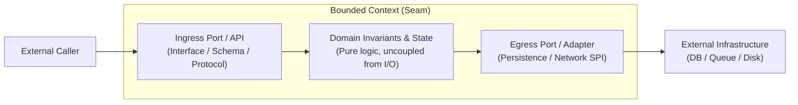
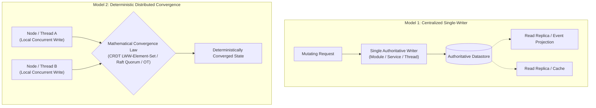
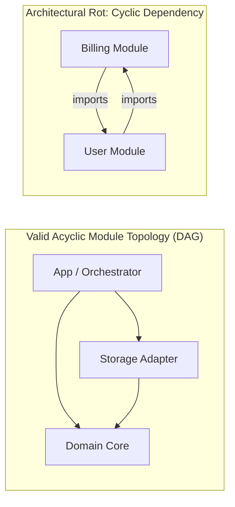

# Boundaries, Coupling, and Deterministic State Authority

> **Mandate**: System complexity is dominated by the topology of its boundaries and the ownership of its state. When boundaries leak, systems decay into unmaintainable distributed monoliths. Enforce strict architectural boundary DAGs and unambiguous state authority across every module, package, and service.

---

## 1 · Domain Seams & Bounded Contexts (Paradigm-Agnostic)

A boundary is not a class or a file; it is an encapsulated computational domain that protects internal invariants from external change.

### 1.1 The Dependency Inversion Invariant (Ports & Adapters)
* **High-Level Domain Logic** (business rules, state transitions, calculation algorithms) must **never** import or depend on **Low-Level Delivery Mechanisms** (HTTP frameworks, database drivers, filesystem APIs, cloud SDKs).
* Low-level mechanisms must depend upon domain-defined interfaces or contracts (Ports). The flow of control points outward to infrastructure, but the flow of source-code dependencies points inward to the domain core.

---

## 2 · Deterministic State Authority (Convergence Law)

Uncoordinated multi-writer shared state is the primary cause of silent data corruption, race conditions, and deadlocks. Every mutable resource must operate under a formal State Authority model:

### 2.1 Model 1: The Single-Writer Principle (Default)
In standard modular or microservice architectures:
* Exactly one module, service, or thread owns write authority over a database table, file, or in-memory state slice.
* Other modules cannot write directly to that table. They must send a command or event to the owning boundary.
* Reads may be distributed via read-only caches or event projections, but writes remain strictly serialized or transactionally gated by the single owner.

### 2.2 Model 2: Deterministic Distributed Convergence (CRDTs & Consensus)
In collaborative editors, peer-to-peer swarms, multi-master databases, or lock-free concurrent memory:
* Multiple actors write concurrently without centralized locking.
* The system **must** uphold a mathematical convergence law:
  1. **State-based CRDTs (CvRDT)**: States form a semi-lattice with a partial order ($\le$) and a join operator ($\sqcup$) that is commutative ($x \sqcup y = y \sqcup x$), associative ($(x \sqcup y) \sqcup z = x \sqcup (y \sqcup z)$), and idempotent ($x \sqcup x = x$).
  2. **Operation-based CRDTs (CmRDT)**: Concurrent operations commute.
  3. **Consensus Quorums (Raft/Paxos)**: State transitions are linearized via leader election and quorum agreement ($\lfloor N/2 \rfloor + 1$).
  4. **Lock-Free Concurrency (Ring Buffers)**: Enforce Single-Producer Single-Consumer (SPSC) or Multi-Producer Single-Consumer (MPSC) pointer ordering without mutex deadlocks.

---

## 3 · Topological Graph Theory: Module-Boundary DAGs

At the architectural level, software modules form a directed graph $G = (V, E)$, where $V$ is the set of modules and $E$ is the set of dependency imports.

> [!IMPORTANT]
> **The Acyclic Boundary Invariant**:
> $$G_{\text{architecture}} \text{ must be a Directed Acyclic Graph (DAG)}$$
> There must exist no path $v_1 \to v_2 \to \dots \to v_n \to v_1$ across package, module, or namespace boundaries.

### 3.1 Resolving Module Cycles
When two modules depend on each other, resolve the cycle using one of three structural transformations:
1. **Dependency Inversion**: Extract an interface into the higher-level module or a shared contracts module. Module A calls the interface; Module B implements it.
2. **Module Splitting**: Extract the mutually referenced entities into a new, lower-level foundational module $C$ that both $A$ and $B$ depend upon.
3. **Event Decoupling**: Replace the synchronous direct call from $B \to A$ with an asynchronous domain event emitted by $B$ that $A$ listens to.

### 3.2 In-Memory Graphs vs Boundary DAGs (The Crucial Distinction)
* **Permitted**: Within a single encapsulated module boundary (e.g. inside `src/engine/scene/`), internal objects may have circular references (e.g., a `SceneNode` points to its `Parent`, and the `Parent` holds an array of `Children`). This is a local data structure concern.
* **Forbidden**: The `scene` package importing the `renderer` package while `renderer` imports `scene`. This is an architectural boundary violation.

---

## 4 · Quantitative Coupling & Stability Metrics (Robert C. Martin)

Measure the structural health of module boundaries using formal graph metrics:

### 4.1 Instability Metric ($I$)
$$I = \frac{C_e}{C_a + C_e}$$
Where:
* $C_a$ = **Afferent Coupling** (number of external classes/modules that depend on this module; incoming dependencies).
* $C_e$ = **Efferent Coupling** (number of external classes/modules that this module depends on; outgoing dependencies).
* $I = 0$: Maximally stable (heavily depended upon, depends on nothing; hard to change).
* $I = 1$: Maximally instable (depends on many things, depended upon by none; easy to change).

### 4.2 Abstractness ($A$) & Distance from the Main Sequence ($D$)
$$A = \frac{N_a}{N_c} \quad (\text{Ratio of abstract classes/interfaces to total types})$$
$$D = |A + I - 1| \quad (\text{Normalized distance from the Main Sequence } A + I = 1)$$

* **The Zone of Pain** ($A = 0, I = 0, D \approx 1$): Highly concrete, highly stable. Extremely rigid, painful to modify because many callers depend on concrete implementation details.
* **The Zone of Uselessness** ($A = 1, I = 1, D \approx 1$): Highly abstract, highly instable. Unused interfaces that depend on volatile details; pure architectural bloat.
* **The Main Sequence** ($A + I = 1, D \to 0$): Perfect balance between stability and abstractness. Modules that are stable are abstract; modules that are concrete are instable.
