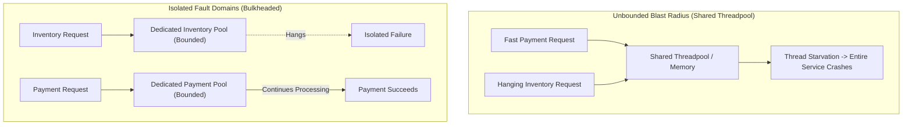
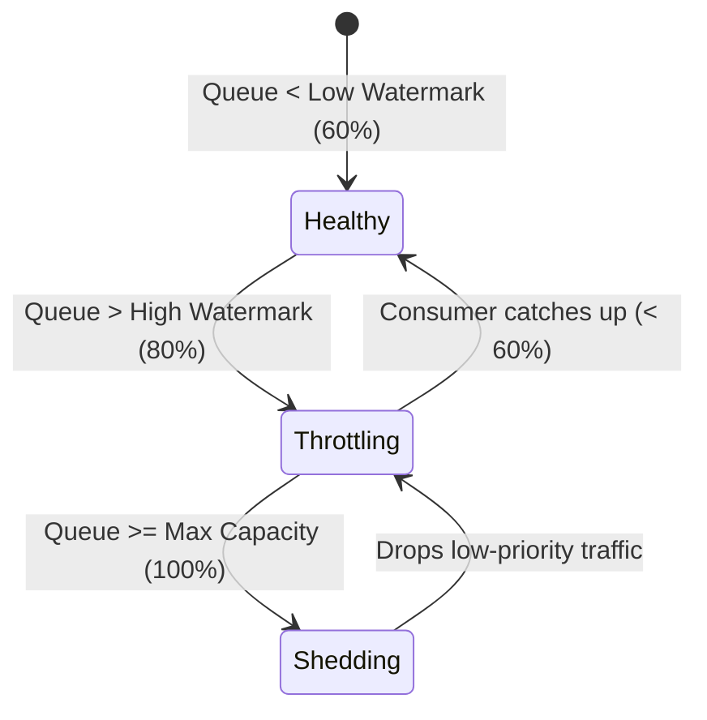
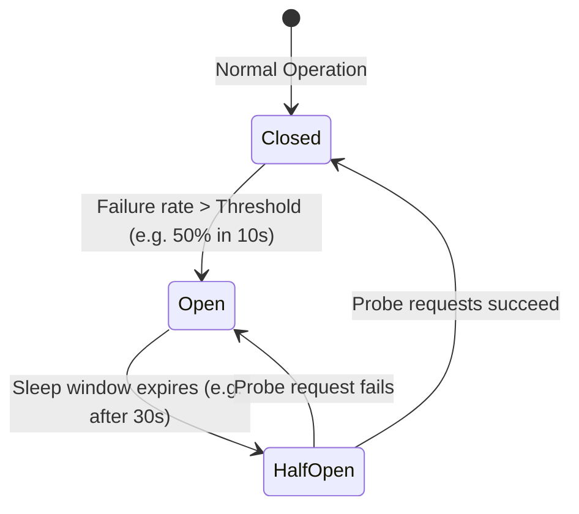

# Failure Modes, Resilience, and Blast-Radius Containment

> **Mandate**: In complex systems, components will fail, networks will partition, disks will fill, and external dependencies will hang. Resilience is not the absence of failure; it is the mathematical containment of its blast radius. A resilient architecture guarantees that partial failure degrades system fidelity gracefully without causing catastrophic total collapse.

---

## 1 · Fault Domains & Bulkheading

A **Fault Domain** is a set of resources that share a single point of failure (a thread pool, a process, a virtual machine, an availability zone, or a cloud region).

### 1.1 The Bulkheading Rule
* Never share execution resources (thread pools, database connection pools, memory buffers) between mission-critical operations and non-critical or slow external dependencies.
* Allocate bounded resource quotas per domain. If external service $X$ takes 30 seconds to respond, its dedicated pool fills up and rejects further requests locally, while the rest of the application functions at full speed.

---

## 2 · Distributed Systems Reality: CAP & PACELC

The physical laws of networking dictate how distributed state behaves under stress:

### 2.1 The CAP Theorem (Brewer / Gilbert & Lynch)
In the presence of a **Network Partition ($P$)**, a distributed system must strictly choose between:
* **Consistency ($C$)**: Return an error or block until state can be guaranteed consistent across all nodes.
* **Availability ($A$)**: Return the best available local state, accepting that different nodes may return divergent or stale data.

### 2.2 The PACELC Theorem (Abadi)
CAP only describes behavior during rare network partitions. PACELC describes the permanent trade-off:
$$\text{If } \mathbf{P} \text{ (Partition)} \implies \text{Choose between } \mathbf{A} \text{ and } \mathbf{C}; \quad \text{Else } (\mathbf{E}) \implies \text{Choose between } \mathbf{L} \text{ (Latency) and } \mathbf{C} \text{ (Consistency)}.$$
Even when the network is healthy, choosing strong consistency requires cross-node round-trip coordination, directly increasing latency ($\mathbf{L}$).

---

## 3 · Flow Control, Backpressure & Self-Healing

### 3.1 Reactive Backpressure & Queue Watermarks
When an upstream producer generates work faster than a downstream consumer can process it, unbuffered queues explode memory and buffered queues explode latency.

* **Load Shedding**: When queue capacity reaches its ceiling, reject non-essential requests immediately with HTTP 429 / 503 or dropped UDP frames. Processing a doomed request wastes compute that could have finished a viable one.
* **Upstream Backpressure**: Signal the producer (via TCP window scaling, reactive stream signals, or pull-based worker loops) to slow its emission rate.

### 3.2 Jittered Exponential Backoff (Eliminating Retry Storms)
Naïve retries synchronize failed clients, causing a **thundering herd / retry storm** that prevents recovering services from coming back online.
$$\text{Wait Time} = \min\left(T_{\max}, \; T_{\text{base}} \cdot 2^{\text{attempt}}\right) + \text{UniformRandom}(0, \; \text{Jitter})$$

* Adding randomized jitter decorrelates retry requests across clients, flattening the arrival spike into a smooth queue.

### 3.3 The Circuit Breaker State Machine (Nygard)

* **Closed**: Requests pass through normally. Success and failure rates are tracked.
* **Open**: Requests fail immediately without hitting the network or target resource. Instant fallback/degradation is returned.
* **Half-Open**: A limited canary batch of test requests is allowed through to probe downstream recovery.

---

## 4 · Idempotency & Message Delivery Semantics

In distributed or async architectures, networks drop acknowledgments, causing senders to retry messages that were already processed.

| Semantics | Mechanism | Architectural Invariant |
| :--- | :--- | :--- |
| **At-Most-Once** | Fire-and-forget; no retries. | Acceptable only for ephemeral metrics or loss-tolerant telemetry. |
| **At-Least-Once** | Retry on timeout until ACK received. | **Requires Idempotent Processing** at the receiver to prevent duplicate charges or double mutations. |
| **Effectively-Once** | At-least-once transport + deduplication window. | Deduplicate using a unique client-generated **Idempotency Key** stored with a TTL in an atomic store. |

### 4.1 Mathematically Idempotent State Transitions
Whenever possible, design mutations as state assertions rather than incremental deltas:
* **Incremental (Non-Idempotent)**: `UPDATE account SET balance = balance + 50` $\to$ retrying adds 50 twice!
* **State Assertion (Idempotent)**: `UPDATE account SET balance = 150 WHERE transaction_id = 'tx-123'` $\to$ retrying is safe.

---

## 5 · Degraded Operating Modes (Graceful Degradation)

Every system design must document what remains operational when dependencies fail:

| Failed Component | Unacceptable Failure (Total Collapse) | Resilient Behavior (Degraded Mode) |
| :--- | :--- | :--- |
| **Recommendation Engine** | Webpage returns HTTP 500. | Fall back to static cached top-10 list. |
| **Full-Text Search Index** | User cannot view their profile or dashboard. | Disable search bar; allow direct navigation via bookmark/ID. |
| **Payment Gateway** | Cart is wiped; user logged out. | Hold order in "Pending Processing" state; notify user via async email. |
| **Vector DB / RAG Retrieval** | AI Agent crashes with unhandled exception. | Agent informs user knowledge base is temporarily unreachable and uses base reasoning. |
