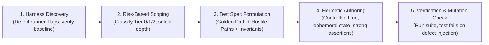

# Testing: Universal Empirical Verification Protocol

> **Mandate**: Code is an unverified hypothesis until empirical evidence proves it correct. Test external behavior and contracts, not internal implementation details; focus effort where risk is highest; eliminate false confidence and mock drift; and guarantee deterministic, hermetic execution.

---

## 1 · The 5-Phase Testing Lifecycle

Never assume code works merely because it compiles or looks plausible. Execute every verification task through this disciplined protocol:

1. **Harness Discovery & Baseline Health**: Automatically detect existing test runners, configuration files, and conventions. Verify the baseline test suite *before* authoring new changes.
   - **The Broken Baseline Protocol**: If pre-existing tests are failing prior to your changes:
     1. Determine whether the failures are related to your target module or environment configuration.
     2. If unrelated, document the pre-existing failures explicitly so they are not conflated with your work.
     3. Do not silently modify or delete unrelated failing tests unless instructed.
     4. Ensure that your new work does not introduce *additional* test breakages.
2. **Risk-Based Scoping (Cognitive Sizing)**: Allocate testing effort based on defect impact. High-risk systems (auth, finance, data integrity) demand deep hostile path verification; peripheral UI/glue code warrants lightweight smoke checks (see Section 2 and [`references/risk-based-testing.md`](references/risk-based-testing.md)).
3. **Test Specification Formulation**:
   - For complex features or multi-component additions, outline the verification matrix in a lightweight test spec (`TEST_SPEC.md` or plan section) defining the Golden Path, Hostile Failure Paths, and Boundary Invariants before implementation.
   - For localized bug fixes and minor patches, a concise 3-line test intent in conversation or commit history suffices.
4. **Hermetic Authoring**:
   - Assert observable behavior and public contracts; never mock private internal methods.
   - Enforce strong assertions; eliminate false-confidence checks and mock drift (see [`references/assertion-strength.md`](references/assertion-strength.md)).
   - Enforce deterministic clocks, ephemeral test ports, and isolated state (see [`references/hermetic-isolation.md`](references/hermetic-isolation.md)).
5. **Empirical Execution & Mutation Validation**:
   - Execute newly written tests to verify behavioral correctness.
   - Execute the broader regression suite to ensure zero unintended breakage.
   - Apply the **Mutation Mindset**: Invert logic or simulate defects to confirm that tests actually turn red when code is broken (see [`references/hostile-paths.md`](references/hostile-paths.md)).

---

## 2 · Risk-Based Effort Allocation

Do not apply uniform testing overhead to all code. Focus cognitive and test execution budgets where defects cause catastrophic harm:

| Tier | System Component | Test Levels Mandated | Depth of Verification |
| :---: | :--- | :--- | :--- |
| **Tier 0 (Critical Invariants)** | Auth/crypto, financial billing, data persistence, concurrency locks, state machines. | Unit + Integration + Property-based + Fault injection. | Exhaustive Golden & Hostile paths, network timeout simulation, boundary limits, mutation check. |
| **Tier 1 (Core Domain)** | Business workflows, API handlers, data transformations, domain services. | Unit + Integration. | Canonical Golden Path, valid input variations, common error paths, schema validation. |
| **Tier 2 (Peripheral / UI)** | Presentational UI, CLI help formatters, glue scripts, configuration wrappers. | Unit smoke test or Component contract. | Happy path sanity check, graceful error fallback. Avoid asserting fragile presentation details. |

---

## 3 · Universal Testing Invariants

### 3.1 Test Behavior, Not Implementation
* **Assert Observable Contracts**: Tests must interact with the system strictly through public interfaces, API endpoints, or observable side effects (database records, emitted events).
* **Never Mock Private Internals**: If refactoring a private helper or renaming an internal variable breaks a test, the test is fragile and testing implementation details rather than behavior.

### 3.2 False-Confidence Detection & Assertion Strength
* **Ban Weak Assertions**: Checks like verifying an object is merely defined or asserting HTTP status 200 without checking the body schema are dangerous traps. Always assert semantic invariants, returned payload structures, and state transitions (see [`references/assertion-strength.md`](references/assertion-strength.md)).
* **Prevent Mock Drift**: When every dependency is replaced by a mock, you test your mock configuration rather than the application. Prefer real in-memory or lightweight lightweight dependencies over sprawling mock trees.

### 3.3 The Mutation Mindset
* A test that cannot fail is worse than no test. When reviewing or authoring a test, perform a quick verification: *If I invert this condition or remove the core logic, does this test turn RED?* If the test still passes, rewrite the assertions.

### 3.4 Invariants & Property-Based Thinking
* For parsers, serializers, decoders, encoders, and algorithmic transformations, hand-written example tests miss edge cases. Verify algebraic properties:
  - **Round-Trip**: `deserialize(serialize(data)) === data`
  - **Idempotency**: `normalize(normalize(input)) === normalize(input)`
  - *(See [`references/property-based.md`](references/property-based.md)).*

### 3.5 Hermetic Determinism (Zero Flakiness)
* Ban wall-clock arbitrary delays (such as `sleep(2000)`). Use simulated/fake clocks or deterministic polling with bounded timeouts.
* Never share mutable databases, files, or global variables between tests. Use isolated scopes with unique names or temporary sandboxes (see [`references/hermetic-isolation.md`](references/hermetic-isolation.md)).

---

## 4 · Hard Edge Cases & Brownfield Codebases

Real repositories often deviate from ideal setups (see [`references/edge-case-playbook.md`](references/edge-case-playbook.md)):

* **Zero-Harness Repositories**: Scaffold a minimal runner native to the project's ecosystem, or execute an ephemeral verification script asserting exit code 0 before clean deletion.
* **Untestable Legacy Systems**: Pin existing behavior with **Characterization Tests** (Golden Master snapshots) before altering code; introduce minimal surgical seams (dependency injection).
* **Stochastic & Floating-Point Logic**: Enforce delta/epsilon assertions (`toBeCloseTo`); fix random seeds for reproducible test runs.
* **Sandboxed / Offline Environments**: Swap unavailable external services with embedded in-memory test doubles or recorded fixtures.

---

## 5 · Guardrails & Anti-Patterns

### 5.1 Strictly Disallowed Actions
- ❌ **No Tautological Assertions**: Never assert that a mock was called with the arguments you just passed it without checking the actual system output or state.
- ❌ **No Wall-Clock Delays**: Never use fixed sleep durations to wait for asynchronous tasks. Use deterministic completion promises or reactive polling.
- ❌ **No Order-Dependent Test Suites**: Every test must execute independently without depending on state left by preceding tests.
- ❌ **No Suppressed Failures**: Never configure test runners or flags to silently ignore failures or report success when zero tests were executed.

### 5.2 The Empirical Stopping Contract
The agent may claim a testing or bug-fix task is complete **only** when:
- [ ] Baseline test runner discovered, calibrated, and executed.
- [ ] New tests verify the Golden Path and at least one Hostile Failure Path.
- [ ] Assertions verify concrete state invariants and payload shapes.
- [ ] The test was verified to fail when the defect was injected (mutation mindset).
- [ ] The relevant regression test suite executes and passes cleanly with exit code 0.
