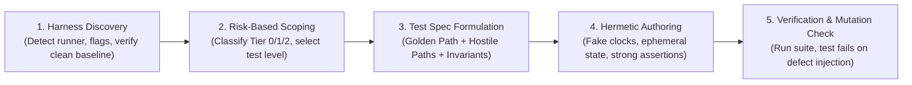

# Testing: Universal Empirical Verification Protocol

> **Mandate**: Code is an unverified hypothesis until empirical evidence proves it correct. Test external behavior and contracts, not internal implementation details; focus effort where risk is highest; eliminate false confidence and mock drift; and guarantee 100% deterministic, hermetic execution.

---

## 1 · The 5-Phase Testing Lifecycle

Never assume code works merely because it compiles or looks plausible. Execute every verification task through this disciplined protocol:

1. **Harness Discovery & Baseline Health**: Automatically detect existing test runners, configuration files, and active flags. Verify that the baseline test suite passes before authoring new changes (see [`references/harness-discovery.md`](references/harness-discovery.md)).
2. **Risk-Based Scoping (Cognitive Sizing)**: Allocate testing effort based on defect impact. High-risk systems (auth, finance, data integrity) demand deep hostile path verification; peripheral UI/glue code warrants lightweight smoke checks (see Section 2 and [`references/risk-based-testing.md`](references/risk-based-testing.md)).
3. **Test Specification Formulation**: Outline the verification matrix in a lightweight `TEST_SPEC.md` defining the Golden Path, Hostile Failure Paths, and Boundary Invariants before implementation (see [`examples/test-spec-template.md`](examples/test-spec-template.md)).
4. **Hermetic Authoring**:
   - Assert observable behavior and public contracts; never mock private methods.
   - Enforce strong assertions; eliminate false-confidence checks and mock drift (see [`references/assertion-strength.md`](references/assertion-strength.md)).
   - Enforce zero wall-clock sleep, fake clocks, ephemeral ports, and isolated state (see [`references/hermetic-isolation.md`](references/hermetic-isolation.md)).
5. **Empirical Execution & Mutation Validation**:
   - Execute newly written tests to verify behavioral correctness.
   - Execute the broader regression suite to ensure zero unintended breakage.
   - Apply the **Mutation Mindset**: Mentally or physically invert logic to confirm that tests actually fail when code is defective (see [`references/hostile-paths.md`](references/hostile-paths.md)).

---

## 2 · Risk-Based Effort Allocation

Do not apply uniform testing overhead to all code. Focus cognitive and test execution budgets where defects cause catastrophic harm:

| Tier | System Component | Test Levels Mandated | Depth of Verification |
| :---: | :--- | :--- | :--- |
| **Tier 0 (Critical Invariants)** | Auth/crypto, financial billing, data persistence, concurrency locks, state machines. | Unit + Integration + Property-based + Fault injection. | Exhaustive Golden & Hostile paths, network timeout simulation, boundary limits, mutation check. |
| **Tier 1 (Core Domain)** | Business workflows, REST/gRPC API handlers, data transformations, domain services. | Unit + Integration. | Canonical Golden Path, valid input variations, common error paths, schema validation. |
| **Tier 2 (Peripheral / UI)** | Presentational UI, CLI help formatters, glue scripts, configuration wrappers. | Unit smoke test or Component contract. | Happy path sanity check, graceful error fallback. Avoid testing CSS pixels or exact markup. |

---

## 3 · Universal Testing Invariants

### 3.1 Test Behavior, Not Implementation
* **Assert Observable Contracts**: Tests must interact with the system strictly through public interfaces, API endpoints, or observable side effects (database records, emitted events).
* **Never Mock Private Internals**: If refactoring a private helper or renaming an internal variable breaks a test, the test is fragile and testing implementation details rather than behavior.

### 3.2 False-Confidence Detection & Assertion Strength
* **Ban Weak Assertions**: Checks like `expect(response).toBeDefined()` or verifying HTTP status 200 without checking the body schema are dangerous traps. Always assert semantic invariants, returned payload structures, and database states (see [`references/assertion-strength.md`](references/assertion-strength.md)).
* **Prevent Mock Drift**: If every dependency is replaced by a mock, you are testing your mock configuration, not your application. Prefer real in-memory lightweight dependencies (e.g. SQLite `:memory:`) over sprawling mock trees.

### 3.3 The Mutation Mindset
* A test that cannot fail is worse than no test. When reviewing or authoring a test, perform a quick fault injection: *If I invert this condition (`>` to `<`) or delete the return statement, does this test turn RED?* If the test still passes, rewrite the assertions.

### 3.4 Invariants & Property-Based Thinking
* For parsers, serializers, decoders, encoders, and algorithmic math, hand-written example tests (`f(2) == 4`) miss boundary cases. Verify algebraic properties:
  - **Round-Trip**: `deserialize(serialize(data)) === data`
  - **Idempotency**: `normalize(normalize(input)) === normalize(input)`
  - *(See [`references/property-based.md`](references/property-based.md)).*

### 3.5 Hermetic Determinism (Zero Flakiness)
* Ban real wall-clock `sleep()` or timeout loops. Use fake clocks (`useFakeTimers`, `timecop`, `clock_gettime` mocks) or promise polling with short timeouts.
* Never share mutable databases, files, or global variables between tests. Use ephemeral paths with unique UUIDs (see [`references/hermetic-isolation.md`](references/hermetic-isolation.md)).

---

## 4 · Hard Edge Cases & Brownfield Codebases

Real repositories often deviate from ideal setups. The skill provides clear protocols for dark corners (see [`references/edge-case-playbook.md`](references/edge-case-playbook.md)):

* **Zero-Harness Repositories**: Gracefully offer to scaffold a minimal native runner (`node:test`, Python `unittest`, `go test`) or execute an ephemeral verification script (`verify_fix.py`) asserting exit code 0 before clean deletion.
* **Untestable Legacy Spaghetti**: Pin existing behavior with **Characterization / Golden Master Tests** before touching code; introduce minimal surgical seams (dependency injection).
* **Stochastic & Floating-Point Logic**: Enforce delta/epsilon assertions (`toBeCloseTo`); fix random seeds (`seed(42)`).
* **Sandboxed / Offline Runtimes**: Swap unavailable external services with embedded in-memory adapters.

---

## 5 · Guardrails & Anti-Patterns

### 5.1 Strictly Disallowed Actions
- ❌ **No Tautological Assertions**: Never assert that a mock was called with the arguments you just passed it without checking the outcome.
- ❌ **No Wall-Clock Delays**: Never use `sleep(2000)` to wait for an asynchronous task to complete. Use deterministic event triggers or reactive polling.
- ❌ **No Order-Dependent Test Suites**: Every test must be executable in complete isolation or randomized order without cascading failures.
- ❌ **No Suppressed Failures**: Never configure `--passWithNoTests` or skip flags to mask failing assertions.

### 5.2 The Empirical Stopping Contract
The agent may claim a testing or bug-fix task is complete **only** when:
- [ ] Baseline test runner discovered, calibrated, and executed.
- [ ] New tests verify the Golden Path and at least one Hostile Failure Path.
- [ ] Assertions verify concrete state invariants and payload shapes.
- [ ] The test was verified to fail when the defect was injected (mutation mindset).
- [ ] The full regression test suite executes and passes cleanly with exit code 0.
