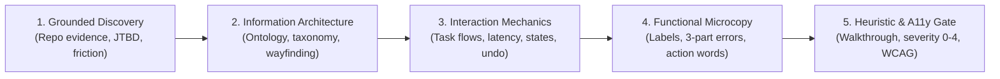

# UX Engineering: Universal Cognitive Ergonomics & Interaction Protocol

> **Mandate**: *A visually polished interface is not automatically good UX.* Protect user goals, findability, mental model alignment, predictable feedback, error recovery, inclusive accessibility, and evidence-grounded utility before visual polish. Structure interaction flows through human cognitive physics and state machine determinism; visual polish strictly serves those functional constraints. Never restrict architectural creativity—liberate it through cognitive clarity.

---

## 1 · The 5-Phase UX Engineering Lifecycle

Every interface—whether a high-density financial terminal, a mobile consumer app, an ANSI terminal CLI, or an autonomous AI conversational agent—must be engineered through this 5-phase protocol:



1. **Grounded Discovery & Problem Formulation**: Ground requirements in empirical evidence from the repository (issue trackers, bug reports, crash telemetry, user journeys). Formulate the core **Job to be Done (JTBD)**. Never invent synthetic user personas or hallucinated interviews (see [`references/evidence-grounded-discovery.md`](references/evidence-grounded-discovery.md)).
2. **Information Architecture & Wayfinding**: Map the domain ontology. Organize resources into logical, task-oriented taxonomies rather than technical database tables. Establish unambiguous wayfinding (Where am I? How did I get here? What can I do next?) (see [`references/information-architecture.md`](references/information-architecture.md)).
3. **Interaction Mechanics & Task Flows**: Prune the critical path. Minimize decision branching. Guarantee the **Doherty threshold** ($\le 100\text{ms}$ instantaneous acknowledgment, $\le 400\text{ms}$ feedback loops). Replace disruptive confirmation modals with optimistic execution and reversible undo. Enforce strict state machines (see [`references/interaction-flows-and-states.md`](references/interaction-flows-and-states.md)).
4. **Functional Microcopy & Content UX**: Treat words as functional interaction affordances. Craft active, outcome-oriented call-to-action (CTA) labels. Enforce the **3-Part Error Invariant** (cause, impact, actionable next step) (see [`references/ux-writing-and-microcopy.md`](references/ux-writing-and-microcopy.md)).
5. **Heuristic & Accessibility Gate**: Subject the interface to an adversarial cognitive walkthrough against the 8 Universal Invariants and 10 Nielsen Heuristics. Audit keyboard operability, screen reader semantics, and focus order. Grade defects on the 0–4 Nielsen severity scale (see [`references/usability-auditing-and-metrics.md`](references/usability-auditing-and-metrics.md)).

---

## 2 · Progressive Disclosure (Reference Routing)

To prevent cognitive overload and preserve context bandwidth, **never load all reference manuals simultaneously**. Consult reference manuals strictly on demand based on task context:

| Context Trigger | Mandatory Reference Manual | Purpose |
| :--- | :--- | :--- |
| **Cognitive limits, decision speed, target physics, heuristics** | [`references/hci-laws-and-heuristics.md`](references/hci-laws-and-heuristics.md) | Mathematical formulation of Fitts, Hick-Hyman, Miller, Jakob, Tesler, Doherty, Postel, and Nielsen 10. |
| **User pain points, feature motivation, repo issue analysis** | [`references/evidence-grounded-discovery.md`](references/evidence-grounded-discovery.md) | 3-tier Epistemic Evidence Ladder, mining repo friction, grounded JTBD formulation without hallucinations. |
| **Navigation trees, menus, search, tagging, sitemaps** | [`references/information-architecture.md`](references/information-architecture.md) | Domain modeling, OOUX, navigation topologies (hub-spoke, tree, flat), wayfinding, progressive disclosure. |
| **Forms, wizards, state machines, undo, async actions, AI UX** | [`references/interaction-flows-and-states.md`](references/interaction-flows-and-states.md) | Critical path pruning, state machines (Idle/Optimistic/Undo/Error), AI agent streaming & blast-radius mediation. |
| **Button copy, error text, onboarding copy, tooltips** | [`references/ux-writing-and-microcopy.md`](references/ux-writing-and-microcopy.md) | The 3-part error formula, plain language rules, active voice CTAs, tone consistency, jargon eradication. |
| **Audit reviews, PR review of UI, heuristic evaluations** | [`references/usability-auditing-and-metrics.md`](references/usability-auditing-and-metrics.md) | Nielsen 0–4 severity scale, cognitive walkthrough protocol, mathematical finding schema, 168-principle catalog. |

---

## 3 · Adaptive Cognitive Sizing (The 4 Execution Modes)

Size your UX engineering effort to the scope and operational risk of the task. Do not write essays for simple patches, and never skip structural scaffolding on full workflows:

| Mode | Trigger & Scope | UX Discipline | Required Output & Protocol |
| :--- | :--- | :--- | :--- |
| **`micro`** | Button label, localized error message, single input validation, tooltip (< 30 lines / 1 element). | Verify plain language, active voice, actionable error recovery, and hit target bounds. | **Zero preamble essay**. Emit the code/copy diff directly with a 1-line rationale. |
| **`flow`** | Multi-step form, search/filter panel, checkout flow, onboarding sequence, interactive dialog. | Task-flow streamlining; critical path step count; optimistic feedback check; state mapping; undo safety. | **3-Line UX Intent Block** immediately preceding code implementation. |
| **`system`** | Full application shell, navigation tree overhaul, agentic conversation system, new product module. | Full 5-phase lifecycle; domain ontology; navigation taxonomy; wayfinding; multi-state matrix; accessibility architecture. | Structured **JTBD $\to$ IA $\to$ Flow Spec** + complete implementation. |
| **`audit`** | Pre-release UX review, heuristic inspection, accessibility audit, PR review of user interface. | Adversarial cognitive walkthrough; 10 Nielsen heuristics; 0–4 severity grading; mathematical citation schema. | **Mathematical Finding Matrix** with anchored citations, severity, and code patches. |

### The 3-Line UX Intent Protocol (For `flow` and `system` modes)
To prevent philosophical essay bloat, summarize UX intent in exactly 3 structured lines before emitting implementation code:
```markdown
> **JTBD**: When [trigger/situation], user wants to [motivation/action], so they can [functional outcome].
> **Task Path**: [Step count: N] · [Primary affordance] · [Doherty feedback: Immediate / Optimistic / Progress]
> **Error Strategy**: [Inline prevention / Non-blocking recovery / Reversible undo]
```

> **Boundary**: This skill owns *user task flows, information architecture, and cognitive load optimization*. For *visual structure and aesthetics* (typography, color, spacing), activate `design-philosophy`. For *inclusive access for disabled users* (screen readers, ARIA), activate `accessibility`.

---

## 4 · The 8 Universal UX Invariants

Regardless of technology (Web, iOS, Android, Flutter, TUI, Desktop, Canvas, or AI Agents), every interface must adhere to the 8 Universal UX Invariants:

### 4.1 Invariant 1: Cognitive Load Minimization (Miller's Law & Hick-Hyman Law)
* **Working Memory Ceiling ($7 \pm 2$)**: Never force working memory to hold more than 5–9 discrete chunks of information simultaneously. Cluster complex data into structured semantic groups.
* **Logarithmic Decision Latency ($T = b \cdot \log_2(n + 1)$)**: Decision time increases logarithmically with the number and complexity of choices. Reduce initial choices through progressive disclosure, sensible defaults, and faceted filtering.

### 4.2 Invariant 2: Predictable Mental Model Alignment (Jakob's Law)
* **Respect Universal Conventions**: Users spend 99% of their time on other systems. Never invent idiosyncratic navigation schemes, non-standard gestures, or bizarre iconography when proven conventions exist.
* **Implementation Model $\ne$ Mental Model**: Internal software architecture (database schemas, microservice names, internal caching states) must never leak into the interface. Present concepts in the user's natural domain vocabulary.

### 4.3 Invariant 3: Deterministic Feedback & Perceptual Latency (Doherty & Fitts)
* Apply interactive target sizing and feedback timing thresholds per `design-philosophy`'s [`references/shared-ui-constants.md`](../design-philosophy/references/shared-ui-constants.md).

### 4.4 Invariant 4: Reversible Action & Hostile Error Tolerance (Tesler & Postel)
* **Undo Over Confirmation Modals**: Asking "Are you sure?" causes modal fatigue, leading users to reflexively click "Yes" without reading. Make destructive actions instantly reversible (Undo toast / Trash snapshot) rather than interrogative.
* **Tesler's Law (Conservation of Complexity)**: Every system has an irreducible amount of complexity. The software must absorb that complexity rather than offloading it onto the user.
* **Postel's Law (Robustness Principle)**: Be liberal in what you accept (forgiving input parsers, resilient date/phone formatters) and conservative in what you output.

### 4.5 Invariant 5: Findability Over Memorability (Information Architecture)
* **Recognition Beats Recall**: Never force users to remember information from one step to the next. Keep current context, filters, and active parameters visible.
* **Unambiguous Wayfinding**: The interface must continuously answer three questions:
  1. *Where am I?* (Page title, active breadcrumb, highlighted navigation anchor).
  2. *How did I get here?* (Back navigation, deep-link URL state, unambiguous history).
  3. *What can I do next?* (Clear primary call to action, obvious available next steps).

### 4.6 Invariant 6: Content as Functional Interaction (UX Writing)
* **Words are Functional Affordances**: Microcopy is an active interactive control, not decorative filler. Action labels must describe the explicit outcome (e.g. `"Create Database"` instead of `"Submit"`).
* **The 3-Part Error Invariant**: Every error message must clearly state:
  1. *What happened* (in human, causal language; zero unformatted stack traces).
  2. *Why it matters / impact* (was data saved or lost?).
  3. *Immediate recovery action* (a direct button or link to retry, fix input, or proceed).

### 4.7 Invariant 7: Inclusive Multi-Sensory Accessibility (Universal Usability)
* **POUR Compliance**: Interfaces must be Perceivable, Operable, Understandable, and Robust across all human abilities.
* **Input-Agnostic Parity**: Every action must be fully executable via keyboard alone, screen reader, mouse, touch, or switch control. Never trap keyboard focus.
* **Semantic Grounding**: Never rely on visual position or color alone to convey state. Back every visual affordance with native semantic elements or accessible labels (`aria-*`, platform accessibility APIs).

### 4.8 Invariant 8: Autonomous & Non-Deterministic Interaction Contracts (Modern AI & Agents)
* **Streaming Liveness Perception**: AI-generated responses must begin streaming initial semantic tokens within $\le 200\text{ms}$ to maintain the perception of system liveness and prevent frozen UI perception.
* **Blast-Radius Mediation**: When an AI agent executes tools that mutate state (file writes, database edits, external API calls), it must present clear pre-flight parameters and offer a 1-click rollback/undo mechanism.
* **Confidence & Source Attribution**: AI-generated assertions and extractions must provide direct citations and anchors to source material.
* **Human-in-the-Loop Sovereignty**: The user must retain unconditional sovereignty to interrupt, pause, redirect, or edit an autonomous agent flow at any turn.

---

## 5 · The Rosetta Interaction Engine

Translate universal interaction moves directly into idiomatic primitives for your target technology:

```
Universal UX Move:
"Perform high-impact action, provide instant optimistic feedback, allow 5-second reversible undo, and handle errors with self-recovery."
```

| Technology Platform | Input & Sensor Modality | Optimistic Feedback | Undo Mechanism | Accessible Announcer |
| :--- | :--- | :--- | :--- | :--- |
| **Modern Web** (HTML / React / Vue / Svelte) | Pointer click, Enter key, Tap | Optimistic DOM update + muted pulse | Floating Snackbar with "Undo" button (5s timer) | `aria-live="polite"` element update |
| **Mobile Touch** (iOS SwiftUI / Android Compose) | Capacitive tap, Haptic motor | Immediate UI state change + light impact haptic | Bottom toast bar with Undo action | Accessibility Announcement API / UIAccessibility |
| **Terminal CLI / TUI** (Rust / Go / Python) | Keystroke (`d`, `Enter`), Signals | Terminal redraw in $< 16\text{ms}$ | Press `u` within session or auto-backup snapshot | High-contrast status line + Bell suppression |
| **Desktop Application** (macOS / Windows / Linux) | Mouse click, Shortcut (`Cmd+Delete`) | Immediate item removal from list | Standard `Cmd+Z` / `Ctrl+Z` menu hook & toast | OS Accessibility API (NSA11y / UI Automation) |
| **AI / Agentic Interface** (LLM Chat / Generative UI) | Natural language prompt, Tool call | Streaming acknowledgment token ($\le 200\text{ms}$) | Rollback step button / edit previous turn | Markdown status message + conversational confirmation |

---

## 6 · Usability Auditing & The Mathematical Finding Protocol

When running in **`audit`** mode, you are strictly forbidden from reporting vague, subjective, or purely cosmetic complaints. Every audit finding must satisfy this mathematical schema:

$$\text{Finding} = [\text{Component/Line Anchor}] + [\text{Specific Invariant/Heuristic Violated}] + [\text{Severity 0–4}] + [\text{Concrete Code Remediation}]$$

### The Nielsen 0–4 Severity Matrix
* **Severity 0 (Cosmetic)**: No task impact. Minor phrasing polish or optional convenience. Fix only if time permits.
* **Severity 1 (Minor)**: Mild hesitation or cognitive friction. User easily bypasses it without assistance.
* **Severity 2 (Moderate)**: Measurable delay, disorientation, or confusion. User completes task with frustration; high risk of repeat errors.
* **Severity 3 (Major)**: Critical friction. Significant percentage of users fail or abandon the task without guidance. High priority.
* **Severity 4 (Catastrophic)**: Complete task blocker. Causes unrecoverable data loss, system lockout, or irreversible corruption. Must fix immediately.

### Sample Audited Finding Format
```markdown
### [FINDING-01] Delete Action Lacks Reversible Safety
- **Anchor**: `src/components/UserRow.tsx:L84`
- **Violated Invariant**: Invariant 4 (Reversible Action & Hostile Error Tolerance / Nielsen #5 Error Prevention)
- **Severity**: 3 (Major)
- **Observation**: Clicking "Delete Project" executes an immediate irreversible HTTP DELETE without an Undo window, relying solely on a native `window.confirm()` dialog.
- **Remediation**:
```tsx
// Replace window.confirm with optimistic soft-delete + 5-second undo toast
const handleDelete = (id: string) => {
  markProjectArchivedOptimistic(id);
  toast.show("Project deleted", {
    action: { label: "Undo", onClick: () => restoreProject(id) },
    duration: 5000,
  });
};
```
```

---

## 7 · Anti-Pattern Kill-List (Hostile UX Guardrails)

The following patterns are strictly disallowed in any system adhering to this protocol:

* ❌ **Confirmation Fatigue (Modal Spam)**: Interrupting users with "Are you sure?" modal dialogs for routine or reversible actions.
* ❌ **Mystery Meat Navigation**: Unlabeled icons, hidden hover-only triggers, or ambiguous symbols that force users to guess functionality.
* ❌ **Silent Failures & Dead Ends**: Operations that fail without visual explanation, or empty states that say "No Data Found" with zero instruction on how to add or create data.
* ❌ **Cognitive Dumping**: Presenting dozens of unorganized form fields on a single screen without logical grouping, progressive disclosure, or default values.
* ❌ **Blaming Error Messages**: Error copy that blames the user (e.g. `"Invalid user input"`) or displays cryptic internal error codes (`"Error 0x80040154"`).
* ❌ **Dark Patterns & Deceptive Friction**: Fake urgency timers, hidden cancellation paths, pre-checked opt-in boxes, or asymmetric button weights designed to manipulate user choices.
* ❌ **Frozen AI Interfaces**: Triggering an LLM or autonomous agent tool call without an immediate streaming token or active progress indicator within $\le 200\text{ms}$.
* ❌ **Hallucinated Research Personas**: Fabricating fictitious user interview quotes or personas instead of grounding UX decisions in actual repository telemetry, issue tracker data, or code analysis.
