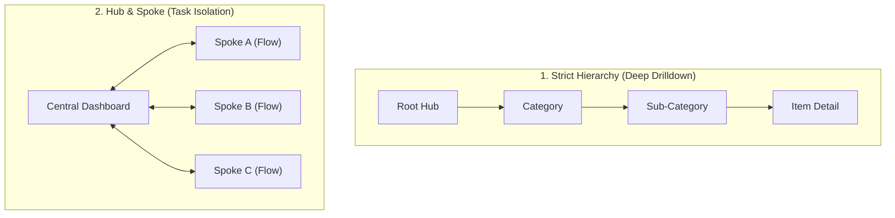

# Information Architecture, Wayfinding & Ontology Mapping

This reference defines the principles for structuring domain information, architecting navigation systems, and ensuring effortless findability across all computing platforms.

---

## 1 · Domain Ontology vs. Technical Implementation Schemas

The most severe flaw in amateur information architecture is **implementation schema leakage**: organizing user interfaces around database tables, microservice endpoints, or backend serialization models rather than human domain objects.

```
┌────────────────────────────────────────────────────────┐
│             THE INFORMATION ARCHITECTURE BRIDGE        │
├────────────────────────────┬───────────────────────────┤
│ The User's Mental Model    │ The Backend Architecture  │
│ (Invoices, Customers,      │ (PostgreSQL normalization,│
│ Projects, Tasks, Reports)  │ join tables, Redis caches)│
└────────────────────────────┴───────────────────────────┘
```

### The 4 Laws of Domain Ontology
1. **Model Around User Objects (OOUX)**:
   * Identify the core nouns that users speak: *Project*, *Document*, *Build*, *Artifact*, *Member*.
   * Group all related attributes, relationships, and actions around those primary nouns.
2. **Never Expose Internal State Plumbing**:
   * Users do not care about `user_role_mappings_v2` or `cache_invalidation_tokens`. They care about *"Team Permissions"* and *"Refresh Status"*.
3. **Task-Oriented Grouping Over Functional Grouping**:
   * Instead of grouping by technical format (e.g., "All Forms", "All Tables", "All Downloads"), group by user workflow (e.g., "Billing & Invoices", "Project Settings", "Team Access").
4. **Contextual Co-Location**:
   * Place actions where their target objects live. Do not force users to visit a distant "Settings" tab to perform an operation on a currently viewed document.

---

## 2 · The 4 Canonical Navigation Topologies

Choose the navigation topology that matches the relationship structure of your domain:



### 1. Strict Hierarchical Tree
* **Best For**: Deep content repositories, documentation libraries, file trees, nested settings.
* **Ergonomic Rule**: Maximum nesting depth should not exceed **3 levels** without breadcrumbs and direct lateral search. If users must drill down 5 levels, the taxonomy is failing.

### 2. Hub-and-Spoke
* **Best For**: Transactional dashboards, mobile productivity apps, gaming menus, setup wizards.
* **Ergonomic Rule**: The central hub serves as the primary orienting anchor. Users diverge into specialized "spokes" to complete discrete tasks, then cleanly return to the hub upon completion.

### 3. Flat / Lateral Navigation
* **Best For**: High-frequency switching between equal-weight domains (e.g. Code, Issues, Pull Requests, Actions in GitHub).
* **Ergonomic Rule**: Maximum of **5–7 primary tabs** (Miller's Law). Must be persistent and support keyboard switching (e.g., number shortcuts or tab switching).

### 4. Faceted / Matrix Search
* **Best For**: Catalogs with high attribute density (e-commerce, observability log viewers, code search).
* **Ergonomic Rule**: Combine free-text search with dynamic, multi-select facet filters. Active filters must be individually dismissible with 1 click.

---

## 3 · The Wayfinding Triad

Wayfinding is the spatial orientation of a user inside a digital information space. Every screen, CLI prompt, and modal dialog must continuously answer three questions:

```
┌────────────────────────────────────────────────────────┐
│                   THE WAYFINDING TRIAD                 │
├────────────────────────────────────────────────────────┤
│ 1. Where am I?            │ Page Title, Active Tab,    │
│                           │ Prompt Anchor, Breadcrumb  │
├───────────────────────────┼────────────────────────────┤
│ 2. How did I get here?    │ Back Button, URL Path,     │
│                           │ Terminal History, Parent   │
├───────────────────────────┼────────────────────────────┤
│ 3. What can I do next?    │ Primary CTA, Clear Actions,│
│                           │ Secondary Affordances      │
└────────────────────────────────────────────────────────┘
```

### 3.1 Where Am I? (Orientation)
* **Web/Desktop**: Prominent, semantically correct page heading (`<h1>`); bold or highlighted active navigation item; explicit breadcrumb trail.
* **CLI/TUI**: Current working directory, active git branch, or context indicator in the shell prompt (e.g. `[my-project:production]$`).
* **AI Chat**: Persistent conversation title, current active model indicator, and tagged context pills (e.g. `"Referencing 3 files"`).

### 3.2 How Did I Get Here? (Provenance & History)
* **URL State Parity**: Every major filter change, tab switch, and modal drilldown should reflect in the URL query string (`?tab=billing&filter=active`) so that browser back buttons, bookmarks, and team sharing work without broken states.
* **Breadcrumb Rules**: Breadcrumbs must show true structural hierarchy, not clickstream history:
  $$\text{Home} > \text{Organization} > \text{Project} > \text{Settings}$$
* **CLI Parity**: Terminal tools should support history traversal (`Up Arrow`, `Ctrl+R`) and directory jump commands (`cd -`).

### 3.3 What Can I Do Next? (Affordance Visibility)
* Unambiguous hierarchy of actions: exactly **one** primary call to action (high visual luminance/contrast), accompanied by clearly subordinate secondary actions (ghost/muted styling).
* Never leave a screen without an obvious next step.

---

## 4 · Search & Faceted Filtering Ergonomics

1. **Instant Feedback & Debouncing**:
   * As users type into a search query, debounce API queries by $250 - 300\text{ms}$.
   * Display instant local filter results or a loading spinner when querying remote servers.
2. **Persistent Filter State & Clear All**:
   * Display active filters as dismissible tags/pills above the data results.
   * Always provide a 1-click `"Clear All Filters"` button when any filter is active.
3. **Empty Filter States**:
   * When a search or filter produces zero results, never show a blank void.
   * State: *"No results matching 'keyword' with active filters [FilterA, FilterB]"*.
   * Action: Provide a 1-click button: `[Clear Filters]` or `[Reset Search]`.

---

## 5 · Progressive Disclosure Design Patterns

Progressive disclosure manages cognitive load by deferring advanced or rarely used features to secondary screens, preventing initial overwhelm:

| Pattern | Description | Best Used For |
| :--- | :--- | :--- |
| **Staged Disclosure (Wizards)** | Breaks a complex linear task into discrete, ordered steps with progress indicators. | Onboarding flows, checkout flows, complex resource provisioning. |
| **Layered Disclosure (Accordions)** | Displays summaries with expandable detail sections on demand. | Settings pages, FAQ sections, detailed system telemetry. |
| **Contextual Disclosure (Hover / Focus)** | Reveals controls only when the user targets a specific item. | Row actions in tables, copy buttons on code blocks. |
| **Volumetric Disclosure ("Show More")** | Renders top 5 items; provides `"Show 12 more..."` toggle. | Search results, activity feeds, log inspectors. |
